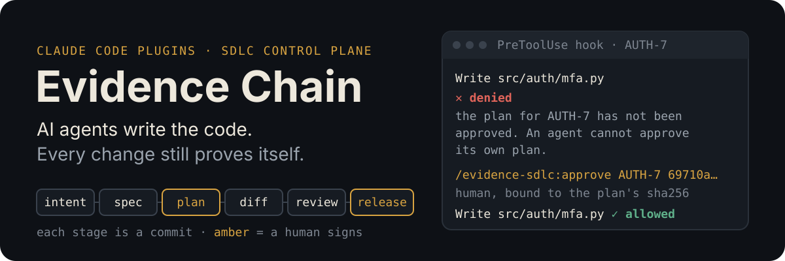
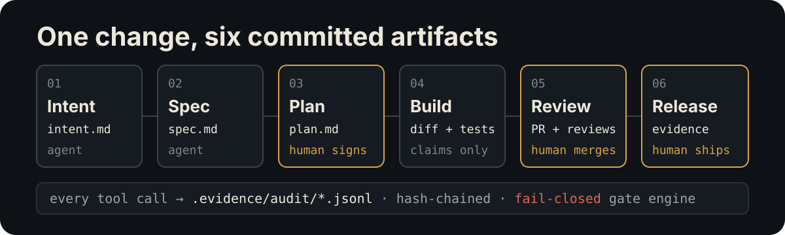

<p align="center">
  
</p>

<p align="center">
  <a href="LICENSE"></a>
  
  
  
  
</p>

<p align="center">
  <b>An AI-native SDLC control plane for teams that have to prove what they shipped.</b><br>
  <a href="#install">Install</a> · <a href="#one-change-in-60-seconds">One change in 60 seconds</a> · <a href="#the-gates">The gates</a> · <a href="docs/getting-started.md">Getting started</a> · <a href="CHANGELOG.md">Changelog</a>
</p>

> [!IMPORTANT]
> **This is not regulatory, legal or compliance advice.** Read [DISCLAIMER.md](DISCLAIMER.md)
> before using any of it. Nothing here makes anything compliant; every gate ends at a
> named human, deliberately.

## What the agent actually hits

Real output from the gate engine on a Tier 3 auth change
([full walkthrough](examples/scenarios/v2-gates-in-action/README.md)). The agent tries
to write code before anyone approved the plan:

> Writing src/auth/mfa.py: the plan for AUTH-7 has not been approved. Ask a human to
> review intent/2026-09-24-mfa-login/plan.md and send
> `/evidence-sdlc:approve AUTH-7 69710aaf135c` … An agent cannot approve its own plan.

After the human approves that exact plan text, it wanders outside the plan:

> Writing src/users/profile.py: src/users/profile.py is not in the approved plan's
> "Files claimed" for AUTH-7. Add it to the plan (which voids the approval) and ask for
> re-approval, or leave the file alone.

And tries to sneak a write past the Edit tool:

> This command modifies files in a way the gates cannot inspect (python3 inline code
> that writes files). Use the Edit or Write tools for file changes so the plan, claims,
> test-protection and secret checks can run.

## What it is

Five Claude Code plugins (skills, agents, slash commands and hooks) that put an agent
inside the whole development lifecycle while keeping the controls an audited product
needs. **Skills make the standards likely. One fail-closed gate engine makes the
non-negotiable ones certain.** It is a Python hook that sees every Edit, Write and Bash
call.

**Who it's for:** teams shipping software an outside party can ask them to justify.
That includes regulated industries (medical devices, pharma, financial services,
payments) and any team that has decided "an AI wrote it" must never become "nobody can
explain why it's correct."

## How it works

<p align="center">
  
</p>

Every stage ends with a committed artifact the next stage reads: `intent.md` →
`spec.md` → `plan.md` → diff and tests → PR and review findings → release evidence.
The chain of commits is the audit trail, so nobody has to rebuild it by hand at release
time. Along the way:

- No source edit happens without a human-approved plan for an active change.
- Only files the plan claims can be edited.
- Commits carry the tracker key and the agent session.
- Nothing reaches a protected branch or production without a human.
- The agent cannot approve its own plan or edit the configuration that governs it.
- The `evidence` CLI derives the traceability matrix from what the repository actually contains.

### The five plugins

| Plugin | What it does | Contents |
| --- | --- | --- |
| `evidence-discovery` | Runs first. Reads the repo and writes facts to `.evidence/context/` (stack, deployment, toolchain, design system, compliance, test strategy). It never guesses: every line is `[confirmed]`, `[inferred]` or `[ASK]`. | 6 skills, `stack-surveyor` agent |
| `evidence-sdlc` | The core loop and the control plane: the intent → spec → plan skills, risk tiering, security review, the gate engine, lifecycle state, human-only approval, a hash-chained audit log, and the `evidence` CLI | 10 skills, 7 agents, 5 commands, the engine |
| `evidence-quality` | Test strategy, automation, E2E, accessibility, performance, security and static analysis, CI design, test-case authoring, traceability IDs | 10 skills, `test-designer`, `flake-triage` |
| `evidence-compliance` | Loads only the control sets the compliance profile names, and derives the evidence package from the chain | 2 skills, `compliance-reviewer` |
| `evidence-integrations` | Changes that cross the platform boundary, and contract tests | 2 skills |

Every skill's trigger phrases are in [docs/skills-reference.md](docs/skills-reference.md).

## Install

Requirements: Claude Code, `git`, **Python 3.8+** on `PATH`, and macOS or Linux (WSL on Windows; native Windows is not supported).

**Signing key.** Without `EVIDENCE_SIGNING_KEY` the plugins run in *unsigned mode*,
which is fine for a trial but limits agent work to Tier 1 changes: approvals and
records can't be told apart from forgeries without it. For Tier 2 and 3 work, deploy
the key as described in [docs/managed-settings.md](docs/managed-settings.md). The gate engine and
the CLI use only the standard library. `jq` is no longer needed. If `python3` is
missing, the engine fails closed and denies every file change and command.

**1. Add the marketplace.** From a local clone (works today):

```
claude plugin marketplace add /path/to/evidence-chain      # from your shell
/plugin marketplace add /path/to/evidence-chain            # or inside Claude Code
```

The repository is published at https://github.com/harshil-1411/ai-sdlc, so
`/plugin marketplace add harshil-1411/ai-sdlc` also works. A fork publishes its own
remote and adds that instead.

**2. Install all five.** The plugins have soft dependencies on each other
(`evidence-sdlc` reads `evidence-discovery`'s profile; quality, compliance and
integrations rely on `evidence-sdlc`'s engine and CLI). They are soft on purpose: a
missing sibling degrades a feature with a clear message instead of disabling the
plugin, and `evidence doctor` reports which siblings are installed. Install all five:

```
/plugin install evidence-discovery@evidence-chain
/plugin install evidence-sdlc@evidence-chain
/plugin install evidence-quality@evidence-chain
/plugin install evidence-compliance@evidence-chain
/plugin install evidence-integrations@evidence-chain
```

**3. Check it's live.** Start a new session. Its context must include
`Evidence Chain gates live (engine …; policy: …)`. If it doesn't, the gates aren't
running. See [docs/managed-settings.md](docs/managed-settings.md) for the canary test.

**Updating.** Every plugin has a semver `version`, and CI refuses a plugin change that
doesn't bump it, so `/plugin marketplace update evidence-chain` followed by
`/plugin update <name>@evidence-chain` always picks up real changes. Read
[CHANGELOG.md](CHANGELOG.md) and re-read the hook and engine code after every update.
It runs with your permissions ([SECURITY.md](SECURITY.md)).

**Rolling out to an organisation** means deploying `managed-settings.json` (force-enabled
plugins, narrow git permissions, OTel, sandbox) plus an optional org policy. Before
that works, the owner has to take the actions listed in
[docs/managed-settings.md](docs/managed-settings.md).

## One change in 60 seconds

A Tier 2 feature, `PAY-142`, in a repository that has already run discovery.

1. **Start.** You type `/evidence-sdlc:start PAY-142 2 feature CSV export`. The agent
   runs `evidence change start PAY-142 --tier 2 --kind feature` and switches to
   `feature/PAY-142-csv-export`. Then it writes `spec.md` and a plan whose
   `## Files claimed` lists the exact paths it will touch. Until the plan is approved,
   every source edit is denied.
2. **Approve (you, not the agent).** The agent shows `evidence change status PAY-142`,
   which includes the plan's sha256. You read the plan, then send
   `/evidence-sdlc:approve PAY-142 3f9a1c2e7b4d`. A `UserPromptSubmit` hook records
   the approval, bound to that exact plan text. The model can't write a user prompt,
   so it can't approve its own plan. Any later edit to the plan voids the approval.
3. **Implement.** Edits inside the claimed files are allowed. Anything else is denied:
   an edit outside the claims, a Bash write the engine can't inspect, a secret, a
   control-plane file.
4. **Review.** Tier 2 requires the `verifier` and `security-reviewer` agents (Tier 3
   adds `code-reviewer`). Their completed runs are recorded in the audit log
   automatically.
5. **Commit and PR.** Every commit message carries `PAY-142` and the trailer
   `Agent-Session: <session id>`. `git push` of the feature branch and `gh pr create`
   go through once the review agents have run. A human code owner merges. The agent
   cannot push to `main` or merge.

## The gates

A single engine (`plugins/evidence-sdlc/scripts/engine/`) makes every decision, driven
by [policy](docs/policy-reference.md). Full rules, deny messages and tests are in
[docs/gates-reference.md](docs/gates-reference.md).

| Gate | Denies |
| --- | --- |
| Active change | A source write (Edit, Write, or a Bash write) with no started change, a missing tier artifact, a stub plan, or a missing or stale human approval |
| Claims and tier floors | Edits outside the plan's `Files claimed`; edits to auth, crypto, migrations and similar paths below the tier policy requires |
| Change control | Migrations, CI, infra, audit, signing and crypto edits without a human-set `CHANGE_TICKET` |
| Test protection | Editing or deleting an existing test after a fix's failing test is recorded |
| Control plane | Any agent write to settings, policy, approvals, change state, audit logs or managed settings |
| Secrets | Credentials in writes, commands, commit messages and staged diffs |
| Commits | No tracker key in the message, the wrong key, or no `Agent-Session` trailer |
| Pushes and merges | Pushes to protected refs, from any branch and in any form; `gh pr merge` and merge/protection API calls (gh, GraphQL, curl); push or PR before the required review agents have run |
| Production | Deploys to a production target without a human-set `RELEASE_APPROVAL` |
| Self-approval | An agent running `evidence approve`, `change set-tier` or `change release`; writing an `Approved by:` line into a plan; `gh pr review --approve`, or posting `/approve-plan` comments |

It fails closed: missing `python3`, malformed hook input, or an engine error all deny.
Regression suite: `python3 plugins/evidence-sdlc/scripts/tests/engine-tests.py`.

## The `evidence` CLI

Shipped in `evidence-sdlc/bin/` and on `PATH` inside sessions. Outside a session,
use `python3 cli/evidence …` from a clone.

```
evidence change start KEY --tier 2 --kind feature   # lifecycle state for a change
evidence change status [KEY]                        # stage, missing artifacts, approval, review agents
evidence change advance KEY failing-test            # fix changes: lock existing tests
evidence approve KEY                                # human, own terminal (types the sha prefix)
evidence approve KEY --github-pr 12                 # record a GitHub approval by an allowed login
evidence audit verify                               # check the hash-chained audit logs
evidence metrics                                    # stage skips, denials by rule, self-approval attempts
evidence doctor | scan | gaps | export              # traceability: preflight, graph, gaps, matrix
```

See [cli/README.md](cli/README.md) for gap categories and exit codes.

<details>
<summary><b>Documentation</b>: getting started, concepts, every gate, every policy key</summary>

| Doc | For |
| --- | --- |
| [docs/getting-started.md](docs/getting-started.md) | Your first change, end to end |
| [docs/concepts.md](docs/concepts.md) | How it works, design commitments, traceability, risk tiering, rollout order, caveats |
| [docs/gates-reference.md](docs/gates-reference.md) | Every engine rule, its deny message, overrides and tests |
| [docs/policy-reference.md](docs/policy-reference.md) | Every policy key, and the org and repo layers |
| [docs/managed-settings.md](docs/managed-settings.md) | Deploying to an organisation, the canary, owner actions |
| [docs/skills-reference.md](docs/skills-reference.md) | Every skill's triggers, and the agents |
| [docs/extending.md](docs/extending.md) | Adding a skill, an agent, a gate rule or a plugin |
| [docs/third-party-tooling.md](docs/third-party-tooling.md), [docs/toolchain-connectivity.md](docs/toolchain-connectivity.md) | Which other plugins and connectors are safe alongside this |
| [docs/external-review-packet.md](docs/external-review-packet.md) | The traceability export, explained for a QA/RA lead |
| [governance/](governance/) | What an auditor asks for |

</details>

<details>
<summary><b>Worked examples</b>: ten scenarios, from a Tier 1 story to a 21 CFR Part 11 change</summary>

Worked scenarios in [examples/scenarios/](examples/scenarios/). Each shows which skill
fires, what it produces and which gate checks it. Full index:
[examples/README.md](examples/README.md).

| Scenario | Shows |
| --- | --- |
| [new-feature-non-regulated](examples/scenarios/new-feature-non-regulated/README.md) | The lightest path: a Tier 1 story |
| [regulated-change-tier3](examples/scenarios/regulated-change-tier3/README.md) | The heaviest path: e-signature capture under 21 CFR Part 11 |
| [v2-gates-in-action](examples/scenarios/v2-gates-in-action/README.md) | A Tier 3 auth change hitting each v2 gate, with the deny messages |
| [incident-bug-fix](examples/scenarios/incident-bug-fix/README.md) | Root cause first, and a failing test that locks the existing tests |
| [schema-migration-regulated-table](examples/scenarios/schema-migration-regulated-table/README.md) | Expand-contract phasing and regulated-record checks |
| [third-party-integration](examples/scenarios/third-party-integration/README.md) | Where security review ends and integration review begins |
| [standalone-cli-audit](examples/scenarios/standalone-cli-audit/README.md) | Just the CLI, on a repo that uses none of this |
| [qa-evidence-profile](examples/scenarios/qa-evidence-profile/README.md) | What each test case's evidence is, and where it lands |
| [test-strategy-and-release-cycle](examples/scenarios/test-strategy-and-release-cycle/README.md) | The testing side end to end, to a human-signed go/no-go |
| [sensor-and-learning-loop](examples/scenarios/sensor-and-learning-loop/README.md) | Advisory sensors and turning corrections into `CLAUDE.md` rules |

</details>

## Limits, stated plainly

- In local mode, the approver is whoever holds the machine's `git user.email`. That
  isn't a cryptographic identity. GitHub approval mode is identity-bound. Server-side
  branch protection and CODEOWNERS remain the authoritative merge control, and a
  plugin can't configure them.
- The audit log is tamper-evident, not tamper-proof. To make it tamper-resistant, ship
  it off the machine (OTel or a CI artifact).
- Approving a change nobody read is worse than no AI at all. Tier the work, and measure
  how deeply reviews actually go ([docs/concepts.md](docs/concepts.md#measure-these)).

## Contributing, prior art, licence

See [CONTRIBUTING.md](CONTRIBUTING.md). The most valuable contributions are reports
from real rollouts and gates that failed open. Maintainers picking up in-flight work
should start with [HANDOFF.md](HANDOFF.md): current state, how to verify, open work and
owner actions.

This project was shaped by Anthropic's AI-native SDLC playbook, AWS's AI-DLC
methodology and Andrej Karpathy's LLM Council pattern. MIT licence; see
[LICENSE](LICENSE). Security reports: [SECURITY.md](SECURITY.md).
