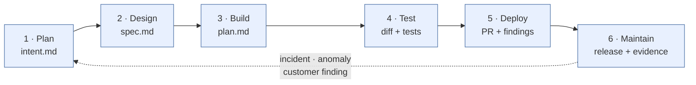
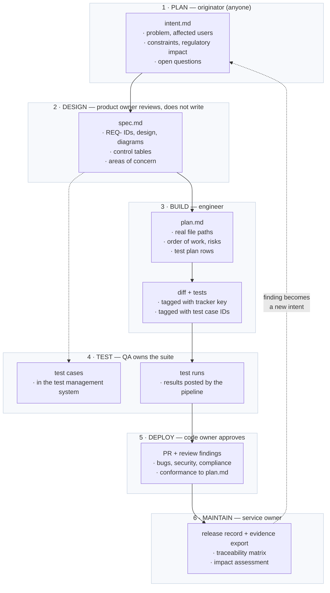
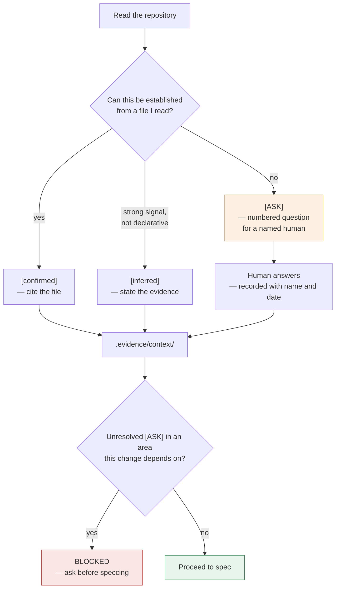
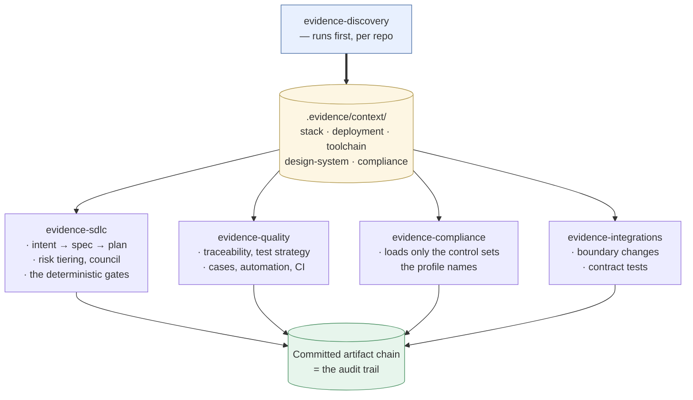
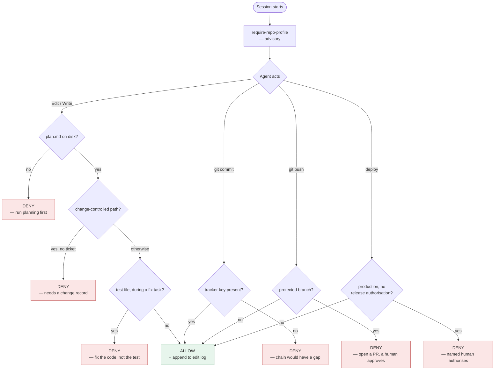
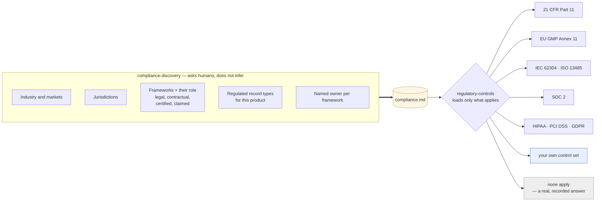
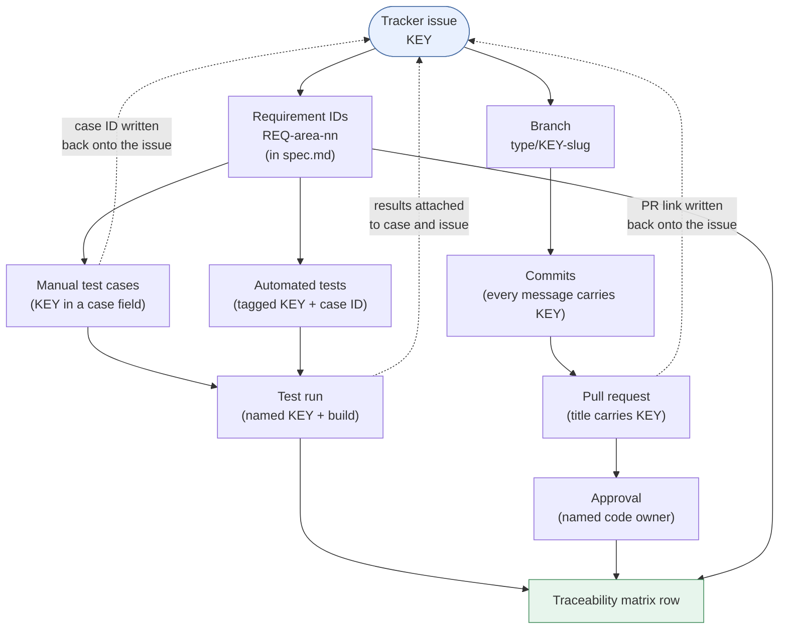
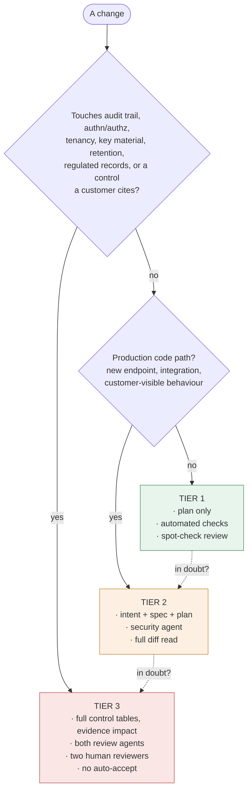
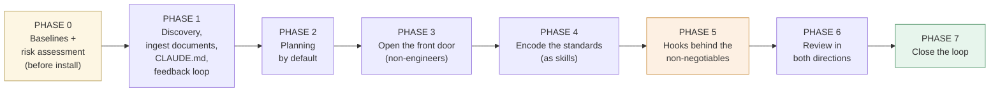

# Evidence Chain

**An AI-native SDLC control plane for teams that have to prove what they shipped.**

Claude Code plugins that put an agent inside your whole development lifecycle while
keeping the controls a regulated, audited, or safety-relevant product needs — planning
gates, traceability, test discipline, security review, and a validation-evidence chain
that falls out of the process instead of being assembled at release time.

> **This is not regulatory, legal or compliance advice.** Read [DISCLAIMER.md](DISCLAIMER.md)
> before using any of it. Nothing here makes anything compliant; every gate ends at a
> named human, deliberately.

---

## The problem it addresses

Code stopped being the bottleneck. The steps either side of it did not move.

Once agents write most of the diff, two things break at once. Review capacity — reading
every line made sense when a person wrote every line. And evidence — the faster you
ship, the more expensive it gets to reconstruct *what was required, what was built, what
proved it, and who approved it.*

Going faster without addressing those just moves the queue to QA and security, and in a
regulated shop it produces a human approval gate that has quietly become fiction. An
auditor probing an approval nobody read is a worse outcome than not using AI at all.

Evidence Chain's answer: **each stage ends by committing an artifact the next stage
reads, and the controls run at the moment the agent acts.** The chain of commits is then
the audit trail.



### What each stage produces, and who owns it



Every arrow is a commit. The chain of commits is the audit trail: who asked for what,
what the agent produced, what proved it, and who approved it.

## Two design commitments

**1. It does not know your stack, and never guesses.**

No skill hardcodes a language, framework, datastore, or deployment target. Instead
`evidence-discovery` runs first in each repository and writes a profile to
`.evidence/context/`. Every other skill reads that profile.

Discovery has one standing rule: **evidence, then question, never guess.**



The profile files it writes:

| File | Holds |
| --- | --- |
| `stack.md` | Languages, frameworks, data layer, build/test/lint commands, VCS conventions |
| `deployment.md` | IaC, environments, regions, residency, pipelines, rollback |
| `toolchain.md` | Every tool, how the agent reaches it, credentials, scope, read vs write |
| `design-system.md` | Component source of truth, tokens, conventions, accessibility baseline |
| `compliance.md` | Industry, jurisdictions, applicable frameworks, regulated record types |

Confidently wrong is the expensive failure mode, and a framework that assumes a stack —
or a regulation — will be confidently wrong in half your repositories.

**2. Skills advise; hooks enforce.**

A skill makes an agent very likely to apply a policy while writing code. Nothing forces
compliance. A hook runs on every matching action, for everyone, and can block.

So: write a skill for everything, and put a hook behind any policy that must hold
without exception. Hooks on everything creates prompt fatigue and people route around
them. Skills on everything means your controls are a suggestion. Getting this balance
wrong in either direction is the main way these rollouts fail.

---

## Install

```
/plugin marketplace add <your-org>/evidence-chain
/plugin install evidence-discovery@evidence-chain
/plugin install evidence-sdlc@evidence-chain
```

Then run discovery in the repository you want to onboard, and answer its questions. Add
`evidence-quality`, `evidence-compliance` and `evidence-integrations` as they become
relevant.

Read every hook script before installing. They run on your machine with your
permissions — that is the point, and it is also the risk. See [SECURITY.md](SECURITY.md).

## What's in here

```
.claude-plugin/marketplace.json   Marketplace manifest
.mcp.json.example                 Connector template, keyed to the toolchain profile
managed-settings.json             Platform-owned policy engineers cannot override
pipeline.example.yml              CI + continuous testing stage design
.evidence/adapter.example.yml     Where THIS repo's traceability chain lives — copy
                                  the matching preset to .evidence/adapter.yml
cli/evidence                      doctor / scan / gaps / export — see cli/README.md
docs/                             toolchain-connectivity.md — what connects how
                                  third-party-tooling.md — what to adopt, and what
                                  quietly disables the controls
governance/                       The documents an auditor asks for

plugins/
  evidence-discovery/     RUN FIRST. Establishes facts; never assumes a stack.
    stack-discovery             Languages, frameworks, data, build/test/run commands
    toolchain-discovery         Which tools, and whether you can reach them
    design-system-discovery     Component source of truth, tokens, conventions
    compliance-discovery        Industry, jurisdictions, frameworks — asked, not inferred
    document-ingestion          Existing SOPs and protocols into the chain, safely
    stack-surveyor              Read-only survey with evidence and confidence markers

  evidence-sdlc/          Stack-agnostic. The core loop.
    intent-capture              Front door for every team, not just engineering
    spec-and-design             Requirements + design in one pass, policy applied live
    codebase-grounded-planning  Plans against the repo you actually have
    risk-tiering                Ceremony scales with risk; tiered DoR and DoD
    secure-api-review           What a generic scanner can't know: tenancy, regulated
                                records, audit requirements, residency
    schema-migration             Expand-contract, backfill verification, tested
                                rollback, regulated-record integrity on migrations
    architecture-diagrams       Diagrams as code, reviewed in the diff
    agent-trust-boundaries      Untrusted content is data, never instruction
    legacy-characterization     Pin down old code before touching it
    root-cause-analysis         Trace a defect to its actual cause before fixing it
    decision-council            Multi-perspective pressure test for one-way doors
    agents/                     cartographer, verifier, security-reviewer
    hooks/ scripts/             The deterministic gates
    templates/                  intent / spec / plan / REVIEW / DoR-DoD / CLAUDE.md

  evidence-quality/       Testing and the traceability chain.
    traceability-ids            One key linking tracker → case → commit → evidence
    test-strategy               Which layer proves which requirement
    testrail-authoring          Manual cases in the tool's required format, linked back
    test-automation             Framework-agnostic discipline, tagging, flake policy
    continuous-testing          What runs when, what blocks, what is evidence
    agents/                     test-designer, flake-triage

  evidence-compliance/    For regulated records.
    regulatory-controls             Framework-agnostic control checks, with shipped control sets
    evidence-package          Derives the deliverables you owe from the artifact chain
    compliance-reviewer         Controls + validation pass over a diff

  evidence-integrations/  Anything crossing the platform boundary.
    integration-change          Trust + availability + compliance boundary at once
    contract-testing            Catch partner drift in the pipeline, not in production
```

## How the plugins fit together



Nothing downstream of discovery hardcodes a stack, a toolchain, or a regulation. They
all read the profile.

## The gates

| Gate | Enforces |
| --- | --- |
| `require-repo-profile` | Every session knows the stack — or knows that it doesn't |
| `gate-plan-exists` | No source edit without an approved `plan.md` on disk |
| `require-issue-key` | No commit without the tracker key. The chain has no gaps |
| `protect-validated-paths` | Change-controlled paths need a change ticket in the environment |
| `block-test-weakening` | An agent fixing a bug cannot edit the test that proves it |
| `block-protected-branch-push` | The agent has no route to main. Segregation of duties, mechanically |
| `production-gate` | The agent may act up to the production gate and not past it |



## Compliance without hardcoding a regulation

`compliance-discovery` establishes which frameworks actually apply and writes them to
`.evidence/context/compliance.md`. `regulatory-controls` then loads only the matching
control sets. Nothing assumes an industry.



Two things this deliberately gets right. **Applicability is asked, not inferred** — a
repository cannot tell you which markets you sell into or what you committed to
contractually, so every entry carries a person's name and a date. And **the role of each
framework is recorded separately**: a legal obligation, a contractual commitment, a
certification you hold, and a standard you merely claim alignment with are four
different things that are routinely conflated.

Shipped control sets live in
`plugins/evidence-compliance/skills/regulatory-controls/references/`. They are starting
points drafted from public sources, structured for reviewing a diff rather than for
satisfying an auditor. Writing your own is expected — `references/README.md` gives the
shape.

## Traceability

The tracker issue key is the anchor; everything references it.



The dotted arrows are the half people skip. A test case that references the issue while
the issue does not reference the case is a half-chain, and half-chains are what make
audits expensive.

**Two-way linking is the point.** One-way links rot. Creating a test case writes its ID
back onto the issue; a completed run attaches results to both.

## Risk tiering — ceremony scales with risk

Nine mandatory gates on every change recreates the process weight this framework exists
to remove.



**When in doubt, tier up.** A Tier 2 change that was really Tier 3 is the failure that
matters.

## Rollout order

Each step is useful alone and makes the next cheaper. **Do not start with the gates** —
gating a process nobody follows yet just generates workarounds.



**Phase 0 — before installing anything.** Capture the baselines in
`governance/baseline-metrics.md`. You cannot reconstruct them later, and without them
every impact claim is unfalsifiable. Start the tool risk assessment with your quality
function in parallel; it takes longer than the technical setup.

**Phase 1 — establish facts, then competence.** Run discovery, answer the `[ASK]`s,
commit `.evidence/context/`. Run `document-ingestion` on the procedures and requirement
documents that already govern your work — skipping this produces a parallel set of
markdown that drifts from your controlled documents, which is worse than not starting.
Then a one-page `CLAUDE.md` per repo, and a feedback loop: one command each for build,
test and lint, each exiting non-zero on failure. Run `legacy-characterization` in
parallel on the modules people are afraid of — it is the highest-value early use of an
agent, higher than feature work.

**Phase 2 — planning becomes the default.** Plan mode first, `plan.md` committed.

**Phase 3 — open the front door.** Non-engineering teams get `intent-capture`. Support
is the highest-leverage, lowest-cost group to onboard.

**Phase 4 — encode the standards.** One policy, one named owner, one source of truth.

**Phase 5 — hooks behind the non-negotiables.** Only now, and only after leadership,
change management and quality have listed the approvals that must survive.

**Phase 6 — review in both directions.** `REVIEW.md`, agent review passes, human
attention moved up a level to intent and risk.

**Phase 7 — close the loop.** Scheduled scans, control bands on production metrics,
findings re-entering as `intent.md`. Rehearse rollback before you get here.

## Measure these

Velocity and guardrails on the same page, always. Velocity gains that conceal a rising
failure rate are the classic failure of these programmes.

- Time from first conversation to committed `intent.md`
- Share of changes merging on the first implementation pass
- First-pass CI success rate for agent-written changes
- Defects caught before merge vs. escaping to production
- **Review depth** — review time per change, plus a quarterly spot-audit of whether
  approvals were substantiated. This is the only honest check on approval theatre
- **Evidence assembly time at release.** If the chain is working this collapses from a
  project to an export. Usually the clearest number to show leadership

## On third-party plugins

The ecosystem is large and some of it makes this framework better — official security
tooling, document conversion, read-only documentation servers, browser automation for
test authoring. Some of it quietly disables the controls this framework exists to
provide: context compressors mean a security or compliance skill may never see the code
it was supposed to examine and will report a clean pass anyway; persistent cross-session
memory puts state outside version control; design "taste" plugins argue against an
established design system and win locally.

`docs/third-party-tooling.md` has the four questions to ask, the standing decisions, and
how something gets onto an allowlist.

Notably: **install Anthropic's `security-guidance` plugin and do not duplicate it.**
`secure-api-review` here deliberately covers only what a generic scanner cannot know.

## Adapting it

- **Fork it and make it yours.** These skills encode *someone's* standards. Replace the
  control checklists with your regulatory framework, replace the review policy with
  yours, delete the plugins you don't need.
- **Not in a regulated industry?** `evidence-sdlc`, `evidence-discovery` and
  `evidence-quality` stand alone. The artifact chain and traceability are worth having
  whether or not anyone audits you.
- **Different regulatory framework?** `regulatory-controls` is a worked example of the
  shape: a table of controls, each with a verdict and a pointer to evidence. Swap the
  rows for ISO 13485, SOC 2, IEC 62304, or whatever applies.
- Keep organisation-specific content in your fork, not in a public one.

## Caveats worth stating plainly

- **Human approval on a change nobody read is worse than no AI at all.** Risk-tier the
  work and measure review depth, or the control becomes a fiction.
- **An agent inside your product is a different system** from an agent inside your
  development process. The risk assessment here covers the second, not the first.
- **Nothing here makes anything compliant.** These skills surface findings and evidence.
  Your quality function decides, and a human signs.

## Prior art

Shaped by Anthropic's AI-native SDLC playbook, AWS's AI-DLC methodology, and Andrej
Karpathy's LLM Council pattern. The synthesis, the discovery-first design and the
traceability model are this project's own.

## Licence

MIT — see [LICENSE](LICENSE).
