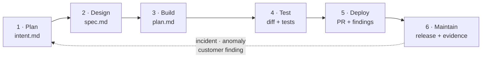
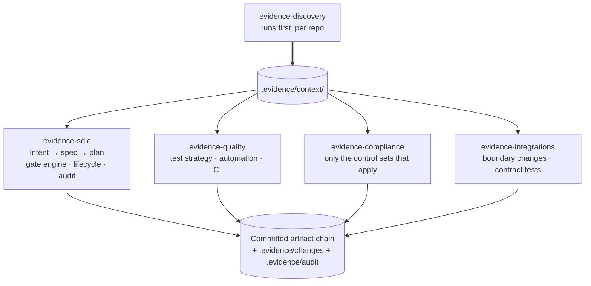

# Concepts

This is the long-form companion to the [README](../README.md). It covers how Evidence
Chain works, the problem it addresses, its two design commitments, how the plugins fit
together, traceability, risk tiering, rollout order, and the caveats. The exact
mechanics of each gate are in [gates-reference.md](gates-reference.md), and the policy
that drives them is in [policy-reference.md](policy-reference.md).

## How it works

Five things, in order, make up the mechanism.

1. **Discovery runs first and writes facts, not assumptions.** `evidence-discovery`
   reads the repository itself, never the README or CLAUDE.md. It writes what it finds
   to `.evidence/context/`: stack, deployment, toolchain, design system, compliance
   and test strategy. Each line is marked `[confirmed]`, `[inferred]` or `[ASK]`.
2. **Every other plugin reads that profile instead of guessing.** None of them
   hardcodes a stack, a toolchain or a regulation.
3. **Skills make the standards likely; the gate engine makes the non-negotiable ones
   certain.** A skill shapes what the agent does while it works. The gate engine is a
   single Python hook that runs on every Edit, Write, MultiEdit, NotebookEdit, Bash and
   Agent call. It is deterministic code, not model judgement, and it can deny a tool
   call outright. A separate class of hook, the [sensors](#sensors), can only inform.
4. **Every stage commits an artifact the next stage reads**, and the engine tracks
   where each change stands. `evidence change start` creates
   `.evidence/changes/<KEY>/state.json`. A human approval is bound to the plan's
   sha256. A hash-chained audit log records every tool call, every denial and every
   review-agent run.
5. **One tracker key threads everything together, in both directions.** Requirement
   IDs, branches, commits (checked by the engine), PRs, test cases and evidence all
   carry the same key.

The `evidence` CLI checks all five: it reads the repository's commits, specs, tests and
test results, and reports whether the chain is actually there.

## The problem it addresses

Code stopped being the bottleneck. The steps on either side of it did not move.

Once agents write most of the diff, two things break at once. The first is review
capacity: reading every line made sense when a person wrote every line. The second is
evidence: the faster you ship, the more it costs to reconstruct *what was required,
what was built, what proved it, and who approved it.*

Going faster without fixing those two things just moves the queue to QA and security.
In a regulated shop it also produces a human approval gate that has quietly become
fiction. An auditor probing an approval nobody read is a worse outcome than not using
AI at all.

There's a failure mode on either side of this:

- **Too loose.** Hand an agent the whole problem and expect it to finish unsupervised.
  That works for a prototype, but not for anything that has to be reviewed and proven.
- **Too tight.** Keep the agent on such a short leash that it only executes narrow,
  pre-approved tasks. Then the review and evidence cost never goes away.

Evidence Chain is neither. It keeps plan-mode discipline and human approval at every
stage, and uses deterministic gates instead of the model's judgement for anything that
must never be skipped.

### What each stage produces, and who owns it

| Stage | Owner | Artifact | What the engine checks |
| --- | --- | --- | --- |
| 1 · Plan | Originator (anyone) | `intent.md`: problem, affected users, constraints, regulatory impact | Required before source edits at Tier 3 |
| 2 · Design | Product owner reviews; does not write | `spec.md`: `REQ-` IDs, design, control tables, areas of concern, ADRs in `.evidence/decisions/` | Required at Tier 2 and 3 |
| 3 · Build | Engineer | `plan.md`: real paths, `Files claimed`, order of work, test-plan rows. Then the diff and tests | Required at every tier. It must not be a stub, and a human approves its exact hash. Edits stay inside its claims |
| 4 · Test | QA owns the suite | Test cases and test runs | For fixes, existing tests are locked after `failing-test` |
| 5 · Deploy | Code owner approves | PR and review findings | Push and PR need the tier's review agents. No agent route to protected refs or merges |
| 6 · Maintain | Service owner | Release record, evidence export, impact assessment | Production deploys need a human-set `RELEASE_APPROVAL` |

Every arrow is a commit. The chain of commits is the audit trail, and
`.evidence/audit/` records who (which session, which agent) did what inside it.

### The same six stages, four entry points

| Stage | New epic | User story | Enhancement | Bug fix |
| --- | --- | --- | --- | --- |
| **1 · Plan** | One `intent.md` for the epic; each story cites its key | Required at Tier 3 (the ticket is enough at Tier 1) | State what changes and why | Still written. The incident and its evidence go under "Problem" |
| **2 · Design** | One `spec.md` per story or component | Required at Tier 2 and above | Cite existing behaviour (via `codebase-cartographer`) before proposing anything new | Often skipped at Tier 1; `root-cause-analysis` output takes its place |
| **3 · Build** | One plan per story | Required at every tier | Extend what exists | The test comes **first**. `evidence change start KEY --kind fix`, approve the plan, commit the failing test, then `evidence change advance KEY failing-test`. From then on, tests that existed at that commit can't be edited |
| **4 · Test** | Full layered suite | At least one test per requirement | A regression case plus a new case | The failing test *is* the regression case |
| **5 · Deploy** | Per story; the parent key rolls them up | Code-owner review | A second reviewer at Tier 2 and above | Escalate to Tier 3 if a regulated record was touched ([deviation runbook](../governance/deviation-capa-runbook.md)) |
| **6 · Maintain** | Rolled up across the epic | Standard | Standard | Record both the root cause and the trigger |

## Two design commitments

**1. It does not know your stack, and never guesses.** No skill hardcodes a language,
framework, datastore or deployment target. Discovery follows one rule: **evidence,
then question, never guess.** If a fact can be read from a file, it is `[confirmed]`
with the file cited. A strong but non-declarative signal is `[inferred]`, with the
evidence stated. Anything else is `[ASK]`, a numbered question for a named human. An
unresolved `[ASK]` in an area a change depends on blocks the spec.

| Profile file | Holds |
| --- | --- |
| `stack.md` | Languages, frameworks, data layer, build/test/lint commands, VCS conventions |
| `deployment.md` | IaC, environments, regions, residency, pipelines, rollback |
| `toolchain.md` | Every tool, how the agent reaches it, credentials, scope, read vs write |
| `design-system.md` | Component source of truth, tokens, conventions, accessibility baseline |
| `compliance.md` | Industry, jurisdictions, applicable frameworks, regulated record types, evidence profile |
| `test-strategy.md` | Test types in scope, targets, environments, owners, entry and exit criteria |

**2. Skills advise; the engine enforces.** A skill makes an agent very likely to apply
a policy, but nothing forces it. The engine runs on every matching action, for
everyone, and can deny. So: write a skill for everything, and put a gate rule behind
only the policies that must hold without exception. Gates on everything create fatigue,
and people route around them. Skills on everything turn your controls into
suggestions.

v2 added a third commitment: **the agent cannot change its own controls.** Settings,
policy, approvals, change state and the audit log are the control plane. No tool can
write them, including Bash. The three human-only environment variables
(`CHANGE_TICKET`, `RELEASE_APPROVAL`, `EVIDENCE_ACTIVE_CHANGE`) can only come from the
person who launches the session.

## How the plugins fit together

The dependencies are declared in each `plugin.json`. `evidence-sdlc` depends on
`evidence-discovery`. `evidence-quality` and `evidence-compliance` depend on both.
`evidence-integrations` depends on `evidence-sdlc`.

## Sensors

Gates deny; sensors only inform. The engine's sensor (`scripts/engine/sensor.py`) runs
on PostToolUse after Edit, Write and MultiEdit, and can never block anything. It adds an
advisory note when it finds one of these:

- a `spec.md` whose `## Areas of concern` is missing or still the template placeholder
- a plan whose `## Files claimed` is missing or a placeholder
- a Tier 2 or 3 plan whose `## Order of work` has no CHECKPOINT step
- a new `SKILL.md` with no eval case

## Running parallel sessions safely

- **One tracker key per worktree.** Each session plans into its own `plan/<KEY>.md`,
  or an `intent/<date>-<slug>/plan.md` whose header says `Tracker: <KEY>`. A plan that
  belongs to another change never unlocks edits.
- **Claims are enforced.** An edit outside the approved plan's `Files claimed` is
  denied, so one plan can't unlock a whole monorepo. `evidence change start` warns
  when your claims overlap another active change's. When that happens, stop and
  sequence the work.
- **One session at a time on change-controlled paths** (migrations, CI, infra, audit,
  signing, crypto, validation). Sequence them, and say why in each plan.
- **State merge order up front** in both plans when two changes touch adjacent code.

## Compliance without hardcoding a regulation

`compliance-discovery` establishes which frameworks actually apply and writes them to
`compliance.md`. Then `regulatory-controls` loads only the matching control sets:
21 CFR Part 11, EU GMP Annex 11, IEC 62304, ISO 13485, ISO 27001, SOC 2, HIPAA,
PCI DSS, GDPR, NIST SSDF, or your own. "None apply" is a real, recorded answer.

**Applicability is asked, not inferred.** A repository can't tell you which markets
you sell into. **Each framework's role is recorded separately**, because a legal
obligation, a contractual commitment, a certification you hold and a claim of
alignment are four different things. The shipped control sets are starting points
drafted from public sources, and every one is marked `Owner: UNASSIGNED` until your
organisation names an owner. `evidence doctor` warns about each one.

A project also declares its **evidence profile** (`evidence_profile: L0` to `L3` in
`compliance.md`). That way `test-strategy`, `testrail-authoring` and `evidence-package`
all agree on what a test result's evidence must contain.

## Traceability

The tracker key is the anchor, and everything references it: requirement IDs
(`REQ-<area>-<nn>` in `spec.md`), branches (`type/KEY-slug`), commits (the engine
denies a commit without the key in its message), the PR title, manual test cases,
automated test tags, test runs and matrix rows.

**Two-way linking is the point.** Creating a test case writes its ID back onto the
issue, and a completed run attaches results to both. A one-way link is a half-chain,
and half-chains are what make audits expensive.

Commits also carry `Agent-Session: <session id>`. That maps each commit to the session
and its audit log (`.evidence/audit/<session>.jsonl`), which answers the question
"which agent changed this, and was it allowed to?"

## The evidence CLI

`evidence` derives the chain rather than trusting a description of it. `scan` builds
the graph: key → requirement → test → result → commit. `gaps` reports categories such
as `NO COVERAGE`, `FAILED`, `SELF-ASSERTED`, `UNPROVEN`, `UNVERIFIED-RESULT`,
`ORPHANED`, `UNTRACED`, `DUPLICATE-ID` and `MISSING-CHILD`. A requirement is proven
only by an ingested, machine-readable passing result. A hand-typed `PASS` never counts.
`export` merge-writes the matrix. The exit codes and categories are in
[cli/README.md](../cli/README.md). Before relying on the CLI for anything that matters,
read [cli/REVIEW-BRIEF.md](../cli/REVIEW-BRIEF.md).

Evidence Chain is deliberately **spec-anchored**, not spec-as-source. `spec.md`
persists and is updated when the implementation departs from it, but no code is
generated from it. A human owns the diff.

## Risk tiering: ceremony scales with risk

| Tier | When | Needs before source edits | Review agents before push or PR |
| --- | --- | --- | --- |
| 3 | Audit trail, authn/authz, tenancy, key material, retention, regulated records, or a control a customer cites | intent + spec + plan, human-approved. No auto-accept permission modes | verifier, security-reviewer, code-reviewer, plus two human reviewers |
| 2 | Production code path: a new endpoint, an integration, customer-visible behaviour | spec + plan, human-approved | verifier, security-reviewer |
| 1 | Everything else | plan, human-approved | verifier |

The tier is recorded once, as `Risk tier: <n>` in the artifacts and in
`state.json`. **Tier floors** in policy stop self-classification from going too low.
An edit to `**/auth/**`, `**/migrations/**`, crypto or signing paths in a Tier 1 or 2
change is denied until a human runs `evidence change set-tier`. **When in doubt, tier
up.** A Tier 2 change that was really Tier 3 is the failure that matters.

## Rollout order

Each step is useful alone and makes the next one cheaper. Don't start with the gates:
gating a process nobody follows yet just produces workarounds. Since v2, installing
`evidence-sdlc` switches the engine on immediately, and there is no advisory mode. For
phases 1 to 4, install only `evidence-discovery` (it has no dependencies), or pilot
the full set in one repository.

- **Phase 0, before installing anything.** Record baselines in
  `governance/baseline-metrics.md`, and start the tool risk assessment with quality.
- **Phase 1, establish facts.** Run discovery, answer the `[ASK]`s, and run
  `document-ingestion` on existing controlled documents. Write one `CLAUDE.md` per
  repo, with one command each for build, test and lint. Run
  `legacy-characterization` on the modules people are afraid of.
- **Phase 2, planning by default.** Plan mode first, and commit the plan.
- **Phase 3, open the front door.** Give non-engineering teams `intent-capture`.
- **Phase 4, encode the standards.** One policy, one owner, one source of truth.
- **Phase 5, the gates.** Deploy managed settings and an org policy, run the canary,
  and turn on branch protection and CODEOWNERS
  ([managed-settings.md](managed-settings.md)).
- **Phase 6, review in both directions.** Run the `REVIEW.md` passes and the review
  agents, and move human attention up to intent and risk.
- **Phase 7, close the loop.** Run `evidence gaps` in CI so that a coverage gap blocks a
  release, and send findings back as new `intent.md`s. Rehearse rollback first.

## Measure these

Put velocity and guardrails on the same page. A velocity gain that hides a rising
failure rate is the classic way these programmes fail.

- Time from first conversation to a committed `intent.md`
- The share of changes that merge on the first implementation pass
- First-pass CI success for agent-written changes
- Defects caught before merge vs escaped to production
- **Review depth**: review time per change, plus a quarterly spot-audit of whether
  approvals were substantiated
- **Design-decision lead time**, tracked separately from PR review time
- **Evidence assembly time at release.** If the chain works, this collapses to
  `evidence export`
- `evidence metrics`: stage-skip rate, gate denials by rule, self-approval attempts

## On third-party plugins

Some third-party plugins make this better: official security tooling, document
conversion, read-only doc servers. Others quietly disable its controls. Context
compressors hide code from a review skill. Cross-session memory puts state outside
version control. See [third-party-tooling.md](third-party-tooling.md). Install
Anthropic's `security-guidance` plugin and don't duplicate it.

## Adapting it

- **Fork it and make it yours.** Replace the control sets and review policy with your
  own, and tighten the policy per repo in `.evidence/policy.json`.
- **Not regulated?** `evidence-discovery`, `evidence-sdlc` and `evidence-quality`
  stand on their own.
- **A different framework?** `regulatory-controls/references/README.md` gives the
  shape of a control set.
- Keep organisation-specific content in your fork, not a public one.

## Caveats

- **Approving a change nobody read is worse than no AI at all.** Tier the work and
  measure review depth.
- **If agents write most of the code, engineers stop building the judgement needed to
  review it.** See [governance/human-capability.md](../governance/human-capability.md).
- **An agent inside your product is a different system** from an agent inside your
  development process. The risk assessment here covers only the second.
- **Local approval identity is `git user.email`**, not a cryptographic identity. The
  audit log is tamper-evident, not tamper-proof. Server-side branch protection is the
  authoritative merge control.
- **Nothing here makes anything compliant.** Your quality function decides, and a
  human signs.
