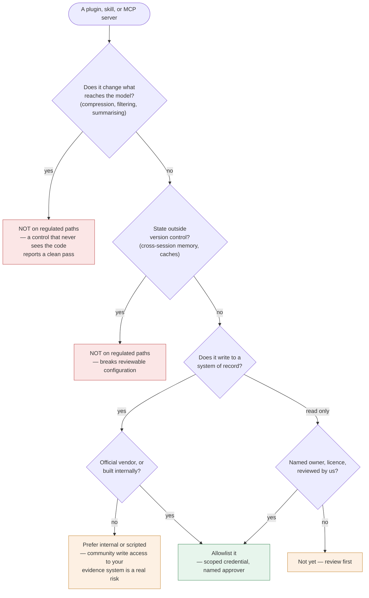

# Third-party tooling policy

The Claude Code ecosystem is large and moving fast. Some of it makes this framework
better. Some of it quietly disables the controls this framework exists to provide.

This document is how you tell the difference. It is opinionated on purpose — a policy
that says "evaluate case by case" is not a policy.

---

## The four questions

Ask these of any plugin, skill, or MCP server before it reaches an engineer's machine.
Any single "yes" in the wrong column means it does not belong on a regulated path.

**1. Who publishes it, and what happens when they stop?**

Official vendor plugins clear the bar by default. Community tooling is a supply-chain
dependency: it needs a named owner, a licence, a visible release cadence, and someone
here who has read what it actually does. "It has a lot of stars" is not a review.

**2. Does it read, or does it write?**

Reading is a modest risk — worst case, context leaks into a session. Writing to your
tracker, your test management system, or your source host means it can corrupt the
record your traceability chain and your evidence depend on. **Prefer official or
internally-built connectivity for anything that writes.** Scope every credential to the
minimum; never an admin token because it was easier to provision.

**3. Does it change what reaches the model?**

This is the question people forget, and it is the one that matters most here. Anything
that filters, compresses, summarises, or reorders context is making decisions about
what the agent sees — including, potentially, the code a compliance or security skill
was supposed to examine.

Two consequences:
- A control that never sees the relevant code reports a clean pass. That is worse than
  no control, because it produces false assurance.
- Behaviour stops being reproducible, which breaks the eval suite as an acceptance test
  for configuration changes. You can no longer tell whether a pass-rate drop came from
  a skill edit or from what got compressed away.

**4. Does it introduce state outside version control?**

Evidence Chain's core property is that everything steering the agent is version
controlled and reviewable. Persistent cross-session memory, local caches that influence
behaviour, and machine-local configuration all break that. They also create a
records-retention question that nobody will have answered.

---

## Standing decisions

### Recommended

**Official security tooling.** Anthropic ships `security-guidance` in the official
marketplace. It layers pattern warnings on file edits with an agentic review at commit
time that traces data flow across files to catch multi-file issues — insecure direct
object references, auth bypass, cross-file SSRF. Its own documentation is clear that
findings are suggestions and not a substitute for human review, SAST, dependency
scanning or penetration testing, which is exactly the posture this framework takes.

Use it, and **do not duplicate it**. `secure-api-review` in this repository deliberately
covers only what a generic scanner cannot know: your tenancy rules, your definition of a
regulated record, your audit-event requirements. Let the official plugin handle the
common vulnerability classes.

Two operational notes: it writes a local debug log, and it calls a model endpoint to
perform reviews. Both belong in your data-flow documentation and your retention policy.

**Document conversion.** Converting existing controlled documents — SOPs, validation
protocols, requirement specifications — into markdown is the missing first step of most
adoptions. See the `document-ingestion` skill.

**Up-to-date API documentation servers.** Read-only, no credentials, and they directly
reduce the hallucinated-API failure mode that `codebase-grounded-planning` exists to
prevent.

**Browser automation for exploration.** Useful for test authoring and reproducing
defects. Never for pipeline test runs — see `test-automation`.

**Diagrams as code.** Both Mermaid and code-rendered architecture diagrams. See the
`architecture-diagrams` skill for why this is a fit rather than a preference.

### Evaluate, but do not bundle

**Codebase mapping and knowledge-graph tools.** These overlap `codebase-cartographer`,
and may be better implementations. The cartographer is deliberately thin so it works
anywhere with no dependency. If a tool clearly wins in your environment, have the
cartographer call it when present rather than replacing the skill.

**General engineering skill libraries.** Frequently excellent, and the wrong thing to
bundle into a governance framework. They double the surface area and encode someone
else's opinions about code style into your control plane. Adopt them personally; keep
them out of the org-wide marketplace unless a specific one has earned it.

### Not on regulated paths

**Context compressors and output filters.** Question 3 above. Legitimate for exploratory
work on non-regulated code; never in a session where a compliance, security, or
validation skill is expected to reach a verdict.

**Persistent cross-session memory.** Question 4 above.

**Design and "taste" plugins.** These are built for greenfield work where aesthetic
judgement is the deliverable. `design-system-discovery` says extend the existing system
and justify any new component; a taste plugin says invent something better. That
argument is won locally and lost organisationally. If your product has an established
design system, these actively work against it.

**Anything installed by a copy-pasted one-liner.** `strictKnownMarketplaces`,
`allowManagedMcpServersOnly` and `disableSideloadFlags` exist precisely to prevent
this. If install one-liners appear in your rollout documentation, your managed settings
are decoration.

---

## Verify before you trust the instructions

Install commands and repository URLs circulate widely and go stale or wrong. Before any
of it enters a runbook:

- Confirm the package name resolves in the registry it claims to be in.
- Confirm the repository URL is a repository and not a directory listing or a registry
  index page.
- Confirm the install path matches current vendor documentation rather than a blog post.

A wrong install command in a governance document is the kind of small error that erodes
trust in everything around it.

---

## How to add something to the allowlist

1. Someone proposes it with a stated use case — not "this looks useful."
2. Answer the four questions in writing.
3. Security review for anything community-published that holds a credential.
4. Named approver, recorded date, recorded scope.
5. Add to the approved marketplace or the managed MCP allowlist. Individual engineers
   never add their own.
6. Re-review annually, or when the publisher changes hands.

Record the decision in `.evidence/context/toolchain.md` for repository-scoped tools, or
in your organisation's tooling register for anything global. A decision nobody wrote
down will be re-litigated every quarter.
