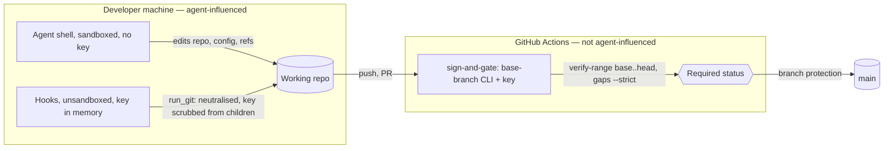

# Spec: Integrity-monitor, engine git and merge-gate hardening (security set)
Tracker: PILOT-58   From: intent/2026-09-24-integrity-monitor-hardening/intent.md
Risk tier: 3 — integrity monitor, audit log, git execution in unsandboxed hooks that hold the signing key, and the CI merge gate; policy floors `**/audit/**` and `.github/workflows/**`.

Any claim below not confirmed from a file, a command, or a named person is marked
inline as [NEEDS VERIFICATION]. An unmarked claim asserts that it was checked.

## Scope history
- **Revision 1** (REQ-IMH-01..18, ADR-0001) was rejected in security design review. The maintainer split the work:
  - PILOT-58: security;
  - PILOT-59: concurrency;
  - PILOT-60: usability, with ADR-0002 revised.
- **Revision 2** (local push-time range check, ADR-0003 first draft) was sent back by the second review. Local inputs (base ref, pushed refs, merges, git config) are agent-controlled.
- **Revision 3** (this one), the maintainer's decision:
  - the CI trusted gate is authoritative for what merges (ADR-0004);
  - local hooks get the contained hardening and an explicitly stated residual key exposure (ADR-0003 rev. 2);
  - key isolation is a later change (PILOT-61).

| Change | Scope | Tier |
| --- | --- | --- |
| **PILOT-58 (this spec)** | Contained local hardening + the CI authoritative merge gate | 3 |
| PILOT-59 | Concurrency: attested engine writes, signed lease, chained snapshots, background writes, pre/post pairing (review F12), hook-before-prompt | 3 |
| PILOT-60 | Usability: CI-owned results (ADR-0002 revised), YAML comments, spec-before-plan IDs, inverted temp-script rule, `-k` crash, re-approval history | 2 |
| PILOT-61 | Key isolation: a signer that never runs git (withdraws ADR-0003 §4) | 3 |

## Requirements
| ID | Requirement | Source (intent.md section) | Acceptance |
| --- | --- | --- | --- |
| REQ-IMH-01 | The monitor lists the control plane without following symlinks, restores through `state.write_file` and removes through a dir-fd `state.remove_file`. It never acts through a symlinked component or outside the repository. A symlink or non-regular entry at a control-plane path, including audit-log paths, is a violation, and so is a refused removal | F1 | Engine tests: `.evidence/violations/x -> <outside>`, `.evidence/changes/K -> <outside>`, a symlinked audit log → outside untouched, violation recorded |
| REQ-IMH-02 | A non-regular entry at a violations-record path is an open violation | F4 | Engine test: a directory at `.evidence/changes/K/violations.json` → push denied |
| REQ-IMH-05 | A change to the type, mode, owner or identity (`st_dev`, `st_ino`) of `.evidence`, `.evidence/audit`, `.evidence/changes` or `.evidence/violations` during a call is a violation | Directory globs | Engine test: `chmod 555` and a directory swap (rename + mkdir) → violation |
| REQ-IMH-06 | If a call's own PostToolUse audit entry cannot be written, an `audit-unwritable` violation is recorded, and the next call is denied | Own log | Engine test |
| REQ-IMH-07 | Deleting a file inside an untracked directory during a call is judged like any other delete | Untracked deletes | Engine test |
| REQ-IMH-08 | Snapshots are written through the safe writer, and read with O_NOFOLLOW, an fstat regular-file check and a size cap. A link, non-file or oversize snapshot is treated as altered, which is a violation. The docs say the protection is the snapshot's HMAC and `tool_use_id` binding, not the directory mode | Temp snapshots | Engine tests: a snapshot replaced by a symlink to a large file → violation, post completes |
| REQ-IMH-09 | Every engine git process runs through `state.run_git`, with command-executing configuration neutralised (ADR-0003 §1). The environment has `GIT_*` and `EVIDENCE_SIGNING_KEY` removed. Config is read with `-z --show-scope --show-origin --includes` and refused per ADR-0003 §2: any scope except `command`, exact key=value allow-list, no newline in allowed values | Hook git | Engine tests, each with a marker script that must never run: `core.fsmonitor`; `diff.<drv>.command` + `.gitattributes`; textconv; `info/attributes` + filter; `core.attributesFile`; `filter.lfs.clean = "git-lfs clean -- %f\n<cmd>"`; `include.path` / `includeIf` / `config.worktree` / `.git` file; submodule config with a filter; `GIT_CONFIG_PARAMETERS` / `GIT_EXTERNAL_DIFF` inherited. Also: a git child's environment has no `EVIDENCE_SIGNING_KEY` |
| REQ-IMH-23 | Git failure fails closed. A `git-unavailable` violation is recorded when the pre-snapshot saw a repository and git now fails; the control-plane restore and the audit-prefix check still run through the filesystem. A pre call with `.git` present but git failing is denied. `run_git` returning nothing never passes a security check | Review F5 | Engine test: `echo '[' >> .git/config` plus a control-plane deletion in one call → violation, file restored, next pre denied |
| REQ-IMH-24 | Every `gh` call the engine makes pins `--repo` to the policy `github_repo`, and runs with `GIT_*` and the key removed | Review F5b | Engine test with a fake `gh` that records its argv and environment |
| REQ-IMH-10 | PreToolUse denies commits with a pathspec, `--only`, `--include`, `-p`, `--patch`, `--interactive` or `--pathspec-from-file`, and `git commit` combined with index-changing git commands in one command. `GIT_INDEX_FILE`, `GIT_OBJECT_DIRECTORY` and `GIT_ALTERNATE_OBJECT_DIRECTORIES` are environment spoofing. This is early feedback; ADR-0004 is authoritative | Commit bypass | Engine tests per form |
| REQ-IMH-11 | `audit verify` treats a repeated entry hash as a break, and requires every entry's `session` to match its `<session>.jsonl` log (approval and clear logs excepted by name) | Fork rule | Engine tests |
| REQ-IMH-20 | Each audit log's snapshot records `(size, sha256 of those bytes)`, and after the call the old bytes must be an exact prefix. An audit log created during the call must verify | Audit integrity | Engine tests: a same-length rewrite, and a replacement by another session's log → violation |
| REQ-IMH-19 | `evidence verify-range --base --head --pr` implements ADR-0004 rev. 2 decisions 0–5. It fails closed on bad or empty SHAs, a missing or short key, a `None` verification, or no token. Policy, allow-lists and CODEOWNERS come from the base. The single change key comes from the head branch name, and every commit carries it and a trailer, with no author exception. The state is live and not released. Approval is an `APPROVED` GitHub review on the head SHA by a non-author CODEOWNER, with claims from the plan whose hash matches `approval.json`. It checks every commit (`-M --root`, `--cc`, net diff `base...head`) for A/M/D/T/R against the claims, and scans secrets in chunks with overlap and a cap. For audit logs: a log is required for each `Agent-Session`, logs at the base aren't deleted, and each log extends its version in every parent. For records: they verify, aren't deleted, the stage doesn't regress, and no open violation is dropped | Review F6–F11, third review N2–N9 | CLI fixture tests, each failing: evil merge; trailer-less `commit-tree` commit; a CODEOWNER-authored commit with no trailer; unclaimed deletion; a truncated audit log in a later commit; a session log omitted; a log that exists at the base deleted; a violations rollback; a state stage regression; a replayed old change key; no key; empty SHA; no approving review; a secret added then removed; `main` moved after the branch point with a clean branch → **pass** |
| REQ-IMH-21 | `.github/workflows/verify-range.yml` runs on `pull_request_target`. It checks out only the base, fetches `refs/pull/N/head` as objects, never executes PR code, runs the base CLI's `verify-range` with the event SHAs and PR number, and has `permissions: contents: read, pull-requests: read`. On `push` to `main` it reports over `before..after` without blocking | Third review N1, N9, N10 | Content test: the workflow exists with `pull_request_target`, has no `actions/checkout` of the head ref, no `continue-on-error`, no `\|\| true`, and has the permissions block and an event condition on each job |
| REQ-IMH-22 | No engine module starts a subprocess except through the approved helpers (`run_git`, `run_gh`, and the named test/sensor runners) | ADR-0003 constraint | Engine test: an AST scan of `plugins/evidence-sdlc/scripts/engine/*.py` |
| REQ-IMH-18 | Docs, governance, HANDOFF and the CHANGELOG Known issues match the shipped behaviour. They state that the local push gate is advisory, that `sign-and-gate` is authoritative, and the ADR-0003 §4 residual risk. Items moved to PILOT-59/60/61 stay listed as known | Compliance evidence | Content test |

## Design
Components reused: `state.write_file` / `_dir_fd`, `signing`, `integrity.snapshot/check` (snapshot-restore kept), `evidence_policy._check_commit`, the policy key `deny_git_config_keys`, `secretscan`, `st.plan_claims` / `claim_matches`, `audit_verify`, and the CLI dispatcher `bin/evidence` (new subcommand `verify-range` in `scripts/engine/lifecycle.py`, registered next to `audit`).

- **REQ-IMH-01, 02, 05, 07, 08, 20** (`integrity.py`, `state.py`):
  - `os.walk(followlinks=False)` with `lstat`, and the new `remove_file`.
  - The `_read_violations` `lstat` check.
  - `_extras` records `(S_IFMT, mode, uid, dev, ino)` for the four directories.
  - Porcelain status is kept per dirty entry.
  - `_snap_path` writes through `write_file`; `check()` reads through an O_NOFOLLOW + fstat + 4 MiB-cap reader.
  - Audit snapshot values become `{size, sha256}`.
- **REQ-IMH-06** (`hook.run_post`): a strict audit call; on failure, `record_violations(branch, audit-unwritable)`.
- **REQ-IMH-09, 22, 24** (`state.py`: `run_git`, `run_gh`, `check_git_config`, `_child_env()`):
  - Every existing `subprocess.run(["git", …])` in `integrity.py` and `evidence_policy.py`, and `_gh` in `lifecycle.py`, moves to the helpers.
  - The deny set is the policy `deny_git_config_keys` ∪ `filter.*`, `diff.*.command`, `diff.*.textconv`, `merge.*.driver`, `core.askPass`, `core.gitProxy`, `core.sshCommand`, `core.worktree`, `core.attributesFile`, `gpg.*program`, `ssh.variant`, `remote.*.uploadpack`, `remote.*.receivepack`, `uploadpack.*`, `*tool.*.cmd`, `interactive.diffFilter`, `pager.*`, `url.*.insteadOf`, `submodule.*.update`.
  - The policy's own list and this union are reconciled in `default-policy.json`, with `include.path`/`includeIf` still denied.
- **REQ-IMH-23** (`integrity.snapshot/check`, `hook.run_pre`): the snapshot records `is_git` and `git_dir` identity; the rules are as in the requirement.
- **REQ-IMH-10** (`evidence_policy`): the flag and one-command denials, and the spoof list.
- **REQ-IMH-11** (`state.audit_verify`): the seen-hash set and the session check.
- **REQ-IMH-19, ADR-0004 rev. 2** (new `lifecycle.cmd_verify_range`). This bullet list gives the plumbing. The rules are in the REQ-IMH-19 row; where an item below conflicts with them, the row wins (base...head, `-M`, no author exception, GitHub review approval).
  - Policy comes from `git show <base>:plugins/evidence-sdlc/policy/default-policy.json`, plus the org policy; CODEOWNERS from `git show <base>:.github/CODEOWNERS`.
  - Reviews come from the GitHub API `pulls/{n}/reviews` using the job token.
  - Pure git plumbing through `run_git`: `rev-list base..head`, then `diff-tree -r --root --name-status` for each commit, plus `--cc --name-status` for merges and `diff --name-status base head`.
  - Messages come from `log --format=%H%x00%B%x00`. Authorship comes from `gh api repos/{repo}/pulls/{n}/commits` for the human-CODEOWNER exception; if `gh` is unavailable, every commit needs the trailer.
  - Blobs are read with `cat-file --batch`, scanned in 1 MiB chunks, with a 20 MiB cap per blob unless allow-listed.
  - Audit logs: each committed version (`log --format=%H -- <path>`) is checked as a prefix of the next, and the head version runs through `audit_verify`.
  - Change records at the head are verified with `signing.verify`.
- **REQ-IMH-21** (new `.github/workflows/verify-range.yml`, written by the human because it's change-controlled):
  - `on: pull_request_target` (opened, synchronize, reopened) and `push` (main);
  - job `verify-range`: `actions/checkout` of `github.event.pull_request.base.sha` (the default for this event is the base, stated explicitly), then `git fetch origin refs/pull/${{ github.event.pull_request.number }}/head`, then `python3 plugins/evidence-sdlc/bin/evidence verify-range --base … --head … --pr …`, with `EVIDENCE_SIGNING_KEY` and `GH_TOKEN` in the step environment only.
  - The PR's code is never checked out or executed.
  - `ci.yml` is not changed.
- **REQ-IMH-18:** docs and governance.

## Regulatory control impact
`.evidence/context/compliance.md` establishes no applicable framework for this repository (all `[ASK]`), so no control set is loaded.

| Framework | Control ID | Applies? | How it is satisfied | Evidence |
| --- | --- | --- | --- | --- |
| none established | — | N/A | compliance.md lists none; awaiting maintainer | `.evidence/context/compliance.md:36` |

For adopters, the rows in `governance/control-mapping.md` for SOC 2 CC8.1, ISO 27001 A.8.32 and NIST SSDF PW.4 now rest on the CI trusted gate (ADR-0004), not on local hooks. REQ-IMH-18 rewrites them to say so.

## Evidence impact
- New rows: REQ-IMH-01, 02, 05–11, 18–24.
- Moved and not defined here: REQ-IMH-03, 04, 12–17.
- Existing REQ-V2G-09 (control plane), REQ-V2A-02 (audit) and REQ-V2G-07/12 (commit) tests must still pass, or be listed in the PR with the reason.
- The change-control claim moves from "the local gate enforces" to "the CI trusted gate enforces; the local gate gives early feedback". This is a re-verification item for adopters, and the CHANGELOG says so.

## Diagrams
- Component / trust boundaries:

## Security design
- **Authority:** CI's trusted gate decides what merges (ADR-0004). The local hooks are early feedback, and the docs say they are bypassable by a determined agent.
- **Local exposure:** reduced, with one helper, neutralisation, the key scrubbed from children, and fail-closed on git failure. The remaining race is **accepted and stated** (ADR-0003 §4). The structural fix is PILOT-61.
- **Kept behaviour:** snapshot-restore of control-plane files. Its concurrency side effects fail closed, since a restore always records a violation (second review Q4).
- **Required review agents** (per `evidence change status PILOT-58`): verifier, security-reviewer, code-reviewer, run one at a time.

## UX
| State / concern | Behaviour |
| --- | --- |
| Error | Local refusals name the key, scope and allow path. A CI `verify-range` failure names the commit, path or entry, and the rule |
| Success | No new local output. CI shows one extra step |
| Edge cases (long values, zero, maximum, unusual input) | Oversize blobs fail unless allow-listed. Without `gh` in CI, every commit needs a trailer |

Component reuse: N/A — no UI.

## Areas of concern
- **Local credential helpers, custom filters and diff drivers** are refused unless allow-listed (exact values). Owner: maintainer — accept at approval.
- **Workflows are change-controlled.** The human writes `.github/workflows/verify-range.yml` from the spec's design. Owner actions after merge:
  - make `verify-range` a **required status check** on `main`;
  - confirm **"Require review from Code Owners"** is on. Code-owner review of `.github/**` is what protects the gate's own definition.

  Owner: maintainer.
- **Fork and Dependabot PRs** fail `verify-range` (no secrets). They merge only through a maintainer re-opening them from a branch in this repository. Owner: maintainer — accept.
- **PILOT-58's own PR isn't gated by `verify-range`,** because `pull_request_target` uses `main`'s workflows, which don't have it yet. It's enforced from the next PR. MAN-IMH-01 checks it live.
- **`enforce_admins=false`** lets admins merge without `sign-and-gate`, which is how PRs #1 and #2 merged. The authoritative gate is only authoritative if admins don't bypass it. Owner: maintainer — consider `enforce_admins=true` once a second reviewer exists.
- **Minimum git in CI:** `ubuntu-latest` [NEEDS VERIFICATION: version ≥ 2.36 for `--remerge-diff`, which is not required because `--cc` is used].

## Architecture decisions
| ADR | Created / Supersedes / Relies on | Status |
| --- | --- | --- |
| `.evidence/decisions/0003-hook-git-is-neutralised-and-commits-are-validated-at-push.md` | Created (revision 2: local hardening + residual risk) | Proposed |
| `.evidence/decisions/0004-ci-trusted-gate-is-authoritative-for-merged-history.md` | Created | Proposed |
| `.evidence/decisions/0001-signed-records-are-validated-not-restored.md` | Rejected; the problem moves to PILOT-59 | Rejected |
| `.evidence/decisions/0002-ci-owns-test-results.md` | Deferred to PILOT-60 | Proposed |

## Rejected alternatives
- **A local push-time range check.** Its inputs are agent-writable (second review F6–F9); replaced by ADR-0004.
- **Keep patching local git execution until closed.** Two reviews show it doesn't converge while the key is in-process. Bounded by ADR-0003 §4 and PILOT-61.
- **See also the ADR alternatives tables.**
