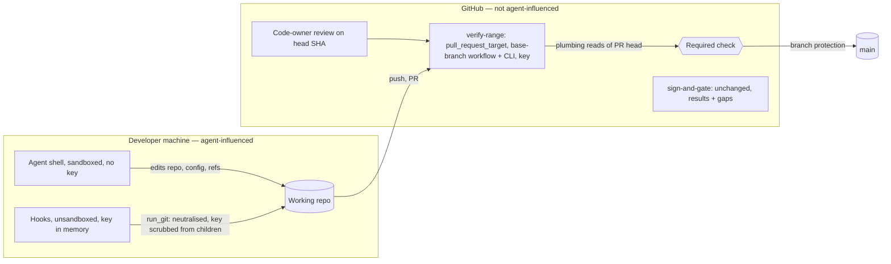

# Spec: Integrity-monitor, engine git and merge-gate hardening (security set)
Tracker: PILOT-58   From: intent/2026-09-24-integrity-monitor-hardening/intent.md
Risk tier: 3 — integrity monitor, audit log, git execution in unsandboxed hooks that hold the signing key, and the merge gate; policy floors `**/audit/**` and `.github/workflows/**`.

Any claim below not confirmed from a file, a command, or a named person is marked
inline as [NEEDS VERIFICATION]. An unmarked claim asserts that it was checked.

## Scope history
- **Revision 1** (REQ-IMH-01..18, ADR-0001) was rejected in security design review. The maintainer split the work into PILOT-58/59/60.
- **Revision 2** (local push-time range check) was sent back by the second review, because local inputs are agent-controlled.
- **Revision 3** was the maintainer's decision: a server-side authoritative gate (ADR-0004), and local hardening with a stated residual risk (ADR-0003).
- **Revision 3.1** applied the third review's fixes. The gate became a base-branch `pull_request_target` workflow, with approval from GitHub code-owner review.
- **Revision 3.2** (this one) applies the code-review consistency and feasibility findings:
  - re-run after approval;
  - merge and human commits;
  - full-depth fetch and injection-safe event data;
  - `github_repo` source;
  - an exact subprocess allow-list;
  - `.evidence/**` rules;
  - push mode;
  - the fixture list.

| Change | Scope | Tier |
| --- | --- | --- |
| **PILOT-58 (this spec)** | Contained local hardening + the authoritative `verify-range` merge gate | 3 |
| PILOT-59 | Concurrency: attested engine writes, signed lease, chained snapshots, background writes, pre/post pairing, hook-before-prompt | 3 |
| PILOT-60 | Usability: CI-owned results (ADR-0002 revised), YAML comments, spec-before-plan IDs, inverted temp-script rule, `-k` crash, re-approval history | 2 |
| PILOT-61 | Key isolation: a signer that never runs git or exposes the key in its environment (withdraws ADR-0003 §4) | 3 |

## Requirements
| ID | Requirement | Source (intent.md section) | Acceptance |
| --- | --- | --- | --- |
| REQ-IMH-01 | The monitor lists the control plane without following symlinks, restores through `state.write_file` and removes through a dir-fd `state.remove_file`. It never acts through a symlinked component or outside the repository. A symlink or non-regular entry at a control-plane path, including audit logs, is a violation, and so is a refused removal | F1 | Engine tests: `.evidence/violations/x -> <outside>`, `.evidence/changes/K -> <outside>`, a symlinked audit log → outside untouched, violation recorded |
| REQ-IMH-02 | A non-regular entry at a violations-record path is an open violation | F4 | Engine test: a directory at `.evidence/changes/K/violations.json` → push denied |
| REQ-IMH-05 | A change to the type, mode, owner or identity (`st_dev`, `st_ino`) of `.evidence`, `.evidence/audit`, `.evidence/changes` or `.evidence/violations` during a call is a violation | Directory globs | Engine tests: `chmod 555`, a directory swap → violation |
| REQ-IMH-06 | If a call's own PostToolUse audit entry cannot be written, an `audit-unwritable` violation is recorded, and the next call is denied | Own log | Engine test |
| REQ-IMH-07 | Deleting a file inside an untracked directory during a call is judged like any other delete | Untracked deletes | Engine test |
| REQ-IMH-08 | Snapshots are written through the safe writer, and read with O_NOFOLLOW, an fstat regular-file check and a 4 MiB cap. A link, non-file or oversize snapshot is treated as altered, which is a violation. The docs state the protection is the snapshot HMAC and `tool_use_id` binding | Temp snapshots | Engine test: a snapshot replaced by a symlink to a large file → violation, post completes |
| REQ-IMH-09 | Every engine git process runs through `state.run_git` with command-executing configuration neutralised (ADR-0003 §1), and an environment with `GIT_*` and `EVIDENCE_SIGNING_KEY` removed. Config is read with `-z --show-scope --show-origin --includes`. Keys in the deny set are refused at every scope except `command`; the exception is `credential.*` at global or system scope. An exact key=value in the allow-list passes if its value has no newline or CR | Hook git | Engine tests, each with a marker script that must never run: `core.fsmonitor`; `diff.<drv>.command` + `.gitattributes`; textconv; `info/attributes` filter; `core.attributesFile`; `filter.lfs.clean = "git-lfs clean -- %f\n<cmd>"`; `include.path` / `includeIf` / `config.worktree` / `.git` file; submodule filter; an inherited `GIT_CONFIG_PARAMETERS` / `GIT_EXTERNAL_DIFF`. Also: a git child has no key in its environment; a global `credential.helper` is accepted and a local one refused |
| REQ-IMH-23 | Git failure fails closed. A `git-unavailable` violation is recorded when the pre-snapshot saw a repository and git now fails; the control-plane restore and the audit-prefix check still run through the filesystem. A pre call with `.git` present but git failing is denied. `run_git` returning nothing never passes a security check | Review F5 | Engine test: `echo '[' >> .git/config` plus a control-plane deletion → violation, file restored, next pre denied |
| REQ-IMH-24 | Every `gh` call pins `--repo`. Locally that is the policy `github_repo`, and an empty value means the call is refused, never `gh repo view`. In CI it is `$GITHUB_REPOSITORY`. `gh` runs with `GIT_*` and the key removed | Review F5b, code review | Engine test with a fake `gh` that records argv and environment; empty `github_repo` → refused |
| REQ-IMH-10 | PreToolUse denies commits with a pathspec, `--only`, `--include`, `-p`, `--patch`, `--interactive` or `--pathspec-from-file`, and `git commit` combined with index-changing git commands in one command. `GIT_INDEX_FILE`, `GIT_OBJECT_DIRECTORY` and `GIT_ALTERNATE_OBJECT_DIRECTORIES` are environment spoofing. This is early feedback; the merge gate is authoritative | Commit bypass | Engine tests per form |
| REQ-IMH-11 | `audit verify` treats a repeated entry hash as a break, and requires every entry's `session` to match its `<session>.jsonl` log (approval and clear logs excepted by name) | Fork rule | Engine tests |
| REQ-IMH-20 | Each audit log's snapshot records `(size, sha256 of those bytes)`; after the call the old bytes must be an exact prefix. An audit log created during the call must verify | Audit integrity | Engine tests: a same-length rewrite, and a replacement by another session's log → violation |
| REQ-IMH-19 | `evidence verify-range` implements ADR-0004 rules 0–6 (PR mode) and the push report mode (rule 7) | Reviews F6–F11, N1–N10; code review | CLI fixture tests with the GitHub API stubbed. **Each of these fails:** • **rule 0:** empty SHA, non-hex SHA, no key, key under 32 characters, `verify` returns `None`, no token, fetched head ≠ event head; • **rule 1:** head branch with no key or two keys, a replayed old key, a change released at the base, a commit without the key, a commit with neither trailer, a review on a stale SHA, approval only by the PR author, approval by a non-owner of a changed path, a team owner, plan hash ≠ `approval.json`; • **rule 2:** evil merge, unclaimed A/M/D/T/R; • **rule 3:** secret added then removed, oversize blob not on the allow-list; • **rule 4:** truncated audit log in a later commit, session log omitted, a log that exists at the base deleted or type-changed; • **rule 5:** violations rollback, a violation closed without a signed clear, state regression, another change's record edited other than by release or clear. **These pass:** a clean branch after `main` moved; a branch with a clean "Update branch" merge of `main`; a human commit with a `Human-Commit:` trailer and the key. **Push mode:** it reports and never blocks, and all-zero `before` → skipped with a note |
| REQ-IMH-21 | `.github/workflows/verify-range.yml` (a human-authored, change-controlled file) runs on `pull_request_target` (opened, synchronize, reopened), on `workflow_dispatch` with a PR number (the re-run after approval), and on `push` to `main` (report mode). It checks out only the base, with `fetch-depth: 0` and `persist-credentials: false`, fetches `refs/pull/N/head` in full and checks it equals the event head. It never checks out or executes PR code. Event data reaches the CLI only through `env:` or `$GITHUB_EVENT_PATH`, never `${{ … }}` inside `run:`. Permissions: `contents: read, pull-requests: read` | Third review N1, N9, N10; code review | Content test: `pull_request_target` present; no checkout of a head ref; `fetch-depth: 0`, `persist-credentials: false`; no `continue-on-error`, no `\|\| true`; no `${{ github.event.pull_request.(head.ref\|title\|body)` in any `run:`; the permissions block; event conditions per job |
| REQ-IMH-22 | Engine subprocesses start only through `run_git`, `run_gh`, the `ps` probe (`lifecycle.py`, process-name lookup) and the release-verify command (`evidence_policy.py`), and the last two also run with `_child_env()` | ADR-0003 constraint; code review | Engine test: an AST scan of `plugins/evidence-sdlc/scripts/engine/*.py` lists every `subprocess.*` / `os.system` / `os.popen` call site and matches the allow-list exactly; release verify runs without the key in its environment |
| REQ-IMH-18 | Docs, governance, HANDOFF and the CHANGELOG Known issues match the shipped behaviour. They say: • the local push gate is advisory; • the `verify-range` `pull_request_target` job is authoritative and `sign-and-gate` is unchanged; • the ADR-0003 §4 residual risk; • the owner actions (required check, code-owner review, re-run after approval, fork PRs); • the items moved to PILOT-59/60/61 | Compliance evidence | Content test |

## Design
Components reused: `state.write_file` / `_dir_fd`, `signing`, `integrity.snapshot/check` (snapshot-restore kept), `evidence_policy._check_commit`, the policy key `deny_git_config_keys`, `secretscan`, `st.plan_claims` / `claim_matches`, `audit_verify`, and the CLI dispatcher `bin/evidence` (new subcommand `verify-range` in `scripts/engine/lifecycle.py`).

- **REQ-IMH-01, 02, 05, 07, 08, 20** (`integrity.py`, `state.py`):
  - `os.walk(followlinks=False)` with `lstat`, and `remove_file`;
  - the `_read_violations` `lstat` check;
  - `_extras` records `(S_IFMT, mode, uid, dev, ino)` for the four directories;
  - porcelain status kept per dirty entry;
  - the snapshot safe write, and a capped O_NOFOLLOW read;
  - audit snapshot values become `{size, sha256}`.
- **REQ-IMH-06** (`hook.run_post`): a strict audit call; on failure, `record_violations(branch, audit-unwritable)`.
- **REQ-IMH-09, 22, 24** (`state.py`: `run_git`, `run_gh`, `check_git_config`, `_child_env()`):
  - Existing git subprocess calls in `integrity.py` (5) and `evidence_policy.py`, and `_gh` in `lifecycle.py`, move to the helpers.
  - The `ps` probe and the release-verify command get `env=_child_env()`.
  - The deny set is the policy `deny_git_config_keys` ∪ `filter.*`, `diff.*.command`, `diff.*.textconv`, `merge.*.driver`, `core.askPass`, `core.gitProxy`, `core.sshCommand`, `core.worktree`, `core.attributesFile`, `gpg.*program`, `ssh.variant`, `remote.*.uploadpack`, `remote.*.receivepack`, `uploadpack.*`, `*tool.*.cmd`, `interactive.diffFilter`, `pager.*`, `url.*.insteadOf`, `submodule.*.update`. It is reconciled in `default-policy.json`.
  - An empty `github_repo` makes `run_gh` refuse locally.
- **REQ-IMH-23** (`integrity.snapshot/check`, `hook.run_pre`): the snapshot records `is_git` and git-dir identity; the rules are as in the requirement.
- **REQ-IMH-10** (`evidence_policy`): the flag and one-command denials, and the spoof list.
- **REQ-IMH-11** (`state.audit_verify`): the seen-hash set and the session check.
- **REQ-IMH-19** (`lifecycle.cmd_verify_range`, per ADR-0004 rev. 2). Plumbing only, all through `run_git`:
  - `rev-list base..head`;
  - `diff-tree -r -M --root --name-status <c>` per commit, plus `diff-tree --cc -M --name-status <merge>`;
  - net `diff -M --name-status base...head`;
  - messages via `log --format=%H%x00%B%x00`;
  - blobs via `cat-file --batch` in 1 MiB chunks with a 4 KiB overlap and a per-blob cap (org policy);
  - audit logs per commit via `show <c>:<path>` against each parent;
  - records via `show <c>:<path>` and `signing.verify`.

  Policy, allow-lists and CODEOWNERS come from `show <base>:…` plus the org policy, never from the head. Reviews come from `gh api repos/$GITHUB_REPOSITORY/pulls/<n>/reviews` through `run_gh`. The change key and PR number are read from `$GITHUB_EVENT_PATH`, not from arguments built by `${{ }}` interpolation.
- **REQ-IMH-21** (new `.github/workflows/verify-range.yml`, written by the human). One job, `verify-range`:
  - `actions/checkout` with `ref: ${{ github.event.pull_request.base.sha || github.sha }}` (a `with:` input, not `run:`), `fetch-depth: 0`, `persist-credentials: false`;
  - a step that fetches `refs/pull/$PR/head` with `PR` from `env:`, and checks `git rev-parse FETCH_HEAD` equals `$HEAD_SHA` from `env:`;
  - `python3 plugins/evidence-sdlc/bin/evidence verify-range` (reads `$GITHUB_EVENT_PATH`), with `EVIDENCE_SIGNING_KEY` and `GH_TOKEN` in that step's `env:` only;
  - `on: workflow_dispatch` with input `pr` re-runs the check for that PR's current head after a review. The owner runs it, or re-runs the failed job from the PR's checks. It's the same base-branch workflow;
  - on `push` to `main`, `--push-report` runs over `before..after`.

## Regulatory control impact
`.evidence/context/compliance.md` establishes no applicable framework for this repository (all `[ASK]`), so no control set is loaded.

| Framework | Control ID | Applies? | How it is satisfied | Evidence |
| --- | --- | --- | --- | --- |
| none established | — | N/A | compliance.md lists none; awaiting maintainer | `.evidence/context/compliance.md:36` |

For adopters, the rows in `governance/control-mapping.md` for SOC 2 CC8.1, ISO 27001 A.8.32 and NIST SSDF PW.4 now rest on the base-branch `verify-range` gate plus GitHub code-owner review (ADR-0004), not on local hooks. REQ-IMH-18 rewrites them.

## Evidence impact
- New rows: REQ-IMH-01, 02, 05–11, 18–24.
- Moved and not defined here: REQ-IMH-03, 04, 12–17.
- Existing REQ-V2G-09, REQ-V2A-02 and REQ-V2G-07/12 tests must still pass, or be listed in the PR with the reason.
- The change-control claim moves from local enforcement to the base-branch gate plus code-owner review, which is a re-verification item for adopters.

## Diagrams
- Component / trust boundaries:

## Security design
- **Authority:** the `verify-range` `pull_request_target` job, from the base branch's workflow, plus GitHub code-owner review (ADR-0004). The local hooks are early feedback, and the docs say they are bypassable by a determined agent.
- **Injection:** attacker-controlled event fields (head ref, title, body) never appear inside `run:`. The CLI reads them from the event file as data.
- **Local exposure:** reduced, and the remainder is stated (ADR-0003 §4). The structural fix is PILOT-61.
- **Kept behaviour:** snapshot-restore of control-plane files. Its concurrency side effects fail closed.
- **Required review agents:** verifier, security-reviewer, code-reviewer, run one at a time.

## UX
| State / concern | Behaviour |
| --- | --- |
| Error | Local refusals name the key, scope and allow path. A `verify-range` failure names the commit, path or entry, and the rule |
| Success | No new local output. The PR shows one extra required check, `verify-range` |
| Re-run after approval | `pull_request_target` doesn't fire on reviews. After approving, the owner re-runs the `verify-range` job from the PR's checks, or dispatches it with the PR number. The PR template and docs say so |
| Edge cases (long values, zero, maximum, unusual input) | Oversize blobs fail unless allow-listed. No token or no `gh` → fail. Fork and Dependabot PRs → fail (no secrets) |

Component reuse: N/A — no UI.

## Areas of concern
- **Local credential helpers, custom filters and diff drivers** are refused unless allow-listed (exact values; `credential.*` is allowed at global or system scope). Owner: maintainer — accept at approval.
- **Workflows are change-controlled.** The human writes `verify-range.yml` from this design. Owner actions after merge:
  - make `verify-range` a required check;
  - confirm "Require review from Code Owners";
  - re-run the check after approving.
- **`enforce_admins=false`** lets admins merge without the check. The push-report mode records it after the fact. Owner: maintainer.
- **Fork and Dependabot PRs** fail the gate. A maintainer re-opens them from a branch in this repository. Owner: maintainer — accept.
- **PILOT-58's own PR isn't gated by `verify-range`** (not yet on `main`). MAN-IMH-01 checks the next PR live.

## Architecture decisions
| ADR | Created / Supersedes / Relies on | Status |
| --- | --- | --- |
| `.evidence/decisions/0003-hook-git-is-neutralised.md` | Created (local hardening + residual risk) | Proposed |
| `.evidence/decisions/0004-ci-trusted-gate-is-authoritative-for-merged-history.md` | Created (rev. 2: `pull_request_target`, GitHub approval; N-ID trace table) | Proposed |
| `.evidence/decisions/0001-signed-records-are-validated-not-restored.md` | Rejected; the problem moves to PILOT-59 | Rejected |
| `.evidence/decisions/0002-ci-owns-test-results.md` | Deferred to PILOT-60 | Proposed |

## Rejected alternatives
- **A local push-time range check.** Its inputs are agent-writable (second review F6–F9).
- **A `verify-range` step in `ci.yml` `sign-and-gate`.** The PR's own workflow file runs on `pull_request` (third review N1).
- **An exception for commits authored by a CODEOWNER.** The author identity follows the commit's email (third review N2). Human commits use an explicit `Human-Commit:` trailer, and the approving review on the head SHA covers the whole PR.
- **See also the ADR alternatives tables.**
