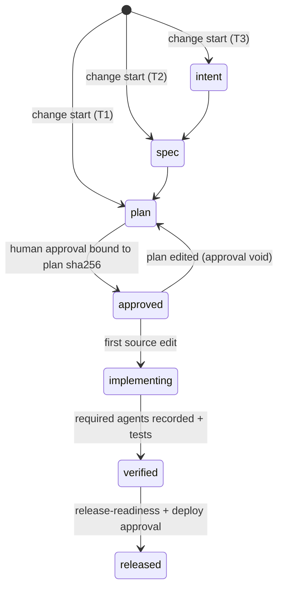

# Spec: v2 enterprise hardening
Tracker: PILOT-53   From: intent/2026-09-24-v2-enterprise-hardening/intent.md   Risk tier: 3

Risk classification: Tier 3. This change rewrites the framework's own gates, which
`risk-tiering` classifies as Tier 3 without exception.

Any claim below not confirmed from a file, a command, or a named person is marked
inline as [NEEDS VERIFICATION]. An unmarked claim asserts that it was checked.

Each requirement cites the v1 audit finding it closes (v1 section numbers).

## Requirements

### Gate engine (v1 §6, §10.1)
| ID | Requirement | v1 finding | Acceptance |
| --- | --- | --- | --- |
| REQ-V2G-01 | One Python policy engine (`evidence_policy.py`, stdlib only) evaluates every PreToolUse decision; hooks are thin wrappers. It fails closed if Python is missing or the input is malformed. | fail-open on malformed JSON; jq hard dependency | Regression: `not json` → deny; missing python3 → deny. |
| REQ-V2G-02 | Source writes made through Bash are detected and held to the same rules as Edit/Write: redirections, `tee`, `sed -i`, `cp`/`mv`/`install`/`dd`/`truncate`, `rm` of source, `git apply`/`checkout -- path`, `patch`, and interpreters with inline code. Inline interpreter code that writes files cannot be analysed reliably, so it is denied outright during a gated state. | Bash bypasses the plan, test and validated-path gates | Regression: each v1 Bash probe → deny without a plan. |
| REQ-V2G-03 | Paths are normalised to repo-relative form (realpath, `..` resolved) before matching. Exemptions are anchored repo-relative prefixes. There are no blanket `*.json`/`*.yml`/`.claude/*` exemptions. | absolute `/tmp/`, `/docs/`, traversal exemptions | Regression: `/…/tmp/repo/src/a.py` and `src/docs/../a.py` → deny. |
| REQ-V2G-04 | Source edits require an **active change** for the current branch's tracker key: a state file `.evidence/changes/<KEY>/state.json` whose plan artifact exists, is not a stub, matches its recorded hash, and has a valid approval (REQ-V2A-01). A plan from another change never unlocks edits. | any plan unlocks | Regression: stale, empty, other-key and `node_modules` plans → deny. |
| REQ-V2G-05 | The push gate parses the push refspecs and denies any push whose **target** is protected, from any branch. This covers `HEAD:main`, `+x:main`, `refs/heads/main`, `--delete`, `--mirror`, `--all`, force pushes to protected targets, and `git -C`/`-c`/`env`/`command`/absolute-path git. `gh pr merge --admin` and `gh api … /merge` are denied. | push gate checks the local branch | Regression: every v1 push probe → deny. |
| REQ-V2G-06 | The production gate detects deploy invocations by command position using a policy list (kubectl, helm, terraform, pulumi, cdk, serverless, gcloud/aws/az deploy verbs, `deploy*` scripts, `gh workflow run`) and matches target environments case-insensitively. Text inside grep, echo or cat arguments never triggers it. | word list; false positives; kubectl/terraform/helm ungated | Regression: v1 probes; `grep -rn production` → allow. |
| REQ-V2G-07 | Commit gate: the key must be in the commit **message**. It is parsed from `-m`/`-F`/`--message`, or from HEAD for `--amend --no-edit`, and must match the configured pattern. Denylisted non-keys (UTF-8, SHA-256, ISO-…, RFC-…) are rejected. It works with `git -c … commit` and `git -C … commit`. A key in the branch name alone is not enough. | UTF-8/SHA-256 accepted; branch-only; `git -c` evades | Regression. |
| REQ-V2G-08 | Change-controlled paths come from policy: case-insensitive globs whose defaults include `migrations`, `db/migrate`, `.github/workflows`, infra/terraform/helm/k8s, `*.tf`/`*.tfvars`, `prisma/schema.prisma`, and audit/signing/crypto/validation. Editing one requires a change ticket that matches the configured pattern. | narrow, case-sensitive; any string accepted | Regression. |
| REQ-V2G-09 | **Control-plane protection.** An agent can never write `.claude/settings*.json`, `.evidence/policy.json`, `.evidence/changes/*/approval.json`, managed-settings files, or plugin hook/scripts directories. Humans edit them outside the agent. | agent can edit settings and set bypass vars | Regression. |
| REQ-V2G-10 | Test-weakening protection switches on from state rather than an env var. While a change of kind `fix` is past `failing-test`, any test file that existed at the fix-base commit cannot be edited or deleted (new test files are allowed). Test patterns cover `test/`, `tests/`, `spec/`, `__tests__`, `*_spec.*`, `*Test.java`, `*.cy.*`, snapshots, and test-runner configs. | FIX_TASK unusable; narrow patterns | Regression. |
| REQ-V2G-11 | The hook `if` filters are removed. Every Bash call goes through the engine, which parses the command with `shlex`, splits on control operators, and strips wrappers (env assignments, `env`, `command`, `sudo`, `nice`, `time`, `bash -c` recursion). | `if` pre-filter let variants through | Regression. |
| REQ-V2G-12 | Monorepo scoping: when `enforce_claims` is on (default on), a source edit outside the active plan's "Files claimed" globs is denied. | one plan unlocks the whole monorepo | Regression. |

### Lifecycle state, approval, attribution, audit (v1 §3 workflow engine, §7, §10.2–4)
| ID | Requirement | v1 finding | Acceptance |
| --- | --- | --- | --- |
| REQ-V2S-01 | `evidence change start <KEY> --tier N --kind feature\|fix\|chore` creates the state file. Stages are `intent → spec → plan → approved → implementing → verified → released`. Tier minimums: T1 needs a plan; T2 needs spec + plan; T3 needs intent + spec + plan. | stateless workflow; stages skipped | CLI tests. |
| REQ-V2S-02 | **Tier floors from policy.** Globs such as `**/auth/**` and `**/migrations/**` set a minimum tier. An edit to a path whose floor is above the change's recorded tier is denied until the tier is raised by a human. | tier self-classified | Regression. |
| REQ-V2S-03 | Tier-3 changes: edits are denied when the session's `permission_mode` is `bypassPermissions`, `acceptEdits`, `dontAsk` or `auto` (the "no auto-accept" rule). | Tier 3 auto-accept not enforced | Regression (skipped with a note if the field is absent). |
| REQ-V2S-04 | Push and PR creation for a Tier ≥ 2 change require recorded runs of the required review agents (`security-reviewer` at T2+, `verifier` always, `code-reviewer` at T3). Runs are recorded by a SubagentStop hook in the hash-chained audit log. Required artifacts for the tier must also exist. | review agents never ran | Regression + scenario rerun. |
| REQ-V2A-01 | Approval is a record written only by a human path, and it binds to the plan's sha256. Paths: `/evidence:approve` (a command-expansion shell step the model cannot invoke), the human's terminal, or `github` mode (verified via `gh api` for an approving review or `/approve-plan <sha>` comment by an allowed user). The agent is denied from running the approve CLI and from writing approval files. Editing the plan after approval invalidates the approval. | self-approval observed live | Regression + scenario rerun. |
| REQ-V2A-02 | The audit log is a hash-chained JSONL at `.evidence/audit/<session>.jsonl`. Each entry records ts, session, user, tool, path or command, the engine's decision and reason, agent type/id when present, and `prev`/`hash`. Bash calls are logged too. `evidence audit verify` detects tampering. | mutable TSV, no tool, verdict or agent | CLI test with a tampered line. |
| REQ-V2A-03 | Commits need an `Agent-Session: <session_id>` trailer that matches the committing session (attribution). Humans committing outside an agent are unaffected because the hook does not run for them. | "which agent changed it?" unanswerable | Regression. |
| REQ-V2A-04 | The OTel env block is shipped in managed-settings with documented collector variables, and `records-retention.md` points to what is actually configured. | OTel referenced but not configured | Doc review. |

### Security (v1 §6)
| ID | Requirement | v1 finding | Acceptance |
| --- | --- | --- | --- |
| REQ-V2K-01 | A secret scanner runs on Write/Edit/MultiEdit content, on Bash command text, and on the staged diff at `git commit`. It covers AWS, GCP, GitHub, GitLab, Slack, Stripe, private keys, JWTs, generic credential assignments, and connection strings with passwords. Findings are denied. Allowlisting is by fingerprint in `.evidence/secrets-allowlist.json` (control plane). Secret values are never echoed. | no secret scanning | Regression with synthetic secrets. |
| REQ-V2K-02 | Managed-settings template: replace `Bash(git *)` with narrow read-only git allows and explicit denies (`git -c *`, `git config *alias*`, `git push --force*`, `git show :*.env*`). Force-enable the five plugins via `enabledPlugins`. Document and test the `allowManagedHooksOnly` interaction with a canary check. | `Bash(git *)` escape; hooks possibly disabled | JSON review + `session-context` canary line. |
| REQ-V2K-03 | The framework's own agents follow least privilege. Read-only agents have no Bash, or are write-denied by the engine by `agent_type`. `security-reviewer` reports every Critical/High finding whatever its confidence. | agents hold Bash; ≥75 filter hides criticals | Agent frontmatter + regression. |
| REQ-V2K-04 | `secure-api-review` covers the OWASP API Top 10 (2023) explicitly, including rate limiting, CORS/CSRF, token lifetime/revocation/session handling, misconfiguration, and audit-event logging. Org specifics (JWT gateway, `/health`, KMS, data classes) come from the profile. Numbering is fixed. | coverage gaps; hardcoded org specifics | Eval case. |

### Agents, skills, templates (v1 §3, §4, §5)
| ID | Requirement | v1 finding | Acceptance |
| --- | --- | --- | --- |
| REQ-V2R-01 | New agents: `architect` (ADRs and conformance to prior ADRs), `code-reviewer` (runs the REVIEW.md passes), `release-manager` (release readiness, test summary report, rollback check), `docs-writer`. | missing roles | Files + eval cases. |
| REQ-V2R-02 | `verifier` is no longer pinned to Haiku. The "other five agents" references are removed. | self-contradiction; stale reference | File review. |
| REQ-V2D-01 | ADR template and location (`.evidence/decisions/NNNN-<slug>.md`). `spec-and-design` links ADRs. The Tier 3 DoD references them concretely. | no ADR | Files. |
| REQ-V2D-02 | New `release-readiness` skill: pre-release checklist, test summary report, rollback rehearsal evidence, deploy through the deploy system's approvals. | no release skill | Eval case. |
| REQ-V2D-03 | One tier notation everywhere (`Risk tier: <n>` plus state.json). `risk-tiering`, `spec-and-design`, the templates and the sensor all agree. | three notations | grep. |
| REQ-V2D-04 | Org-specific hardcoding (Part 11, QA/RA) is replaced by reads from `compliance.md`. | life-sciences assumptions | grep. |
| REQ-V2D-05 | RCA adds a git-history/bisect step, a causal chain, and a sibling-defect sweep. The fix-mode mechanism uses `evidence change start --kind fix`. | RCA gaps; FIX_TASK | Eval case. |
| REQ-V2D-06 | Skill descriptions are trimmed and de-duplicated (no shared trigger phrases between skills), and the non-instruction preamble is removed from `risk-tiering`. | prompt mass; trigger collisions | Description-length check + eval discrimination. |
| REQ-V2D-07 | `contract-testing` names tool options (Pact, OpenAPI validation such as Schemathesis or Prism), chosen from the profile. `legacy-characterization` ranks modules by churn and incident data via git commands. | shallow guidance | File review. |
| REQ-V2D-08 | The sensor and the plan-row check use the active change's state (spec path, plan path) and check every plan, not just the first. | `plan/<KEY>.md` sibling-spec gap; first plan only | Regression. |
| REQ-V2D-09 | Planning's claim-conflict check is implemented: `evidence change start` and the engine report overlap with other active changes' claims. | prose-only claim check | CLI test. |
| REQ-V2D-10 | False and stale comments are corrected (`require-repo-profile.sh`, eval READMEs, REVIEW-BRIEF numbers). | stale docs | grep. |

### CLI (v1 §7, CLI findings)
| ID | Requirement | v1 finding | Acceptance |
| --- | --- | --- | --- |
| REQ-V2C-01 | The CLI ships inside `evidence-sdlc/bin/evidence` (on PATH in sessions), and `cli/evidence` becomes a shim. | CLI not shipped | Session check. |
| REQ-V2C-02 | Test results come from machine-readable reports (JUnit XML, plus `claude plugin eval` JSON) found at `test_results_location`. `UNPROVEN` is satisfied only by an ingested pass. A free-text CSV "PASS" is reported as `SELF-ASSERTED`. | "PASS" free text | CLI fixtures. |
| REQ-V2C-03 | The matrix gains `approved_by` (from approval records / GitHub reviews), `agent_sessions` (from commit trailers) and `implementing_commits` (from git). | who/which-agent missing | CLI fixtures. |
| REQ-V2C-04 | Coverage requires a structural tag: a decorator/marker/tag, a test-name token, or an eval `covers:` frontmatter. A comment next to a test does not count. Fixture directories are excluded via `.evidenceignore`. | regex proximity gameable; false ORPHANED | CLI fixtures. |
| REQ-V2C-05 | `doctor` returns WARN/FAIL for unresolved `[ASK]`s, missing profiles, an inactive gate canary, and missing `python3`. | PASS on 26 ASKs | CLI fixtures. |
| REQ-V2C-06 | `export --write` merges and never overwrites an existing `evidence_link`/`result`/summary; conflicts are reported. | export rewrites rows | CLI fixtures. |
| REQ-V2C-07 | New subcommands: `change` (start/status/advance/list), `approve` (human-only), `audit verify`, `metrics` (stage-skip rate, gate denials, self-approval attempts, SELF-ASSERTED share). | architecture evolution | CLI fixtures. |
| REQ-V2C-08 | Fixtures cover doctor, adapter, `--repos` and export, which previously had none. | untested REQ-CLI-04..07 | CLI tests. |
| REQ-V2C-09 | This repository passes its own `evidence gaps` with no `NO COVERAGE` or `DUPLICATE-ID`. The duplicate REQ-EVAL-01 is renamed. | repo fails its own gate (37/40) | `evidence gaps` exit 0. |
| REQ-V2C-10 | GitHub tracker adapter: verify a key exists and write back links (`gh`). A Jira REST template is documented. | no tracker connectors | CLI test with mocked `gh`. |

### Governance (v1 §6 mapping, §7 overclaims)
| ID | Requirement | v1 finding | Acceptance |
| --- | --- | --- | --- |
| REQ-V2O-01 | Every enforcement claim in `governance/` matches a shipped mechanism, and each claim cites the regression test that proves it. | supplier packet overclaims | Doc review against the tests. |
| REQ-V2O-02 | `governance/control-mapping.md`: SOC 2 CC6/CC7/CC8, ISO 27001:2022 A.5/A.8, and NIST SSDF PO/PS/PW/RV mapped to mechanisms and evidence queries. Add ISO 27001 and NIST SSDF control sets to `regulatory-controls`. | no mapping | Files. |
| REQ-V2O-03 | Unowned control sets say so explicitly, and `doctor` flags an unassigned owner as a WARN. | placeholder owners | grep + CLI. |
| REQ-V2O-04 | The `evidence-package` "never rewrite rows" rule and CLI behaviour agree. | contradiction | CLI test. |

### Product and marketplace (v1 §9)
| ID | Requirement | v1 finding | Acceptance |
| --- | --- | --- | --- |
| REQ-V2P-01 | `version` in each plugin.json, and a marketplace description. A CI check fails if a plugin's files change without a version bump (this addresses the reason versions were reverted twice). CHANGELOG.md. CONTRIBUTING updated. | no versions | `claude plugin validate` shows no warnings; CI script test. |
| REQ-V2P-02 | Metadata: homepage, repository, license, keywords, and owner set to the work email. | missing metadata | validate. |
| REQ-V2P-03 | Slash commands: `/evidence:start`, `/evidence:status`, `/evidence:approve` (human-only), `/evidence:gaps`, `/evidence:release-report`. | no commands | Files + manual check. |
| REQ-V2P-04 | Declared cross-plugin dependencies (in plugin.json if supported, otherwise documented) and graceful degradation messages. Install docs work for local and git sources. The `require-issue-key` split across plugins is resolved (the commit gate moves into the sdlc engine). | undeclared coupling; install confusion | Docs + validate. |
| REQ-V2P-05 | Repository CI (`.github/workflows/ci.yml`) runs: bash -n, the JSON parse check, engine regression tests, CLI tests, the version-bump check, `evidence gaps`, and `claude plugin validate` when available. Evals run via manual dispatch with an API-key secret. The reference pipelines are real YAML for GitHub Actions and GitLab, replacing the pseudo-YAML. A CI-hosted agent example workflow is included. | no CI; pseudo-YAML | Workflow YAML parses; scripts run locally. |
| REQ-V2P-06 | README is short (≤ 250 lines) and details move to docs. Repo hygiene: personal files moved out, `*.zip` ignored. | 823-line README; hygiene | wc; git ls-files. |
| REQ-V2P-07 | `strictKnownMarketplaces` placeholder documented as an owner action with the exact value to set. | placeholder | Doc. |

### Evals (v1 §5, §8)
| ID | Requirement | v1 finding | Acceptance |
| --- | --- | --- | --- |
| REQ-V2E-01 | A full eval pass (3 runs, with-without) across all plugins. The summary is committed per plugin (`evals/SUMMARY.md`). | results not retained | Files. |
| REQ-V2E-02 | Cases that do not beat the baseline are rewritten to test plugin-specific behaviour, or removed with the reason recorded. | weak discrimination | SUMMARY shows the delta. |
| REQ-V2E-03 | Eval cases for new skills, agents and commands. | coverage | Case count. |

### Org scale (v1 §10.6, §11)
| ID | Requirement | v1 finding | Acceptance |
| --- | --- | --- | --- |
| REQ-V2X-01 | Policy inheritance: an org policy (managed path or `EVIDENCE_ORG_POLICY`) merges with the repo policy. The repo may only tighten: lists are unioned, and boolean strictness uses OR. | no org layer | Engine tests. |
| REQ-V2X-02 | Cross-repo: `evidence gaps --repos` checks the PARENT/CHILD chain. | multi-repo | CLI fixture. |

## Design
- **Engine:** `plugins/evidence-sdlc/scripts/engine/evidence_policy.py`. A pure function `decide(event, input, repo_state, policy) → Decision` plus a small I/O shell. Hooks call `python3 "${CLAUDE_PLUGIN_ROOT}/scripts/engine/hook.py" <event>`. The existing `.sh` gate scripts become 3-line shims kept for path stability, so their tests stay meaningful.
- **Policy:** `plugins/evidence-sdlc/policy/default-policy.json`, merged with the org and repo policies (REQ-V2X-01).
- **State and approval:** `.evidence/changes/<KEY>/{state.json,approval.json}`, owned by the CLI (`bin/evidence`), which shares a module with the engine.
- **Audit:** `.evidence/audit/<session>.jsonl`, hash-chained, and committed by the change's final commit.
- **Commands:** `plugins/evidence-sdlc/commands/*.md`.

## Regulatory control impact
| Framework | Control ID | Applies? | How it is satisfied | Evidence |
| --- | --- | --- | --- | --- |
| — none confirmed applicable to this repository | — | N/A | See `.evidence/context/compliance.md` | — |

## Evidence impact
Adopters gain approval, agent and test-execution columns in the matrix. Existing rows are preserved (REQ-V2C-06).

## Diagrams
### State machine

## Security design
- The engine is the trust anchor. It runs outside the model, parses rather than
  pattern-matches, fails closed, and protects its own configuration (REQ-V2G-09).
- Remaining limits, stated honestly:
  - A human-approval record in `local` mode is protected from the agent, but is
    not cryptographically identity-bound. `github` mode is identity-bound.
  - Inline interpreter code is denied, not analysed.
  - Server-side branch protection remains the authoritative merge control.

## UX
Deny messages say what to do next, including the exact command. `/evidence:status`
shows the change's stage, what is missing, and who can unblock it.

## Areas of concern
- **False positives from Bash write detection.** Mitigation: reads are never
  denied, and only paths classed as source are checked.
- **Tight coupling between state and branch key** could frustrate trunk-based
  teams that don't put the key in the branch name. Mitigation:
  `EVIDENCE_ACTIVE_CHANGE` env override, set by a human.
- **Hook input field availability** (`permission_mode`, `agent_type`) varies by
  Claude Code version. Each rule that needs a field degrades to "deny with an
  explanation" only where safety requires it; otherwise it is skipped and the skip
  is recorded in the audit log.
- **Scope size.** Tier 3 with 60+ requirements. Mitigation: work stream checkpoints
  in the plan, and a regression test for each finding.

## Rejected alternatives
- **Keep bash + jq and patch each script.** Rejected. Command parsing, path
  normalisation and policy merging in bash is where the v1 bypasses came from.
- **Rewrite the command via `updatedInput` to add attribution trailers automatically.**
  Rejected. Silently changing what the agent runs is surprising and hard to audit.
  A deny with the exact trailer to add is explicit.
- **Cryptographic signing of local approvals with a per-user key.** Deferred. Key
  management is out of scope; `github` mode gives identity binding through an
  existing identity provider.
