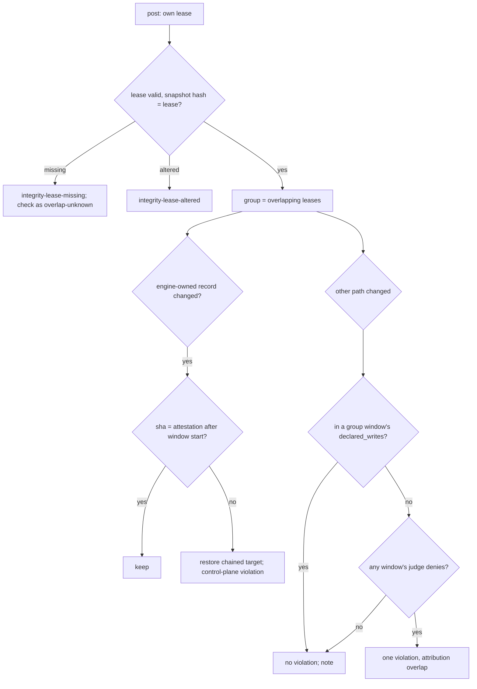

# Spec: Concurrency-safe integrity monitor (windows, signed leases, attested writes, chained snapshots) and the PILOT-58 review deferrals
Tracker: PILOT-59   From: intent/2026-09-25-concurrency-and-deferrals/intent.md
Risk tier: 3. The change covers the integrity monitor and its restore of signed records, the audit log (a new attestation log under `.evidence/audit/`), the Bash pre-check parser, the approval route, and `verify-range` rules 2 and 4. These are the framework's own gates. The policy floors `**/audit/**`.

Any claim below not confirmed from a file, a command, or a named person is marked
inline as [NEEDS VERIFICATION]. An unmarked claim asserts that it was checked against
the code at `7759c17`.

**Proposed split (owner decides at approval):**
- **59a**, concurrency and monitor gaps: REQ-CON-01..13.
- **59b**, deferrals: REQ-CON-14..23.

REQ-CON-24 (docs) is shared. See the plan, "Split".

## Terms
- **Window:** the interval from a tool call's PreToolUse to its PostToolUse, identified by `(session, tool_use_id)`.
- **Monitor directory:** `<git common dir>/evidence-monitor/`, from `git rev-parse --git-common-dir`. It is per repository and shared by every session and worktree.
- **Lease:** a signed file in the monitor directory that says a window is open.
- **Monitor lock:** an `fcntl.flock` on `evidence-monitor/monitor.lock`. It is held only during the monitor's own critical sections: pre snapshot plus lease registration, and post check, restore and record. It is never held while the command runs.
- **Engine-owned records:** `.evidence/changes/*/state.json`, `.evidence/changes/*/approval.json`, `.evidence/changes/*/violations.json` and `.evidence/violations/*.json`.

## Requirements

REQ-CON-01..13 and REQ-CON-24 (part 2) are **parked** since 2.4.0 and moved verbatim to `parked.md`; `evidence gaps` does not read that file. To revive them, move the rows back.

| ID | Requirement | Source (intent.md section) | Acceptance |
| --- | --- | --- | --- |
| REQ-CON-14 | **After a post-hook timeout, the alarm is re-armed.** When `hook.run_integrity` catches `HookTimeout`, it re-arms `_watchdog` for `HOOK_BUDGET_SECONDS_RECORD` (4 s) before writing the audit and violation records. A second timeout writes only the `integrity-timeout` audit entry and returns | Review deferral 7 | Engine test: a stubbed `integrity.check` that sleeps past the budget, and a stubbed `record_violations` that sleeps → the hook returns within 30 s, and the `integrity-timeout` audit entry is present |
| REQ-CON-15 | **`cmdparse` sees every command on every line:** • `split_simple` splits top-level unquoted, unescaped newlines as `;`, outside heredoc bodies, `$(…)`, backticks and quotes. A `\` followed by a newline joins the lines; • `_strip_heredocs` keeps the rest of the operator's line (`| sh`, `&& touch x`, `> f`), and handles several heredocs on one line in order; • `<<<` is a here-string, never a heredoc; • anything the scanner cannot place sets `ok = False`, which the existing callers treat conservatively | Other deferrals: cmdparse | Engine tests through the hook: • denied: `echo hi⏎touch src/auth/login.py` (`tier-floor`); `cat <<EOF \| sh⏎touch src/auth/login.py⏎EOF` (script execution); `cat <<EOF && touch src/auth/login.py⏎hi⏎EOF`; • allowed: `cat <<'EOF'⏎hi⏎EOF⏎git status`; the PILOT-58 case, a heredoc `git commit -F -` then `git status` on the next line, with a valid message; • `cat <<<"x"⏎rm src/app.py` → `rm` seen; • `echo a \⏎b` → one `echo` |
| REQ-CON-16 | **A GitHub approval must not come from the change's creator:** • `change start` records `created_by_github`: the login from `st.run_gh(["api", "user", "--jq", ".login"], …)` when `approval.github_repo` is set, or `null` on failure; • `_approve_github` refuses an approver equal to the PR author (as today), to `created_by_github`, or to `approval.github_identities[created_by]` (a new org map, email → login; a repository policy may only add entries); • the approval records `creator_login`; • `check_write`'s `tier3-same-person` rule also applies to method `github`; • for Tier 3, when neither login is known, the GitHub approval is refused, with the owner action | Other deferrals: approver vs creator | Engine and CLI tests with a fake `gh`: creator login `alice`, approving review by `alice` on a PR authored by `bot` → refused; review by `bob` → accepted, `creator_login: alice`; an org map `{dev@x: alice}` with no captured login → `alice` refused; Tier 3 with no known creator login → refused; Tier 1 with none → accepted, with a note |
| REQ-CON-17 | **Rule 4, ordered containment.** `_check_audit` replaces set containment (`set(old) <= set(new)`) with **ordered-subsequence** containment: the old lines appear in the new log in the same order. This is used for the whole-range check and for a merge's non-first parents | Review deferral 5 | CLI fixture tests: a log whose lines are reordered in the range → fails rule 4 (it passes today); an append-only range → passes |
| REQ-CON-18 | **Rule 4, shared logs in merges.** For a shared log (`approval-*.jsonl`, `clear-violations.jsonl`, `attestations.jsonl`), a merge passes when every parent's version is an ordered subsequence of the merged version, and every merged line comes from a parent. The first-parent byte-prefix rule then does not apply, so "base's lines first" passes. A **session** log appended on both sides still fails, with a message naming the session and saying to rebase instead of merge. It stays unsupported (ADR-0004 rev. 3): its hash chain forks | Review deferrals 1, 4 | CLI fixture tests: a `clear-violations.jsonl` merge with the base's lines first → passes; the same with a line that neither parent has → fails; one session's log appended on both sides → fails with the "rebase" message |
| REQ-CON-19 | **Rule 2 exempts only real records.** `_check_paths` exempts a path under `.evidence/changes/` or `.evidence/violations/` only when it matches `_RECORD`, and one under `.evidence/audit/` only when it is `*.jsonl`. Any other file there must be claimed | Review deferral 3 | CLI fixture tests: an unclaimed `.evidence/changes/K/run.sh` → fails rule 2; `.evidence/audit/notes.txt` → fails; `state.json` and a session `.jsonl` → exempt, as today |
| REQ-CON-20 | **`.evidence/context/` and `.evidence/decisions/` in CI** stay claimed in CI; the merge gate does not loosen. Locally, `check_write` allows the write as today, but adds an advisory `additionalContext`: "verify-range requires this path in the plan's Files claimed". The local write stays allowed | Review deferral 2 | Engine test: an Edit of `.evidence/decisions/0009-x.md` outside claims → allowed, with the note; inside claims → no note |
| REQ-CON-21 | **CODEOWNERS depth.** `_owners_of` matches, as GitHub does, a pattern with no `/` except a trailing one at any depth (`docs` owns `a/docs/x`). A pattern with a leading or middle `/` stays anchored | Review deferral 6 | CLI tests: `docs @o` owns `a/b/docs/x.md`; `/docs @o` does not own `a/docs/x.md`; `src/app.py @o` is anchored |
| REQ-CON-22 | `_commit_bypass` resolves long-option abbreviations as git does, from length 3 (`--o` … `--only`, `--inc` … `--include`), when the prefix is unique among `git commit`'s options [NEEDS VERIFICATION of git's ambiguity rule for `--o` in plan step 1] | Review deferral 8 | Engine tests: `git commit --o -m "ABC-1 x" src/app.py` → `commit-bypass`; `git commit --onl -m …` → denied; `git commit -m "ABC-1 x"` → allowed |
| REQ-CON-23 | **Fail-open sweep.** Every engine helper that turns a failed git or `gh` call into a value (`or ""`, `or []`, `None` read as "absent") is listed and made to fail closed, or its safety is stated in a code comment. Candidates found by grep: `evidence_policy.py:467`, `integrity._git_dir_id`, `integrity._extras`, `lifecycle.cmd_change` (`fix_base`), `state._attr_source` and `state.current_branch` | Monitor gaps: sweeps | Engine tests: `fix_base` recorded as empty when git fails → `failing-test` refused; `_extras` with git failing → `git-unavailable`, never hashes `root/config`; the list and dispositions are in the PR |

## Design
Components reused:
- `integrity.snapshot` / `check` / `_dirty` / `_hash` / `_extras` / `_control_plane_entries`;
- `state.write_file` / `_dir_fd` / `read_file_nofollow` / `remove_file` / `open_append` / `audit_append` / `audit_verify_lines` / `record_violations` / `run_gh`;
- `signing.sign` / `verify`;
- `hook.run_pre` / `run_post` / `run_integrity` / `_watchdog`;
- `cmdparse.split_simple` / `_strip_heredocs` / `writes_of`;
- `lifecycle._approve_github` / `write_approval` / `_clear_violations` / `_check_audit` / `_check_paths` / `_owners_of`;
- `evidence_policy.check_write` / `_commit_bypass`.

### The window protocol (REQ-CON-01..10)
New module `plugins/evidence-sdlc/scripts/engine/monitor.py`. It is standard library only, adds no subprocess, and leaves the REQ-IMH-22 allow-list unchanged. It holds the monitor directory helpers, `lock(root, wait)`, `open_window`, `close_window`, `windows_overlapping(start_seq, end_seq)`, `expired_windows(now)`, `next_seq` and `last_post`.

**Pre (Bash):**
1. `monitor.ensure_dir` (owner check).
2. Take the lock.
3. Run any deferred checks of expired windows (REQ-CON-05).
4. `seq = next_seq()`.
5. Append `tool-start` (REQ-CON-11).
6. `integrity.snapshot` writes `snapshots/<session>/<id>.json` with `seq`, `prev` and `root`.
7. `open_window` writes the lease with `snapshot_sha256`.
8. Release the lock.

**Pre (edit tools):** steps 1, 2, 4, 5 and 7, with no snapshot.

**Post (Bash):**
1. Take the lock.
2. Load and verify the lease, then pair (REQ-CON-03, 04).
3. `end_seq = next_seq()`.
4. `group = windows_overlapping(lease.seq, end_seq)`, minus itself.
5. `integrity.check(ctx_at_snapshot_root, judge_for(group), group, lease)`.
6. Record, writing violations through the attested writer.
7. Write `last-post.json`.
8. `close_window`.
9. Release the lock.

**Post (edit tools):** `close_window` under the lock.

**What the lease protects:**
- **Attribution:** a post learns exactly which windows overlapped it, and what each declared.
- **Pairing:** the lease binds the snapshot bytes, the root and the sequence number. A replayed, swapped or re-rooted snapshot fails.
- **Liveness:** an interrupted call is found and checked later (REQ-CON-05), instead of being silently unmonitored as today.

The lease does **not** serialise commands. Only the seconds-long critical sections are serialised. The agent can delete a lease but cannot forge one. Deleting one is a violation (REQ-CON-04). Holding the lock only denies the agent's own calls.

**Attestation (REQ-CON-06, 07):**
- `st.attested_write` appends the attestation first, then writes the file. A post that runs between the two sees the old bytes and no change, so the order is race-free without the lock.
- The check branch for engine-owned records lives in `integrity.check` step 1, before the 2.1 restore. `integrity.ENGINE_RECORDS` holds the glob list.
- `monitor.attested_since(root, rel, seq)` reads `attestations.jsonl` backwards to the window's start `seq`, stopping on any entry that does not verify. Such an entry is itself `audit-tamper`, found by the prefix check.

**Group judging (REQ-CON-08):** `judge_for(group)` returns `judge(rel)` evaluated with a `Ctx` rebuilt from each window's lease: `session`, `agent_type`, and `permission_mode`, which the lease also stores.

### Deferrals (REQ-CON-14..23)
- **REQ-CON-15** (`cmdparse.py`): a new `_split_lines(cmd)` scanner, which tracks quotes, escapes, `$(` depth, backticks and heredoc bodies. It emits `;` for top-level newlines, and `split_simple` calls it before `_tokenize`. `_HEREDOC` becomes `<<-?\s*(['"]?)(\w+)\1([^\n]*)\n(.*?)\n\s*\2\s*(?:\n|$)`, with a lookbehind excluding a third `<`. `repl` returns `"<< HEREDOC" + m.group(3) + "\n"`.
- **REQ-CON-16:**
  - `lifecycle.cmd_change` (`start`) adds `created_by_github`;
  - `_approve_github`'s `eligible()` adds the creator logins;
  - `write_approval` records `creator_login`;
  - in `evidence_policy.check_write`, the `tier3-same-person` condition adds `or (approval.get("method") == "github" and approval.get("approver", "").lower() in creator_logins)`;
  - `state._merge` gets a union rule for `approval.github_identities` from a repository policy.
- **REQ-CON-17, 18** (`lifecycle._check_audit`): new `_ordered_subseq(old_lines, new_lines)` and `_SHARED_LOG = re.compile(r"^(approval-.+|clear-violations|attestations)\.jsonl$")`.
- **REQ-CON-19:** `_check_paths` uses `_RECORD` and the `.jsonl` test.
- **REQ-CON-21:** `_owners_of` builds `**/pat` and `**/pat/**` for slashless patterns.
- **REQ-CON-22:** `_commit_bypass` uses an option table and a unique-prefix resolver.

### Policy (`default-policy.json`, `state._merge`)
New keys:
- `monitor_window_ttl_seconds` (660) and `monitor_background_ttl_seconds` (3600): a repository may only lower them;
- `monitor_lock_wait_seconds` (10): ignored from a repository;
- `approval.github_identities` (`{}`): a repository may only add entries.

## Regulatory control impact
`.evidence/context/compliance.md` establishes no applicable framework for this repository (all `[ASK]`), so no control set is loaded.

| Framework | Control ID | Applies? | How it is satisfied | Evidence |
| --- | --- | --- | --- | --- |
| none established | — | N/A | compliance.md lists none; awaiting maintainer | `.evidence/context/compliance.md` |

For adopters, `governance/control-mapping.md` claims tamper-evidence for audit and violation records (SOC 2 CC8.1, ISO 27001 A.8.32, NIST SSDF PW.4). This change strengthens those claims: records are no longer lost under concurrency, and every engine write is attested. It adds no authority to the local layer. REQ-CON-24 rewrites the rows.

## Evidence impact
- New rows: REQ-CON-01..24.
- Existing tests that must still pass unchanged:
  - REQ-IMH-01, 08 (no-follow, snapshot safety);
  - REQ-IMH-20 (audit prefix);
  - REQ-IMH-22 (AST subprocess allow-list; `monitor.py` adds no call site);
  - REQ-IMH-23 (git fails closed);
  - REQ-V2G-09 (unsigned records, signed restores);
  - every REQ-IMH-19 `verify-range` fixture except those listed next.
- Existing tests whose assertion changes:
  - a merge fixture that expects a base-first shared log to fail (REQ-CON-18);
  - any case that expects the 2.1 snapshot path under `$TMPDIR`.

  Both are listed in the PR with the old and the new assertion [NEEDS VERIFICATION in plan step 1, by grep].

## Diagrams
```mermaid
sequenceDiagram
  participant A as call A (pre/post)
  participant B as call B (pre/post)
  participant M as evidence-monitor (lock, leases, seq)
  participant L as attestations.jsonl
  A->>M: lock; seq=10; tool-start; snapshot; lease A; unlock
  B->>M: lock; seq=11; tool-start; snapshot; lease B; unlock
  B->>L: attest violations.json sha=X (seq 12)
  B->>M: post B: lock; check; write violations.json=X; close B; unlock
  A->>M: post A: lock; group={B}; violations.json sha=X attested after 10 -> keep
  A->>M: unexplained paths judged under A and B; close A; unlock
```

```mermaid
flowchart TD
  P[post: own lease] --> V{lease valid, snapshot hash = lease?}
  V -- missing --> LM[integrity-lease-missing; check as overlap-unknown]
  V -- altered --> LA[integrity-lease-altered]
  V -- yes --> G[group = overlapping leases]
  G --> R{engine-owned record changed?}
  R -- yes --> AT{sha = attestation after window start?}
  AT -- yes --> K[keep]
  AT -- no --> RS[restore chained target; control-plane violation]
  G --> W{other path changed}
  W --> D{in a group window's declared_writes?}
  D -- yes --> OK[no violation; note]
  D -- no --> J{any window's judge denies?}
  J -- yes --> VI[one violation, attribution overlap]
  J -- no --> OK
```

## Security design
- **Laundering:** parallelism can only *explain* a write that some overlapping call's pre-check declared and allowed. Everything else is judged under every overlapping context, and the strictest judge wins. The negative test is REQ-CON-08.
- **Replay:** signatures alone bind no sequence (the ADR-0001 finding). Acceptance needs an attestation **inside the window**, and the restore target chains through attestations. An older signed record is restored.
- **Forgery:** leases, `last-post.json`, `seq` and attestations are HMAC-signed. The agent has no key. Deleting them is detected and fails closed. In unsigned mode nothing becomes acceptable.
- **Denial of service:** holding the lock, or planting FIFOs, can only deny the agent's own calls. B1 removes the stall.
- **Human actions:** attested writes happen in the human's terminal, with the key (`_require_key_if_signed`). They are accepted because they carry an attestation, not because of who ran them.
- **Parser:** REQ-CON-15 closes a pre-check bypass. The monitor stayed the backstop, and still is.
- **Residual risk:** as ADR-0003 §4, an unsandboxed agent can defeat local checks. `verify-range` stays the authority.
- **Required review agents:** verifier, security-reviewer, code-reviewer, one at a time.

## UX
| State / concern | Behaviour |
| --- | --- |
| Parallel subagents | No message unless a real violation. An overlap violation names the windows ("one of these overlapping calls: …") |
| Human `clear-violations` mid-call | Stays cleared. If the lock is busy: "a monitored call is being checked; retry" (seconds) |
| `monitor-busy` | "Another tool call's integrity check is running; retry." |
| `monitor-dir-unsafe` | Names the path, its owner and mode, and the fix (`chmod 700`, or remove it) |
| Interrupted call | The next call runs its deferred check. Any violation names the expired call |
| Edge cases | A worktree (git common dir); a repository without `.evidence/`; a clock change (`seq` orders, time only expires); `tool_use_id` absent (older clients) |

Component reuse: N/A — no UI.

## Areas of concern
- **Lock latency:** a post check can take up to about 20 s on a large tree, and a concurrent pre waits up to 10 s. Parallel fan-out on large repositories may see `monitor-busy`. Owner: maintainer, confirm the defaults.
- **PostToolUse for interrupted and background calls** [NEEDS VERIFICATION]: REQ-CON-05's TTLs assume no post arrives for an interrupted call, and that a background call's post arrives at launch. Plan step 1 confirms with Claude Code's hook docs and a live trace. If a failure event exists, `hooks.json` also closes the window there.
- **Hook before the prompt** (PILOT-58 open question). Proposed: accept. The hook performs only agent stages, signed and audited, and ADR-0006 records it. Owner: maintainer.
- **Nits 2–5** of the PILOT-58 step 5 security review are not recorded anywhere [NEEDS VERIFICATION]. Owner: maintainer supplies them, or they are dropped.
- **GitHub creator identity:** `gh api user` gives the login the machine's `gh` is authenticated as, which is the developer's own on a workstation. In CI or on a shared machine it is not. The org map is the reliable source. Owner: maintainer.
- **The uncommitted local edit of `default-policy.json`** (and its `.bak`) must be resolved by the human before the plan step that edits it. The agent never stages or overwrites it.
- **Size:** see the plan's split.

## Out of scope
- Key isolation (PILOT-61), release automation (PILOT-63), re-approval history and `CLAUDE_CONFIG_DIR` (PILOT-64 proposal).
- The PILOT-62 items (restored violations, user-config edits, Tier 3 auto modes). This change composes with them (see the plan, "Coordination").
- Per-call filesystem views, and denying parallel calls (ADR-0006 alternatives).
- A human's own editor writes outside the control plane mid-call. They are still judged as the call's.

## Architecture decisions
| ADR | Created / Supersedes / Relies on | Status |
| --- | --- | --- |
| `.evidence/decisions/0006-monitor-windows-attested-writes-chained-snapshots.md` | Created; replaces the rejected ADR-0001; relies on ADR-0003 rev. 2, ADR-0004 rev. 3 and ADR-0005 (PILOT-62) | Proposed |

## Rejected alternatives
- **ADR-0001 as written:** signature-validated records (replayable) and an unsigned, fail-open lease.
- **Serialising whole Bash calls:** a long command blocks every other call, and subagent fan-out stops.
- **Charging every overlapping call:** false positives, and the observed data loss.
- **Accepting any change that some overlapping call could have made:** laundering.
- **Keeping the lease in `$TMPDIR`:** the hooks' and the human terminal's `TMPDIR` may differ between sessions [NEEDS VERIFICATION], and the directory is shared on Linux. The git common dir is per repository.
- **Supporting one session's log merged on both sides:** it needs fork-tolerant chains in `audit_verify` for a shape that rebase avoids.
