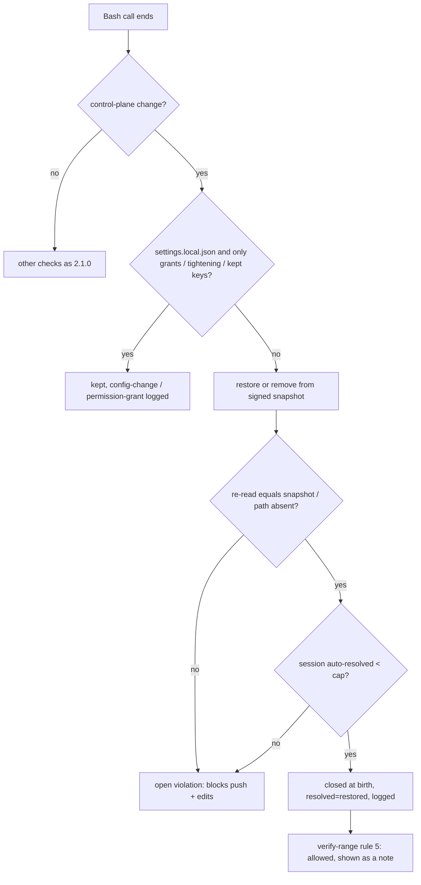
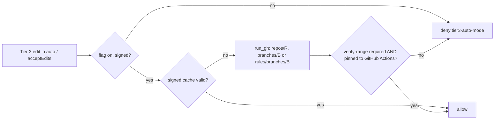

# Spec: Local layer advisory — restored violations, user-config edits, Tier 3 auto modes behind the server gate
Tracker: PILOT-62   From: intent/2026-09-25-local-layer-advisory/intent.md
Risk tier: 3 — integrity monitor, violation records, the Tier 3 permission-mode gate and `verify-range` rule 5; policy floors `**/audit/**`.

Any claim below not confirmed from a file, a command, or a named person is marked
inline as [NEEDS VERIFICATION]. An unmarked claim asserts that it was checked against
the code at `7759c17`.

## Requirements
| ID | Requirement | Source (intent.md section) | Acceptance |
| --- | --- | --- | --- |
| REQ-LLA-01 | A control-plane change that the monitor has undone, and whose undo it has **verified**, is auto-resolved. Such a change is rule `control-plane` with action `restored` or `removed`, or rule `control-plane-symlink` with action `removed`. Verified means the file re-read after the restore equals the snapshot bytes, or the removed path is absent. The entry is written to the violations record with `open: false`, `resolved: "restored"` and `resolved_at`, and is logged as an `integrity-violation` audit event with `resolved`. It blocks neither push/PR (`_review_gate`) nor source edits (`check_write`), and needs no `clear-violations`. The post-call message says the change was undone and that nothing needs clearing | Outcome 1 | Engine tests: an unparsed program rewrites `approval.json` → restored, entry closed with `resolved`, then a feature push is not denied for `integrity-violation` and a source edit is allowed; the same for a created control-plane file (removed) and a planted symlink (removed) |
| REQ-LLA-02 | Everything else stays open and blocks as in 2.1.0: • an unsigned-mode `recorded`; • `control-plane-removal-refused`; • a restore whose write fails or whose re-read differs; • `audit-tamper`, `hidden-change`, `evidence-dir-changed`, `git-unavailable`, `git-dir-replaced`; • `integrity-snapshot-*`, `integrity-timeout`, `integrity-check-error`, `audit-unwritable`; • any gated path written by a program the gates could not see (`outside-claims`, `change-controlled` and so on) | Constraint: agent-caused violations still block | Engine tests, one per class: unsigned restore, a restore made to fail (read-only parent), a re-read mismatch (the file changed again between restore and re-read, by test hook), an unclaimed source file written by an unparsed program, an audit truncation → each open, push denied, source edit denied where it is today |
| REQ-LLA-03 | Auto-resolution is bounded. Once a session has `auto_resolve_max_per_session` auto-resolved entries in the change's (or branch's) record, the next restored change is recorded `open` and blocks. The note says why. The default is 3, and 0 disables auto-resolution. The org policy sets it; a repository policy may only lower it | Constraint: bounded tolerance | Engine tests: three restored changes → closed; the fourth → open, push denied. `auto_resolve_max_per_session: 0` → the first is open. A repo policy raising it is ignored, and one lowering it applies |
| REQ-LLA-04 | `verify-range` rule 5 also judges entries that first appear in a range. An entry that is closed at birth passes only in two cases: it has `resolved: "restored"` and an auto-resolvable rule, or it carries `cleared_by`. Otherwise it fails. Each auto-resolved entry in the range is printed as a note in the report, so the code owner sees it. Rules 0–4 are unchanged | Constraint: no weakening of what merges | CLI fixture tests (stubbed API, test key): a signed record adding a closed `restored` `control-plane` entry → passes with a note; a closed `hidden-change` entry without `cleared_by` → fails rule 5; a closed entry with `cleared_by` → passes (2.1.0 behaviour) |
| REQ-LLA-05 | A change to `.claude/settings.local.json` during a call is kept and logged as a `config-change` audit event, and is not a violation, when every difference is one of these: • `permissions.allow` entries added or removed; • `permissions.deny` or `permissions.ask` entries added; • `permissions.additionalDirectories` entries added or removed; • top-level keys listed in `local_settings_kept_keys` (default `["model", "outputStyle"]`). Every other difference is restored as in 2.1.0 and then follows REQ-LLA-01/03. That includes `hooks`, `disableAllHooks`, `env`, `statusLine`, `apiKeyHelper`, `enabledPlugins`, MCP server keys, `permissions.defaultMode`, a deny or ask rule removed, invalid JSON, and a BOM. A pure allow addition is still logged as `permission-grant` (the 2.1.0 event name) | Outcome 2 | Engine tests: an allow rule removed → kept, `config-change` logged, no violation; a directory added → kept; `hooks` added → restored, closed `restored`; `disableAllHooks: true` → restored; a deny rule removed → restored (the existing REQ-IMH-01 case still passes); a BOM → restored |
| REQ-LLA-06 | A change to a system-managed config file during a call is logged as a `user-config-changed` audit event (path, old and new hash, owner uid, mode), and is not a violation. The files are those listed in `user_config_not_charged`: by default `managed-settings.json`, `managed-settings.d/**` and `evidence-policy.json` under `/Library/Application Support/ClaudeCode/` and `/etc/claude-code/`. This applies only if, both before and after the call, the file is not owned by the hook's uid and neither it nor its parent directory is writable by that uid (`os.access(W_OK)`). A listed file that the session's user could have written is `hidden-change`, as today | Outcome 2 | Engine tests: `integrity._not_user_writable` is true for a root-owned system file (`/etc/hosts`) and false for a file in a scratch directory; a user-owned scratch file listed in `user_config_not_charged` and changed mid-call → still `hidden-change` (negative); the check with the ownership test stubbed in-process → `user-config-changed` logged, no violation |
| REQ-LLA-07 | `~/.claude.json` is charged only when its security projection changes. The projection is the top-level `mcpServers` and, under `projects.*`, the keys in `claude_json_security_keys`: by default `mcpServers`, `allowedTools`, `enabledMcpjsonServers`, `disabledMcpjsonServers` and `enableAllProjectMcpServers`. The snapshot stores a hash of the projection instead of the whole-file hash. Any other rewrite (Claude Code's bookkeeping) is ignored. A file that was valid JSON before the call and is invalid, missing or over 64 MiB after it counts as a projection change | Outcome 2 | Engine tests with `HOME` set to a scratch directory: a bookkeeping key rewritten → no violation; a `projects.<repo>.mcpServers` entry added → `hidden-change`; a top-level `mcpServers` added → `hidden-change`; the file truncated to invalid JSON → `hidden-change` |
| REQ-LLA-08 | Tier 3 source edits are allowed in the modes listed in `tier3_gate_allowed_modes` (default `acceptEdits`, `auto`) when all of these hold: • `tier3_auto_modes_with_required_gate` is true (default true; the org policy may set it false; a repository policy may only set it false); • the session is signed; • REQ-LLA-09 confirms the gate. `bypassPermissions` and `dontAsk` stay denied. A `tier3-auto-mode-allowed` audit event records the gate evidence each time the cache is filled. When the gate is not confirmed, the denial names the missing condition | Outcome 3 | Engine tests with a fake `gh` (`EVIDENCE_GH`): gate confirmed → an `auto` and an `acceptEdits` Tier 3 edit are allowed; `bypassPermissions` → denied; unsigned session → denied; the flag false in the org policy → denied; a repo policy setting it true when the org sets false → denied |
| REQ-LLA-09 | Gate detection reads GitHub, never a local assertion. Through `st.run_gh`, pinned to `approval.github_repo`, it calls `repos/{repo}` (for `default_branch`) and then either `repos/{repo}/branches/{branch}` (classic protection) or `repos/{repo}/rules/branches/{branch}` (rulesets). The gate is confirmed when a required status check named `ci_gate_check` (default `verify-range`) is present **and pinned to the GitHub Actions app** (`ci_gate_app_id`, default 15368 [NEEDS VERIFICATION]; `integration_id` for rulesets). With `ci_gate_require_enforce_admins` true (default false), classic protection must also have enforcement level `everyone`. Any of these means not confirmed: • an empty `github_repo`; • `gh` missing or failing, or a timeout (10 s); • non-JSON output; • the check absent; • the check pinned to "any source" or another app. The result is cached in a signed file under the temp directory, bound to the repository, branch, check name and the policy values: 900 s (`ci_gate_cache_seconds`) for a confirmation, 60 s for a failure. A cache that is unsigned, altered, expired, a link or bound to other values is ignored | Outcome 3; ADR-0005 | Engine tests with a fake `gh` that returns fixture JSON: classic protection with the check pinned → confirmed; rulesets with the check pinned → confirmed; the check with `app_id: null` → not confirmed; another app id → not; the check missing → not; `gh` exits 1 → not; non-JSON → not; empty `github_repo` → not, and `gh` never called; a confirmation served from the cache without a `gh` call; an altered cache → `gh` called again; an expired cache → called again |
| REQ-LLA-10 | PreToolUse denies `gh api` calls that create a commit status or check run as `check-forgery`. These are POST, or fields with no method (gh then posts), to `…/statuses/<sha>`, `…/check-runs` or `…/check-suites`. This is early feedback; the authority is the app pin in REQ-LLA-09 and in branch protection | Security design | Engine tests: `gh api -X POST repos/o/r/statuses/abc -f state=success -f context=verify-range` → denied; `gh api repos/o/r/statuses/abc -f state=success` → denied; `gh api repos/o/r/check-runs -X POST …` → denied; `gh api repos/o/r/commits/abc/check-runs` (a GET) → allowed |
| REQ-LLA-11 | Docs, governance, SECURITY, HANDOFF, CHANGELOG `## 2.2.0` and plugin versions 2.2.0 match the shipped behaviour. They state: • restored violations are closed at birth and bounded; • which config edits are not charged, and why; • how Tier 3 auto modes follow the server gate; • the owner actions: pin `verify-range` to GitHub Actions in branch protection, set `approval.github_repo`, and remove any machine-local permission-mode loosening; • release automation is deferred | Compliance evidence | Content tests |

## Design
Components reused: `integrity.check` / `snapshot` / `_extras` / `_permission_grant`, `state.record_violations` / `open_violations` / `write_file` / `read_file_nofollow` / `run_gh` / `_merge`, `signing.sign` / `verify`, `evidence_policy.check_write` / `_review_gate` / `_check_gh`, `hook.run_integrity`, and `lifecycle._record_transition`.

- **REQ-LLA-01, 02, 03** (`integrity.py`, `hook.py`, `state.py`):
  - In `integrity.check` step 1, after `st.write_file(... old)`, the restored bytes are re-read with `_read_cp` and compared with `old`. After `st.remove_file`, the monitor confirms `not os.path.lexists`. Only a verified undo is marked `"resolved": "restored"` on the violation dict.
  - `hook.run_integrity` splits the list. For resolved entries it counts this session's earlier resolved entries (`st.auto_resolved_count(root, key, branch, session)`, new). Within `auto_resolve_max_per_session`, it passes them to `st.record_violations`, which writes `open: false`, `resolved`, `resolved_at` for entries carrying `resolved`. Past the cap, it drops `resolved` so they are open.
  - The message is built per class: "undone; nothing to clear" for resolved entries, the 2.1.0 text for open ones.
  - `open_violations` is unchanged: it already filters on `open`.
- **REQ-LLA-04** (`lifecycle._record_transition`): for each entry in `new` whose `_vkey` is not in `old`, if it is not `open`, it must have `cleared_by`, or `resolved == "restored"` with its rule in `AUTO_RESOLVABLE` (shared from `integrity.py`); otherwise fail rule 5. Resolved entries are appended to the report's notes.
- **REQ-LLA-05** (`integrity.py`): `_permission_grant` becomes `_local_settings_change(old_b64, cur_b64, pol)`, returning `("grant", added)`, `("kept", summary)` or `None`. It uses the same strict UTF-8, no-BOM parse. It diffs the permission lists as sets (with the direction rules above), and every other top-level key must be equal unless it is listed in `local_settings_kept_keys`. `hook.run_integrity` logs `permission-grant` or `config-change` and drops the entry.
- **REQ-LLA-06, 07** (`integrity.py`):
  - `_extras` records, for a path matching `user_config_not_charged`, `{"h": hash, "sys": _not_user_writable(path)}` instead of a bare hash. For `~/.claude.json` (and the `CLAUDE_CONFIG_DIR`-relative `.claude.json`, if set) it records `{"proj": sha256 of the canonical JSON projection}`.
  - `check` step 1b compares per kind. A system file that is not user-writable before and after is logged as a `user-config-changed` note, which the hook turns into an audit event. A projection that is unchanged is ignored. Everything else is `hidden-change`.
  - The old bare-hash form of a 2.1.x snapshot is still compared as a whole-file hash.
- **REQ-LLA-08, 09** (`evidence_policy.py`):
  - New `_ci_gate(ctx)` returns `(confirmed, why, evidence)`. It uses `st.run_gh(["api", f"repos/{repo}", ...], timeout=10)` and so on. The cache is `evidence-chain-ci-gate/<sha256(root)[:16]>.json`, written with `st.write_file(tempfile.gettempdir(), …)` and read with `st.read_file_nofollow` + `signing.verify`.
  - In `check_write`, the `tier3-auto-mode` branch at `:238` allows the edit when the mode is in `tier3_gate_allowed_modes`, the flag is on, `signing.enabled()` and `_ci_gate(ctx)[0]`.
  - No new subprocess call site: REQ-IMH-22's AST allow-list is unchanged.
- **REQ-LLA-10** (`evidence_policy._check_gh`): a regex on the endpoint for `/statuses/`, `/check-runs\b`, `/check-suites\b`, with the same method and field logic as the `/merge` rule.
- **Policy** (`default-policy.json`, `state._merge`): the new keys are `auto_resolve_max_per_session`, `local_settings_kept_keys`, `user_config_not_charged`, `claude_json_security_keys`, `tier3_auto_modes_with_required_gate`, `tier3_gate_allowed_modes`, `ci_gate_check`, `ci_gate_app_id`, `ci_gate_require_enforce_admins` and `ci_gate_cache_seconds`. `_merge` (tighten-only, from a repository) gains two rules: `auto_resolve_max_per_session` takes the minimum, and `tier3_auto_modes_with_required_gate` may only become false. Every other new key is ignored from a repository policy, which is the existing default branch of `_merge`. The engine reads each key with an in-code default equal to the shipped value.

## Regulatory control impact
`.evidence/context/compliance.md` establishes no applicable framework for this repository (all `[ASK]`), so no control set is loaded.

| Framework | Control ID | Applies? | How it is satisfied | Evidence |
| --- | --- | --- | --- | --- |
| none established | — | N/A | compliance.md lists none; awaiting maintainer | `.evidence/context/compliance.md` |

For adopters, `governance/control-mapping.md` (SOC 2 CC8.1, ISO 27001 A.8.32, NIST SSDF PW.4) rests change control on `verify-range` plus code-owner review (ADR-0004). This change moves nothing from that authority. It restates the local monitor as detection with automatic undo. REQ-LLA-11 rewrites the rows.

## Evidence impact
- New rows: REQ-LLA-01..11.
- Existing tests that must still pass unchanged: REQ-V2G-09 (unsigned is recorded, signed is restored), REQ-IMH-01 (B4 grant kept; a removed deny rule is restored; BOM), REQ-IMH-23 and REQ-IMH-22 (AST allow-list).
- Existing tests whose assertion changes: any case asserting that push or source edits are denied **after a restored control-plane change**. These are listed in the PR with the old and the new assertion [NEEDS VERIFICATION in plan step 1: none found by grep at `7759c17`; the REQ-V2G-09 and REQ-IMH-23 cases assert the restore and the note, not the push].

## Diagrams

## Security design
- **What stays blocking:** anything not undone, or undone without verification; anything outside the control plane written by an unseen program; tampering with audit, evidence directories, git metadata or snapshots.
- **Why a restored change may pass:** its only effect lasted for the call and is gone, which the monitor has verified. The record and the audit event remain, and `verify-range` shows each one to the code owner. The per-session cap stops an agent from probing indefinitely.
- **Config edits:** edits are judged by what they could do, not by who made them, because the engine cannot tell the human from the agent. Keys that run commands or widen execution are always undone. System files are exempt only when the session's user could not have written them. `~/.claude.json` is judged by its MCP and tool-permission keys.
- **Tier 3 auto modes:** the loosening depends on a fact on GitHub. The check must be pinned to the GitHub Actions app, because a required check matched only by name can be satisfied by a commit status that anyone with the token can post (REQ-LLA-10 adds the local denial). The cache is signed, so the agent (which has no key) cannot forge a confirmation.
- **Residual risk:** as ADR-0003 §4, a determined agent with an unsandboxed shell can defeat local checks. The server gate is the authority, and this change adds no local authority.
- **Required review agents:** verifier, security-reviewer, code-reviewer, one at a time.

## UX
| State / concern | Behaviour |
| --- | --- |
| Restored change | Post note: "`<path>` was changed by that command and has been restored; this is recorded, and there is nothing to clear." |
| Past the cap | Post note says the session reached `auto_resolve_max_per_session` restored changes, so this one needs a human `clear-violations` |
| Config edit kept | No note to the agent; an audit event only |
| Tier 3 auto mode, gate not confirmed | The denial names the cause (no `github_repo`; `gh` failed; `verify-range` not required on `<branch>`; not pinned to GitHub Actions) and the owner action |
| Edge cases | An empty or huge `~/.claude.json`; a `settings.local.json` with a BOM; `gh` hanging (10 s timeout, fail closed); a cache file replaced by a symlink (ignored) |

Component reuse: N/A — no UI.

## Areas of concern
- **Default `auto_resolve_max_per_session = 3`.** Owner: maintainer — confirm at approval.
- **`ci_gate_require_enforce_admins` defaults to false.** This repository's owner admin-merges today, so "everyone" would keep Tier 3 auto modes off here. With false, an admin can still merge without the check, and the push report records it after the fact. Owner: maintainer.
- **GitHub Actions app id 15368, and the `checks[].app_id` field in the "Get a branch" response** [NEEDS VERIFICATION]: plan step 1 captures a real response from this repository as the fixture.
- **This machine:** gate detection needs `approval.github_repo` in the org policy, and `verify-range` required and pinned on `main`. Both are owner actions not yet done [NEEDS VERIFICATION]. Until then Tier 3 auto modes are denied, unless the org policy's existing loosening stays.
- **`evidence-policy.json` ownership** [NEEDS VERIFICATION]. If the human created it without `sudo` (user-owned), REQ-LLA-06 still charges edits to it. The fix is to recreate it root-owned.
- **The uncommitted local edit of `default-policy.json`** (and its `.bak`) must be resolved by the human before plan step 6 edits that file. The agent never stages or overwrites it.
- **`CLAUDE_CONFIG_DIR`:** `user_control_plane` lists `~/.claude/…`. With a custom config directory (as on this machine), the real settings live elsewhere and are not watched. Handled only for `.claude.json` here; the rest goes to PILOT-60 [NEEDS VERIFICATION of Claude Code's file layout under `CLAUDE_CONFIG_DIR`].

## Out of scope
- **Release record in CI on merge** (proposed to the owner 2026-09-25). It does not fit cleanly:
  - writing a signed `released` state needs a commit on protected `main` from CI, which needs a bypass actor or a bot PR;
  - the workflow file is change-controlled (human-authored);
  - the intent keeps release a human attestation.

  Proposed as its own change (PILOT-63): `verify-range --push-report` records "merged" in a signed CI artifact, and the release command reads it.
- **Accepting validly signed record changes mid-call,** for example a human `clear-violations` or `approve` during a call being restored. This is ADR-0001's problem and belongs to PILOT-59 (concurrency).
- `deny_git_config_keys` split (PILOT-60), and key isolation (PILOT-61).

## Architecture decisions
| ADR | Created / Supersedes / Relies on | Status |
| --- | --- | --- |
| `.evidence/decisions/0005-local-layer-is-advisory-behind-the-server-gate.md` | Created; relies on ADR-0003 rev. 2 and ADR-0004 rev. 3 | Proposed |

## Rejected alternatives
- **An owner-set policy flag (`ci_gate_required: true`) instead of reading GitHub.** It is an assertion that goes stale when protection changes, and nothing checks it. The agent cannot read the org file on this machine to report it. It does not prove the check is pinned to GitHub Actions.
- **A flag in `.evidence/policy.json`.** The agent can write it, and the repository policy is tighten-only.
- **Reading the latest `verify-range` run result locally.** A passing run does not show the check is *required*.
- **Exempting all user control-plane files.** `~/.claude.json` and `settings.local.json` can register MCP servers and hooks, which is command execution.
- **Deleting restored violations instead of closing them.** It loses the record that `verify-range` and auditors read.
