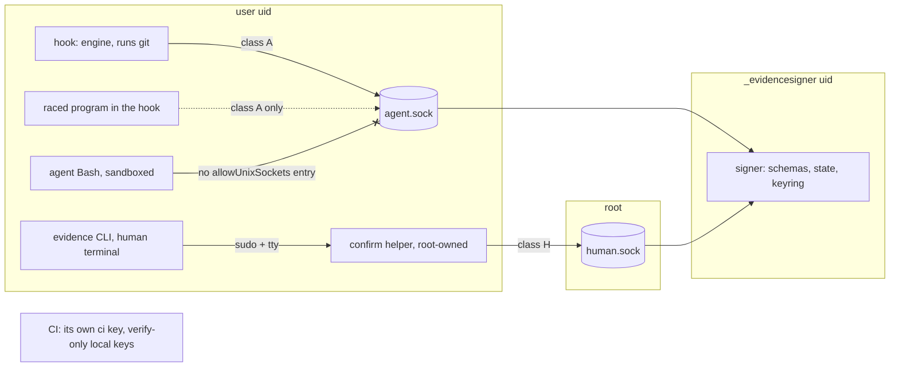

# Spec: Signer key isolation — a separate-user signer that never runs git, typed records, a human channel, key IDs
Tracker: PILOT-61   From: intent/2026-09-25-signer-key-isolation/intent.md
Risk tier: 3 — key custody for every signed record, the hooks' fail-closed behaviour, the human-only actions, CI result signing and `verify-range` rules 0, 4 and 5; a new root-installed component; policy floors `**/audit/**`.

Any claim below not confirmed from a file, a command, or a named person is marked
inline as [NEEDS VERIFICATION]. An unmarked claim asserts that it was checked against
the code at `7759c17`.

## Terms
- **Signer:** `evidence_signer.py` running as the daemon, under its own OS user (`_evidencesigner` on macOS, `evidence-signer` on Linux). It holds the keyring.
- **Agent socket** (`agent.sock`) and **human socket** (`human.sock`): Unix stream sockets in the signer's socket directory (`/var/run/evidence-signer/` by default).
- **Record classes:**
  - **A, agent channel:** audit entries, integrity snapshots, change state written by agent-allowed stages, open violation entries and PILOT-62's closed-at-birth `restored` entries, and PILOT-59's leases, sequence counter, `last-post` and attestations. The engine requests them from a hook.
  - **H, human channel:** approvals (terminal and GitHub method), `clear-violations`, `set-tier`, `release`, `override`, and the cutover migration (REQ-KEY-12).
  - **C, CI:** result sidecars (`evidence results sign`). Signed in CI only.
- **Signer mode:** the org policy's `signer.mode: required`. `off` (the default) is 2.x behaviour.

## Requirements
| ID | Requirement | Source (intent.md section) | Acceptance |
| --- | --- | --- | --- |
| REQ-KEY-01 | The signer is one standard-library module, `plugins/evidence-sdlc/signer/evidence_signer.py`, that never starts a program: it imports none of `subprocess`, `pty`, `ctypes`, `multiprocessing`, `shutil` or `pipes`; it calls none of `os.system`, `os.popen`, `os.exec*`, `os.spawn*`, `os.posix_spawn*`, `os.fork*`; and it imports no engine module (`state`, `integrity`, `lifecycle`, `hook`, `evidence_policy`, `cmdparse`). It never reads the key from its environment: only from the keyring file | Outcome 1 | Engine tests (AST, no allow-list): zero process-starting calls and zero forbidden imports in `signer/*.py`; a fixture copy with one `subprocess.run` added fails the check (negative); a fixture importing `state` fails |
| REQ-KEY-02 | The signer refuses to start unless its files are safe: the keyring is a regular file (no link) owned by the signer user, mode `0400` or `0600`; its directory and every ancestor are owned by root or the signer user and not group- or world-writable; the running code file and its directory are root-owned and not writable by anyone else; the socket directory is root-owned `0755`. `install.sh` (run with `sudo`) creates the user, copies the signer to `/usr/local/libexec/evidence-signer/`, creates the keyring (`/Library/Application Support/EvidenceSigner/keys.json` on macOS, `/etc/evidence-signer/keys.json` on Linux) from `os.urandom(32)`, and installs `com.evidence-chain.signer.plist` (a LaunchDaemon with `UserName`, `KeepAlive`) or `evidence-signer.service` (systemd, `User=`, `NoNewPrivileges=yes`, `ProtectHome=yes`). The daemon is never started by a hook | Outcome 1 | Signer tests under `--test-root` (the ownership check compares with the test uid): a keyring with mode `0644` → refuses; a keyring that is a symlink → refuses; a group-writable keyring directory → refuses; a code file writable by the test uid in production mode → refuses; the safe layout → starts. Content test: `install.sh` sets the modes above and never prints a key |
| REQ-KEY-03 | IPC: one JSON request line (at most 256 KiB) per connection and one response line. The signer reads the peer's uid with `getsockopt(SOL_SOCKET, SO_PEERCRED)` on Linux and `getsockopt(0 /* SOL_LOCAL */, LOCAL_PEERCRED)` (`struct xucred`) on macOS. `agent.sock` (mode `0666` in the root-owned directory) serves peers whose uid is in the keyring's `allowed_uids`; `human.sock` (mode `0600`, root-owned) serves only uid 0. Anything else is refused and logged in the signer's own log (`/var/log/evidence-signer.log`). A request is refused, with no signature, when it is over the size, not strict JSON (duplicate keys, `NaN`, `Infinity`, trailing data), or over the rate limit (`rate_per_second`, default 200 per peer uid). The client connects with a 2 s timeout and gives up after 5 s in total | Outcome 1; threat model | Signer tests: a peer uid not in `allowed_uids` → refused; a Class H request on `agent.sock` → refused `wrong-channel`; a 300 KiB line → refused; duplicate keys → refused; `NaN` → refused; 201 requests in one second → the 201st refused; a client against a socket that never answers → `SignerUnavailable` within 6 s |
| REQ-KEY-04 | Typed signing with the signer's own canonicalisation. Operations: `sign` (`rt`, `record`), `verify` (a batch of at most 1,000 `{rt, record}`), `info` (key IDs and version; never key bytes). For each `rt` the signer holds a schema (allowed keys, JSON types, string and list limits) and refuses a record that does not match. It sets `rt`, `kid` (the signing key's ID) and `repo`, which must be one of the keyring's `repos` (the pinned `approval.github_repo` values). It computes the canonical body itself (`json.dumps(sort_keys=True, separators=(",", ":"), ensure_ascii=True)` over every key except `sig`) and returns the whole signed record, which the engine writes unchanged. `verify` answers `true` or `false` per item, and `false` for an unknown or retired `kid`, a `rt` that differs from the one the caller expects, or a `repo` outside `repos` | Outcome 2 | Signer tests: an `approval` record with an extra key → refused; a string over its limit → refused; a signed `audit` record verified as `approval` → false; a `repo` not in `repos` → refused on sign, false on verify; `info` output contains no key material (checked against the test keys); a record signed, re-serialised with other key order and whitespace → verifies |
| REQ-KEY-05 | Class A requests are checked against the signer's own state (`<keyring dir>/state/`, signer-owned `0700`), so a caller cannot rewrite history:<br>• **audit:** an entry is signed only if its `prev` equals the head the signer last signed for that `(repo, log)`; a log the signer has never seen is adopted at its first entry (trust on first use, logged);<br>• **state:** creation, then only stage moves forward into `AGENT_ADVANCE` stages, history only appended; `tier`, `approval`, `override` and the stages `approved` and `released` are refused;<br>• **violations:** entries the signer has signed may not disappear or close; new entries may be added open, or closed with `resolved: "restored"` up to `auto_resolve_max_per_session` per session (PILOT-62), counted by the signer;<br>• **snapshots, leases, attestations, `last-post`:** first write wins per `(repo, session, tool_use_id)`; a second request for the same identity is refused | Outcome 2 | Signer tests: an audit entry whose `prev` is not the head (a fork) → refused; a stage move `plan → approved` → refused; `verified → plan` → refused; a tier change → refused; an open entry closed without the human channel → refused; the fourth `restored` entry in one session with the cap at 3 → refused; a second snapshot for one `tool_use_id` → refused |
| REQ-KEY-06 | Class H records are signed only over `human.sock`, through the root-owned confirm helper. The CLI (`evidence approve`, `change clear-violations`, `set-tier`, `release`, `override`) builds the request and calls `signing.human_sign(rt, record)`. That call:<br>• refuses inside Claude Code (the existing `_human_tty` checks);<br>• checks that the helper at `signer.confirm_helper` (default `/usr/local/libexec/evidence-signer/evidence-signer`) is a regular file owned by root and not group- or world-writable;<br>• runs `sudo -- <helper> confirm` from one function, `signing._sudo_confirm`, with `_child_env()` and the request on stdin.<br>The helper (as root) validates the request with the same schemas, shows every field it will sign on `/dev/tty`, requires the change key typed back (and the first 8 characters of the plan sha256 for an approval), then sends the request over `human.sock`. The signer adds `channel: "human"`, `sudo_user` and `confirmed_at`, and also signs the PILOT-59 attestation for the record in the same request. `_require_key_if_signed` and its key-pasting instructions are removed in signer mode | Outcome 3 | Signer tests under `--test-root` with a fake `sudo` (`EVIDENCE_SUDO`, honoured only with `--test-root` policy): an approval confirmed on a pty → signed with `channel: human` and an attestation; a wrong typed key → nothing signed; a helper owned by the test uid with mode `0775` → the CLI refuses before running it; `human_sign` with `CLAUDECODE=1` → refused. Engine test: a hook-side call to `human_sign` → refused |
| REQ-KEY-07 | Prompt-channel approval (`/evidence-sdlc:approve` in the Claude Code prompt, `approve_from_prompt`) is a Class A request in signer mode. The record carries `channel: "agent"`. Local gates (`check_gated`, `approval_problem`) accept an `agent`-channel approval only for a change whose tier is at most `signer.prompt_approval_max_tier` (default 2). A Tier 3 change needs a `human`-channel approval or the GitHub route. `verify-range` is unchanged (approval from a GitHub review, ADR-0004) | Outcome 3; owner question | Engine tests: signer mode, a prompt approval of a Tier 2 change → edits allowed; of a Tier 3 change → recorded, and edits denied naming `evidence approve` in a terminal; a `human`-channel Tier 3 approval → allowed; `signer.mode: off` → 2.x behaviour |
| REQ-KEY-08 | In signer mode no hook holds a key. `hook.main` calls `signing.init("hook", policy)` before anything else runs; it removes `EVIDENCE_SIGNING_KEY` and `EVIDENCE_SIGNING_KEYS` from `os.environ`, and from then on `signing` uses only the signer backend. The environment backend exists only for CLI entry points (REQ-KEY-13). If either variable was present, the key was delivered to the hook, and its initial environment still holds it: PreToolUse then denies Edit, Write, MultiEdit, NotebookEdit, Bash, Agent and Task as `signing-key-in-hook-env`, naming the owner action (remove it from `managed-settings.json` `env`); Read, Grep and Glob stay allowed. `_child_env` removes both variables in every mode | Outcome 1 | Engine tests with a test signer: a hook run with the key in its environment → Bash and Edit denied `signing-key-in-hook-env`, Read allowed; a sentinel shows the environment backend never computed a MAC; without the key → records carry the signer's `kid`, and a Bash command's environment (written to a file by the command) has neither variable; `_child_env()` never contains either variable |
| REQ-KEY-09 | The signer being unreachable fails closed and never downgrades to unsigned mode. In signer mode: `signing.enabled()` is true whether or not the signer answers; `sign` raises `SignerUnavailable`; `verify` returns `False`, never `None`. The pre-hook denies write-capable tools and Bash as `signer-unavailable` (Read, Grep, Glob allowed). A post-hook that cannot sign writes an unsigned marker in the monitor directory; the next pre denies until the signer answers, then records a signed `signer-unavailable` violation for that call | Outcome 6 | Engine tests: socket missing → Edit and Bash denied `signer-unavailable`, Read allowed, and the session-start text does not say UNSIGNED MODE; `verify` with no signer → `False`, so a valid-looking `approval.json` is refused; the signer stopped during a Bash call → the next pre is denied, and after it restarts the violation is recorded and signed |
| REQ-KEY-10 | Policy: a `signer` object (`mode` `off`/`required`, `socket_dir`, `confirm_helper`, `timeout_seconds`, `prompt_approval_max_tier`). Only the org policy may set `socket_dir`, `confirm_helper` and `timeout_seconds`; a repository policy's values are ignored. A repository policy may raise `mode` from `off` to `required` and lower `prompt_approval_max_tier`, never the reverse. Signer mode requires a pinned `approval.github_repo`; without one, the session-start message says so and write tools are denied as `signer-misconfigured` | Constraint: fail closed | Engine tests: repo `mode: off` over org `required` → still required; repo `required` over org `off` → required; repo `socket_dir` → ignored; repo `prompt_approval_max_tier: 3` over org 2 → 2; required with an empty `github_repo` → denied `signer-misconfigured` |
| REQ-KEY-11 | Key IDs and rotation. The keyring is `{"keys": {kid: {"key": hex, "use": "sign" or "verify", "class": "local" or "ci", "created": date, "retired": date or null}}, "allowed_uids": […], "repos": […]}`, with one `sign` key per class. `evidence-signer rotate` (root only) adds a new local `sign` key from `os.urandom(32)`, demotes the previous one to `verify`, and writes the CI keyring export (REQ-KEY-13) to a root-only `0400` file, never to the terminal. `evidence-signer retire <kid>` marks a key retired, after which its signatures verify `false`. The signer reloads the keyring on `SIGHUP` | Outcome 5 | Signer tests: after `rotate`, new records carry the new `kid` and records under the old one still verify; after `retire`, the old records verify `false`; `rotate` run by a non-root uid in production mode → refused; the export file is `0400` and the command's output contains no key |
| REQ-KEY-12 | Cutover from 2.x. Records with no `kid` verify against the keyring's `legacy` key (`use: verify`), the 2.x key, which `install.sh --import-legacy <root-only file>` adds without printing it; the verify result says `legacy`. In signer mode:<br>• locally, a legacy `state`, `approval` or `violations` record is refused until migrated; `evidence signer migrate` (Class H) lists every such record in the repository, shows the count on the tty, verifies each against `legacy`, and has each re-signed under the current key;<br>• audit logs keep legacy lines as history. `audit_verify_lines` accepts legacy lines only before the first current-key line of a log;<br>• `verify-range`, when the **base** policy has `signer.mode: required`: rule 5 fails a record added or changed in the range that verifies only as `legacy`, and rule 4 fails a legacy line added in the range | Outcome 5; constraint: no weakening | Engine tests: a legacy approval in signer mode → refused, then accepted after `migrate`; a log with legacy lines then current lines → verifies; a legacy line after a current line → fails. CLI fixture tests (test keys): a PR adding a legacy-signed approval → rule 5 fails; a PR appending a legacy line → rule 4 fails; the same PRs with the base in `off` mode → 2.x behaviour |
| REQ-KEY-13 | CI keeps an environment key, in CLI entry points only (`results sign`, `verify-range`, `audit verify`, `gaps`). The secret `EVIDENCE_SIGNING_KEY` may hold a JSON keyring (`{"sign": kid, "keys": {…}}`) or, as in 2.x, a raw key, which is treated as kid `legacy` with a warning. CI signs results with its `ci` class key. The local signer holds `ci` keys as `verify` only and refuses every `sign` request for `rt: result`. `verify-range` needs the `local` verify keys, which the rotation export provides. The secret's name and the workflow files are unchanged | Outcome 4 | CLI tests: `results sign` with a keyring → the sidecar carries the `ci` kid; with a raw key → `legacy` and a warning; `result_sidecar_ok` in signer mode verifies a CI-signed sidecar through the signer. Signer test: `sign` with `rt: result` → refused |
| REQ-KEY-14 | The engine's subprocess allow-list (REQ-IMH-22) becomes exactly `state.py:run_git`, `state.py:run_gh`, `lifecycle.py:_ps_probe`, `evidence_policy.py:_release_verify` and **`signing.py:_sudo_confirm`**. `_sudo_confirm` passes an argument list (no shell), a fixed program (`EVIDENCE_SUDO` only under a test policy, else `sudo`) and `_child_env()` | Constraint: the signer never runs git | Engine test: the AST allow-list check with the new set (exact match); a fixture with a second call in `signing.py` fails; the `_sudo_confirm` argv is a list and its environment has no key and no `GIT_*` |
| REQ-KEY-15 | PreToolUse denies agent commands that name the signer — its socket directory, `agent.sock`, `human.sock`, `evidence-signer`, the keyring paths, or `evidence_signer.py` outside the repository — as `signer-access`. This is early feedback; the authority is the sandbox (no signer socket in `sandbox.network.allowUnixSockets`) and the peer-uid checks. The managed-settings template drops `EVIDENCE_SIGNING_KEY` from `env`, keeps its `envVars` deny, adds sandbox and Read denies for the keyring and socket directories, and adds `Bash(sudo *)` to `permissions.deny` | Threat model | Engine tests: `python3 -c "import socket; socket.socket(socket.AF_UNIX).connect('/var/run/evidence-signer/agent.sock')"` → denied; `ls /var/run/evidence-signer` → denied; `sudo /usr/local/libexec/evidence-signer/evidence-signer confirm` → denied; `cat /etc/evidence-signer/keys.json` → denied; `ls /var/run` → allowed. Content test: the template has no key in `env` and has the new denies |
| REQ-KEY-16 | ADR-0007, an ADR-0003 revision note (§4 withdrawn for signer mode, and the remaining Class A residual stated), docs, governance, SECURITY, HANDOFF, CHANGELOG `## 2.5.0` (2.6.0 if PILOT-59 splits) and plugin versions match the shipped behaviour. They state:<br>• the install, the owner actions and the platform prerequisites (`sudo` with a password per terminal);<br>• the record classes and what each channel may sign;<br>• the threat model, including what stays possible;<br>• rotation and cutover;<br>• how CI's secret changes | Compliance evidence | Content tests |

## Design
Components reused: `signing._canon` (moved into the signer, kept for the CI backend), `state._child_env` / `write_file` / `read_file_nofollow` / `audit_append` / `audit_verify_lines` / `_merge`, `lifecycle._human_tty` / `HumanOnly` / `AGENT_ADVANCE`, `hook.main` / `run_pre` / `run_session_start`, `evidence_policy.check_bash` / `check_gated`, the engine-test harness, and the AST check of REQ-IMH-22.

### Launch
- The signer is a **system daemon** under its own user, started by launchd (`/Library/LaunchDaemons/com.evidence-chain.signer.plist`) or systemd (`/etc/systemd/system/evidence-signer.service`). It creates its sockets itself; no socket activation, because Python's standard library cannot call `launch_activate_socket`.
- It runs from the root-owned copy in `/usr/local/libexec/evidence-signer/`, never from the plugin directory, which the user (and so the agent) can write.
- A hook never starts it. A hook-started signer would run as the user, and its key file would have to be readable by the user.

### IPC and peer credentials
- `agent.sock` accepts the users in `allowed_uids`. It cannot tell a hook from any other process of that user, so it serves Class A only, and the signer's own state (REQ-KEY-05) keeps a caller from rewriting history.
- `human.sock` accepts uid 0 only. The only way to reach it is `sudo`, which needs the user's password on a terminal, and the helper then needs a typed confirmation.
- macOS: `socket.LOCAL_PEERCRED` is present in this machine's Python 3.14.7 (value 1; checked). `SOL_LOCAL` is not exported, so the signer passes 0. Linux: `socket.SO_PEERCRED` [NEEDS VERIFICATION on the CI runner and on Python 3.8].

### Request flow
```
hook (user uid, runs git)        signer (_evidencesigner, never runs a program)
  build record  ── sign{rt, record} ──▶ strict parse → schema(rt) → class A state check
                ◀── signed record ────  set rt/kid/repo → canon → HMAC-SHA256 → update state
  write record unchanged (st.write_file)
```
- `signing.sign(obj)` becomes `signing.sign(rt, obj)`, and `verify(obj)` becomes `verify(rt, obj)`, plus `verify_many`. Every caller passes its record type: `save_state` (`state`), `write_violations` (`violations`), `audit_append` / `_open_log` (`audit`), `integrity.snapshot` (`snapshot`), `write_approval` (`approval`), `cmd_results` (`result`), and the PILOT-59 lease and attestation writers.
- Audit verification uses `verify_many`, one request per log, so a hook adds one round trip per log, not one per line.

### Hooks never hold the key
- The key leaves `managed-settings.json` `env`, so Claude Code never passes it to hooks.
- REQ-KEY-08 catches a deployment that still delivers it, and fails closed, because `unsetenv` cannot clear the initial environment block that `/proc/<pid>/environ` shows.
- The engine process never holds key bytes: the signer backend holds a socket path, not a key.

### Human actions
| Action | 2.x | Signer mode |
| --- | --- | --- |
| `evidence approve` (terminal) | tty confirm, key pasted into the shell | tty confirm in the root helper via `sudo`; `channel: human` |
| `evidence approve --github-pr N` | key in the shell | the same helper; the record keeps `method: github` |
| `/evidence-sdlc:approve` (prompt) | hook signs | hook asks `agent.sock`; `channel: agent`; Tier ≤ `prompt_approval_max_tier` (REQ-KEY-07) |
| `clear-violations`, `set-tier`, `release`, `override` | tty confirm, key pasted | helper via `sudo` |
| `evidence signer migrate` | — | helper via `sudo` (REQ-KEY-12) |

### CI
- `sign-and-gate` and `verify-range` keep reading `EVIDENCE_SIGNING_KEY`, now holding a keyring. `ci.yml`'s `[ -n "$EVIDENCE_SIGNING_KEY" ]` test still works.
- CI holds `local` keys to verify only, and its own `ci` key to sign results. The local signer holds `ci` keys to verify only, and refuses to sign results.
- So key separation holds in both directions: a local compromise cannot sign results, and a CI compromise already had the key in 2.x.

### Rotation
`sudo evidence-signer rotate` → the new local sign key; the old one becomes verify-only; the CI export is written `0400` for the owner to paste into the GitHub secret. Retire the old key after every open PR has merged, because `verify-range` must still verify records on those branches.

### Policy
`default-policy.json` gains `signer: {"mode": "off", "socket_dir": "/var/run/evidence-signer", "confirm_helper": "/usr/local/libexec/evidence-signer/evidence-signer", "timeout_seconds": 5, "prompt_approval_max_tier": 2}`. `_merge` gains the rules in REQ-KEY-10.

## Regulatory control impact
`.evidence/context/compliance.md` establishes no applicable framework for this repository (all `[ASK]`), so no control set is loaded.

| Framework | Control ID | Applies? | How it is satisfied | Evidence |
| --- | --- | --- | --- | --- |
| none established | — | N/A | compliance.md lists none; awaiting maintainer | `.evidence/context/compliance.md` |

For adopters, `governance/control-mapping.md` (SOC 2 CC8.1, ISO 27001 A.8.32, NIST SSDF PW.4) keeps change control on `verify-range` plus code-owner review (ADR-0004). This change strengthens the integrity of local records (key custody, separation of duties between agent, human and CI). REQ-KEY-16 rewrites the rows.

## Evidence impact
- New rows: REQ-KEY-01..16.
- Existing tests that must still pass unchanged with `signer.mode: off`: every suite in `engine-tests.py` and `cli-lifecycle-tests.py`, which use the environment key (`KEY`).
- Existing tests whose assertion changes: REQ-IMH-22 (the allow-list gains `signing.py:_sudo_confirm`).
- New suite: `plugins/evidence-sdlc/scripts/tests/signer-tests.py`, run by `scripts/ci/run-tests.sh`.

## Diagrams


## Security design
**Threat model.** The agent has Bash (sandboxed under the managed template), Edit/Write, and whatever a hook's raced git runs as the user.

| The agent… | Can it? | Why |
| --- | --- | --- |
| read the key from a hook's environment or `/proc` | No | The key is not delivered to hooks (REQ-KEY-08) |
| read the keyring or the signer's memory | No | A different uid, file `0400`; macOS `task_for_pid` and Linux `ptrace` need root for another user's process |
| reach `agent.sock` from sandboxed Bash | No, with the template | `allowUnixSockets` has no signer entry and `allowUnsandboxedCommands` is false [NEEDS VERIFICATION: live, MAN-KEY-03] |
| reach `agent.sock` from a raced program in a hook, or with the sandbox off | **Yes** | Peer uid is the user. Residual: Class A signatures only |
| forge an approval, clear, release, set-tier or override | No | Class H needs uid 0 on `human.sock`: `sudo` with a password on a terminal, then the helper's confirmation |
| rewrite or fork a signed audit chain, move a stage backwards, close a violation | No | The signer's own state (REQ-KEY-05) |
| sign a CI result | No | The signer refuses `rt: result`; the CI key is not on the machine |
| replay a 2.x-signed record as new | No, in signer mode | The 2.x key verifies only migrated history (REQ-KEY-12) |
| stop the signer, or flood it | Stop: no (another uid). Flood: it denies its own session | Fail closed (REQ-KEY-09) |
| edit the plugin's engine so hooks misbehave | Yes, as today | Class A only; the signer and helper run from root-owned copies |

- **Residual risk (replaces ADR-0003 §4 in signer mode):** a program raced into a hook's git, or any user process when the sandbox is off, can obtain Class A signatures for the current records: appended audit entries, forward agent stages, new open violations, capped `restored` entries, and snapshots or leases for a `tool_use_id` not yet sealed. That is local detection data. It cannot produce a human-only record, and the merge stays gated by `verify-range` (ADR-0004).
- **`sudo` is the human-presence factor.** A `NOPASSWD` rule, or `timestamp_type=global` with a cached ticket, would let the agent's shell (if it could run `sudo` at all) reach the helper. The template denies `Bash(sudo *)`, and the platform prerequisite is stated (REQ-KEY-16).
- **Required review agents:** verifier, security-reviewer, code-reviewer, one at a time.

## UX
| State / concern | Behaviour |
| --- | --- |
| Signer mode, signer running | No visible change for the agent. Session start says "signed by the Evidence signer (kid `<kid>`)" |
| Signer down | Denials name `signer-unavailable` and the owner command (`sudo launchctl kickstart -k system/com.evidence-chain.signer` or `sudo systemctl restart evidence-signer`) |
| Key still in the hook environment | Denials name `signing-key-in-hook-env` and the `managed-settings.json` edit |
| Human approval | `sudo` asks for the password, then the helper shows the key, plan path and sha256, and asks for them to be typed |
| Tier 3 prompt approval in signer mode | The note says the approval was recorded with `channel: agent` and Tier 3 needs the terminal or GitHub |
| Edge cases | A stale socket file after a crash (the signer unlinks it at start, only inside its root-owned directory); a keyring edited by hand (SIGHUP reload fails → the old keyring stays and the error is logged); clock skew (dates are informational, never compared across machines) |

Component reuse: N/A — no UI.

## Areas of concern
- **A daemon under its own user on every developer machine.** It needs an administrator, which some adopters do not give developers. Owner: maintainer — confirm at approval.
- **Prompt approval at Tier ≤ 2 in signer mode** (REQ-KEY-07). The alternative is to remove it in signer mode. Owner: maintainer.
- **Trust on first use of audit logs** (REQ-KEY-05). A log the signer has not seen is adopted at its first entry. After the cutover, a forged "new" log for an invented session can be started. It is Class A and shown by `verify-range` rule 4 as a session with no matching trailer. Owner: maintainer.
- **Hook latency.** Each Bash call adds about four round trips to a local socket (snapshot, audit, lease, verify batch), estimated under 20 ms in total [NEEDS VERIFICATION: measured in plan step 6].
- **macOS home-directory protection.** The signer never reads the repository, so TCC does not apply to it. The helper runs as root and reads only its stdin and `/dev/tty` [NEEDS VERIFICATION: live, MAN-KEY-01].
- **Linux `SO_PEERCRED` and `LOCAL_PEERCRED` on Python 3.8** [NEEDS VERIFICATION: plan step 1].
- **The uncommitted local edit of `default-policy.json`** (and its `.bak`) must be resolved by the human before plan step 7 edits that file. The agent never stages or overwrites it.

## Out of scope
- Asymmetric signatures (Ed25519) and hardware-backed keys (ADR-0007, "Alternatives").
- Sandboxing the hook's git, which would remove the race itself.
- Windows.
- Release automation (PILOT-63), concurrency (PILOT-59; this change signs its records), the local-layer items (PILOT-62) and usability (PILOT-60).

## Architecture decisions
| ADR | Created / Supersedes / Relies on | Status |
| --- | --- | --- |
| `.evidence/decisions/0007-signing-key-held-by-a-separate-user-signer.md` | Created; relies on ADR-0003 rev. 2, ADR-0004 rev. 3, ADR-0005 (PILOT-62) and ADR-0006 (PILOT-59) | Proposed |
| `.evidence/decisions/0003-hook-git-is-neutralised.md` | Relied on. §4 is withdrawn for signer mode by a dated revision note in plan step 10 (it is still Proposed) | Proposed |

## Rejected alternatives
- **A same-user signer** (a LaunchAgent, or a keychain item). Any process of the user, including a raced program, could read the keychain item through the same interpreter, or ptrace the signer.
- **A one-shot helper per request, with the key passed on a file descriptor.** The key still has to come from somewhere the user's process can open, and a per-request process has no durable state for the chain and stage checks (REQ-KEY-05).
- **A `NOPASSWD` sudo rule for signing.** The agent's shell could run it too.
- **Keeping the key in the hook environment and hardening further.** ADR-0003 showed each fix leaves another path.
- **Ed25519 through `openssl` subprocesses.** A new subprocess site on the key path, and an `openssl` whose version and flags differ across macOS (LibreSSL) and Linux.
- **The signer calling GitHub to check approvals itself.** It would need a token, network access and a JSON client on the key path. `verify-range` already does this on the server.
