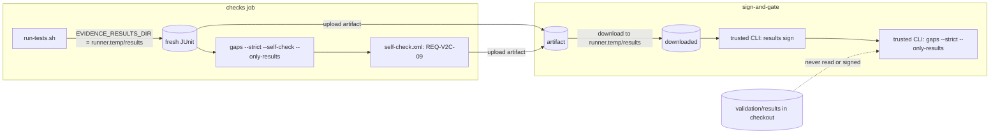
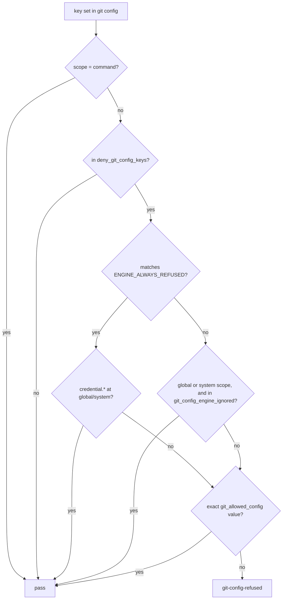

# Spec: Usability — CI-owned test results, YAML comments, plan duplicates, temp-directory paths, `-k`, the git config split
Tracker: PILOT-60   From: intent/2026-09-25-usability/intent.md
Risk tier: 3 — the gate engine's Bash rules and its git config check (which guards the process that holds the signing key, ADR-0003), and where CI signs test evidence (ADR-0002); `.github/workflows/**` floors at 2.

Any claim below not confirmed from a file, a command, or a named person is marked
inline as [NEEDS VERIFICATION]. An unmarked claim asserts that it was checked against
the code at `7759c17`.

## Requirements
| ID | Requirement | Source (intent.md section) | Acceptance |
| --- | --- | --- | --- |
| REQ-USA-01 | `scripts/ci/run-tests.sh` writes its JUnit and logs to `EVIDENCE_RESULTS_DIR`. The default is outside the working tree: `${TMPDIR:-/tmp}/evidence-chain-results/<repo basename>-<first 12 hex of sha256(repo root)>`. It empties the directory's `*.xml`, `*.log` and `*.sig` files before the run, so a stale suite never counts, and prints the directory it used. Nothing under the working tree is written by a default run | Outcome 1; ADR-0002 §2 | Content tests: the script reads `EVIDENCE_RESULTS_DIR`, its default does not start with `$root`, and it no longer names `validation/results`. Manual MAN-USA-01: a human run leaves `git status` clean |
| REQ-USA-02 | The self-check is the last step of `run-tests.sh`: `evidence gaps --strict --self-check --only-results --results "$out"`, run after every suite. Its outcome is written as one JUnit case, `REQ-V2C-09 this repository passes its own evidence gaps --strict (run-tests.sh final step)`, to `$out/self-check.xml` with the existing `junit_from_tsv.py`, and a failure makes the script exit non-zero. `--self-check` exempts **only** the ID hard-coded in the CLI (`SELF_CHECK_REQUIREMENT = "REQ-V2C-09"`) from the blocking lists, and says so in the output. No adapter key can name or change it. The content suite's REQ-V2C-09 check (`content_acceptance_tests.py:298–307`) is removed | Outcome 1; ADR-0002 §1 and its review | CLI tests in a fixture repository: only REQ-V2C-09 unproven → `gaps --strict --self-check` exits 0 and prints the exemption; REQ-V2C-09 and REQ-X-02 unproven → exits 1 naming REQ-X-02; without `--self-check` → exits 1 naming REQ-V2C-09; an adapter line `self_check_requirement: REQ-X-02` → REQ-X-02 still blocks. Content tests: `run-tests.sh` ends with that step; the content suite no longer runs `gaps --strict` |
| REQ-USA-03 | `evidence gaps --only-results` ingests only the `--results` paths and ignores the adapter's `test_results_location`. Without `--results` it exits 2 with a message, before reading anything | Outcome 1; ADR-0002 review (stale committed results) | CLI tests: a committed passing result under the adapter location and an empty fresh directory → with `--only-results` the requirement is unproven and `--strict` exits 1; without it, it passes (2.1.0 behaviour); `--only-results` alone → exit 2 |
| REQ-USA-04 | CI signs and reads only the fresh artifact. In `.github/workflows/ci.yml`: • `checks` sets `EVIDENCE_RESULTS_DIR: ${{ runner.temp }}/results` and uploads that directory (`if: always()`); • `sign-and-gate` downloads it to `${{ runner.temp }}/results`, signs the files there with the base branch's CLI, and runs `gaps --strict --only-results --results "$RUNNER_TEMP/results"`. Nothing under `validation/results/` in the checkout is signed or read. For the one transitional PR whose base CLI predates `--only-results`, the step feature-detects the flag (`gaps --help`) and otherwise runs the 2.1.0 command on the downloaded directory. `pipelines/github-actions/evidence-chain.yml` does the same with `test-results`. `pipelines/gitlab/evidence-chain.gitlab-ci.yml` (artifacts must live in the project directory) fails the gate job when `git ls-files test-results` is not empty | Outcome 1; ADR-0002 review (CI signs whatever sits in the directory) | Content tests on the three files: download path under `runner.temp`, `results sign` and `gaps` pointed at it, `--only-results`, no `validation/results/` in `sign-and-gate`; the GitLab tracked-files guard. Manual MAN-USA-02: the first CI run after merge signs files under `$RUNNER_TEMP` and `sign-and-gate` passes |
| REQ-USA-05 | The adapter reader (`load_adapter`) and eval front matter (`find_eval_covers`) strip YAML comments: a `#` that begins a line or follows whitespace, outside single or double quotes, ends the value. This applies to scalar values, `- item` list entries and inline `[a, b]` lists, before unquoting. A `#` inside quotes, or with no whitespace before it, is part of the value | Outcome 2 | CLI tests: `- intent/*/spec.md   # specs` finds the spec's requirements; `tracker_pattern: "[A-Z]+-[0-9]+"  # keys` → `[A-Z]+-[0-9]+`; `test_results_location: [validation/results]  # junit` → a one-item list. Negative: `requirement_pattern: 'REQ-#-[0-9]+'` keeps `#`; `x: a#b` keeps `a#b`; eval `covers: [REQ-X-01]  # was REQ-X-09` covers REQ-X-01 only |
| REQ-USA-06 | A requirement row in a plan file (a `spec_glob` file that also matches `artifact_chain.plan_glob`) whose ID is already defined in a spec file is a **reference**, not a definition, when the plan's `From:` header names that spec's path or its directory. It is not counted for `DUPLICATE-ID` and does not replace the spec's summary. Spec files are read before plan files. A plan-only ID is still defined by the plan (Tier 1, REQ-P54-07) | Outcome 3 | CLI tests: spec + `plan/ABC-1.md` with `From:` naming the spec → no `DUPLICATE-ID`, summary from the spec. Negative: the same plan with `From:` naming another spec → `DUPLICATE-ID`; two specs defining one ID → `DUPLICATE-ID`; two plans defining one plan-only ID → `DUPLICATE-ID`; a Tier 1 plan-only ID → defined, not orphaned |
| REQ-USA-07 | A temp-directory argument is judged as a path, not as a script, when the program is in `_TEMP_DATA_PROGS` and the argument is not the value of one of that program's code-running options (`_TEMP_EXEC_OPTS`, both `--opt value` and `--opt=value`): • `_TEMP_DATA_PROGS`: `cat`, `head`, `tail`, `wc`, `ls`, `stat`, `file`, `du`, `mkdir`, `rmdir`, `rm`, `touch`, `chmod`, `tee`, `mktemp`, `grep`, `egrep`, `fgrep`, `rg`, `sort`, `uniq`, `cut`, `tr`, `diff`, `cmp`, `md5sum`, `sha256sum`, `shasum`, `jq`, `basename`, `dirname`, `realpath`, `readlink`, `echo`, `printf`, `test`, `[`, `curl`, `wget`, `cp`, `mv`; • `_TEMP_EXEC_OPTS`: `rg --pre`; `sort --compress-program`; `curl -K`/`--config`; `wget -e`/`--execute`/`--config`. For `cp` and `mv`, a temp-directory source is allowed only when no destination is inside the repository. The temp-directory prefix test in `check_bash` compares real paths with a trailing `/` (today `$TMPDIR` is compared without one). Everything else about the command is judged as in 2.1.0 (writes, claims, control plane, secrets) | Outcome 4 | Engine tests, each through the hook: `mkdir -p $TMPDIR/p`, `tail -5 /tmp/build.log`, `ls $TMPDIR`, `cat /private/tmp/x.txt`, `curl -o $TMPDIR/x.json https://example.com`, `cp src/app.py $TMPDIR/app.bak`, `sort /tmp/a > /tmp/b`, `rg foo /tmp/x`, `mktemp`, `d=$(mktemp -d)` → allowed |
| REQ-USA-08 | Negative: running code from a temp directory stays denied `opaque-write`, as does a temp path passed to a code-running option or copied into the repository | Constraint: every loosening has a negative test | Engine tests: `python3 /tmp/x.py`, `bash $TMPDIR/x.sh`, `source /tmp/x`, `make -f /tmp/Makefile`, `go run /tmp/x.go`, `awk -f /tmp/x.awk f`, `sed -f /tmp/x.sed f`, `rg --pre /tmp/x foo`, `sort --compress-program=/tmp/x a`, `curl -K /tmp/cfg https://example.com`, `cp /tmp/x src/app.py`, `mv /tmp/x src/other.py` → denied; the existing round-4 cases (`make -f /tmp/Makefile`, `ditto /tmp/evil src/other`, `(sleep 1; cp /tmp/x src/other.py) &`) still deny |
| REQ-USA-09 | `engine-tests.py`: • `-k SUBSTR` selects which cases are **reported**; a case that is not selected still runs its hook call, so the state later cases depend on is the same as in a full run; • `--suite NAME` (repeatable) runs only the named suites, in the file's order; an unknown name exits 2 listing the valid names; • a filter that selects no case prints `0 cases matched` and exits 1 | Outcome 5 | Engine tests (the harness run as a subprocess): `--suite suite_round4 -k "REQ-V2G-12 round4"` → exit 0, `1 passed, 0 failed`, no traceback; `--suite suite_round4 -k REQ-IMH` → exit 1, `0 cases matched`, no traceback; `--suite nope` → exit 2 |
| REQ-USA-10 | The engine's config check (`state.check_git_config`) does not refuse a key at **global or system** scope that matches `git_config_engine_ignored` and matches none of the hard-coded `ENGINE_ALWAYS_REFUSED` patterns. The default `git_config_engine_ignored` is `alias.*`, `core.editor`, `core.pager`, `pager.*`, `sequence.editor`, `interactive.diffFilter`, `*tool.*.cmd`. The org policy may add entries; a repository policy may only remove them (intersection, as for `ungated`). `credential.*` keeps its 2.1.0 treatment (passes at global and system scope). What an agent may set (`git -c`, `git config` in `_check_git`) still uses the whole `deny_git_config_keys` list | Outcome 6 | Engine tests with `HOME` set to a scratch directory holding `.gitconfig`: each default ignored key at global scope → a source edit is allowed, no `git-config-refused`; `credential.helper` at global → allowed (2.1.0) |
| REQ-USA-11 | Negative: `ENGINE_ALWAYS_REFUSED` (in code, not policy) is `core.fsmonitor`, `core.hooksPath`, `core.sshCommand`, `core.askPass`, `core.gitProxy`, `core.worktree`, `core.attributesFile`, `include.path`, `includeIf.*`, `filter.*`, `diff.*.textconv`, `diff.*.command`, `merge.*.driver`, `gpg.program`, `gpg.*program`, `ssh.variant`, `remote.*.uploadpack`, `remote.*.receivepack`, `uploadpack.*`, `url.*.insteadOf`, `submodule.*.update`, `lfs.extension.*`, `lfs.customtransfer.*`, `lfs.standalonetransferagent`, `credential.*` (the last at local and worktree scope only, as today). These are refused at every scope except `command` whatever the policy says. An ignored key at local or worktree scope is still refused. `git_allowed_config` is unchanged | Constraint: every loosening has a negative test | Engine tests: at global scope `core.fsmonitor`, `core.hooksPath`, `core.sshCommand`, `filter.x.clean`, `diff.x.textconv`, `gpg.program`, `include.path` → `git-config-refused`; `alias.st` and `core.editor` at local scope → refused; `credential.helper` at local → refused; an org policy adding `core.*` → `core.fsmonitor` still refused and `core.editor` ignored; a repo policy adding `core.fsmonitor` to `git_config_engine_ignored` → dropped; `git config alias.x '!rm -rf .'` and `git -c core.editor=vim commit` by the agent → denied `git-config` |
| REQ-USA-12 | ADR-0002 revision 2, docs, governance, HANDOFF, CHANGELOG `## 2.3.0` and plugin versions 2.3.0 match the shipped behaviour. They state: • CI's signed artifact is the test evidence; `validation/results/` is historical; one local `run-tests.sh` run, whose directory is printed; pass `--results <dir>` to a local `gaps`; • the YAML comment rule; • plan rows that repeat their spec are references; • which temp-directory commands are judged as paths, which stay denied, and the sandbox-safe `mktemp "$TMPDIR/x.XXXXXX"` form; • `-k` and `--suite`; • both git config lists and why each key is in its set; • the owner actions (apply the `ci.yml` diff; remove any machine-local `git_allowed_config` entries added only for aliases or editors) | Compliance evidence | Content tests |

## Design
Components reused: `evidence_trace.load_adapter` / `_unquote` / `build_graph` / `compute_gaps` / `cmd_gaps` / `_add_results_arg` / `ingest_results`, `evidence_policy.check_bash` / `_check_script` / `_TMP_DIRS` / `st.normalize` / `cmdparse.writes_of`, `state.check_git_config` / `_merge`, `junit_from_tsv.py`, and the engine-test harness (`case`, `check`, `run_hook`, `make_repo`, `start_change`).

- **REQ-USA-01, 02** (`scripts/ci/run-tests.sh`, `evidence_trace.py`):
  - `out` comes from `EVIDENCE_RESULTS_DIR` or the out-of-tree default; `rm -f "$out"/*.xml "$out"/*.log "$out"/*.sig` before the first suite.
  - After the last suite, `python3 "$root/plugins/evidence-sdlc/bin/evidence" gaps --strict --self-check --only-results --results "$out"` runs from `$root` without the key. Its exit status becomes a `pass`/`fail` TSV line piped to `junit_from_tsv.py "self-check" "$out/self-check.xml"`.
  - `SELF_CHECK_REQUIREMENT` is a module constant. `cmd_gaps` removes that ID from every blocking category's list when `--self-check` is given, and prints `self-check: REQ-V2C-09 is proven by this step, not by an earlier result`. The `--repos` path accepts the flag unchanged.
- **REQ-USA-03** (`evidence_trace.py`): `register_gaps` adds `--only-results`. `build_graph(root, adapter, results_paths, only_results=False)` uses `results_paths` alone when set. The check for a missing `--results` is in `cmd_gaps`, before `build_graph`.
- **REQ-USA-04** (`ci.yml` by the human; `pipelines/…` by the agent): the exact `ci.yml` diff is in the plan, step 7. The feature detection is `if python3 ../trusted/…/evidence gaps --help | grep -q -- --only-results; then …; else …; fi`.
- **REQ-USA-05** (`evidence_trace.py`): new `_strip_comment(value)`, a single pass that tracks the quote state and cuts at the first unquoted `#` preceded by whitespace (or at position 0). `load_adapter` applies it to the text after `:`, to each `- ` item and to the inline list before splitting. `find_eval_covers` applies it to the `covers:` value.
- **REQ-USA-06** (`evidence_trace.build_graph`): `plan_regexes` from `artifact_chain.plan_glob` (default `intent/*/plan.md`, `plan/*.md`). The spec file list is ordered specs first, then plans. For a plan file, `from_ref` is the first `^From:\s*(\S+)` value, stripped of backticks and `./`. For each row ID already in `graph["requirements"]` with `spec_file == from_ref` or `dirname(spec_file) == from_ref.rstrip("/")`, the row is skipped: no occurrence, no summary.
- **REQ-USA-07, 08** (`evidence_policy.py`):
  - New module constants `_TEMP_DATA_PROGS` and `_TEMP_EXEC_OPTS`, and a helper `_temp_arg_is_data(s, i)`. The argument loop in `check_bash` (`:871–876`) calls `_check_script` for a temp argument only when that helper is false.
  - For `cp`/`mv`, the helper also requires every `cmdparse.writes_of(s)` target to normalise outside the repository (`st.normalize` returns `rel is None`).
  - `_temp_prefixes()` returns `_TMP_DIRS`, their real paths and `realpath($TMPDIR)`, each with a trailing `/`. It is used both in the loop and in `_check_script`.
  - `cmdparse.py` is not edited (PILOT-59 owns it). `script_execution` still sends `python3 /tmp/x.py`, `bash …`, `source …` to `_check_script` first, unchanged.
- **REQ-USA-09** (`engine-tests.py`):
  - `case()` computes `selected = not FILTER or FILTER in label`. When the case is not selected it still calls `run_hook` and discards the result. `check()` is unchanged (its condition is already evaluated by the caller).
  - `SUITES` lists the suite functions in today's `__main__` order. `--suite` is parsed with the existing `sys.argv` style.
  - `results["selected"]` counts reported cases; zero with a filter means exit 1.
- **REQ-USA-10, 11** (`state.py`, `default-policy.json`):
  - `ENGINE_ALWAYS_REFUSED` is a tuple in `state.py`. In `check_git_config`, after the deny-list match: `if scope in ("global", "system") and _engine_ignored(kl, policy): continue`. `_engine_ignored` is true when the key matches a `git_config_engine_ignored` pattern and no `ENGINE_ALWAYS_REFUSED` pattern (both via `fnmatch` on lower-cased strings).
  - `_merge` with `tighten_only` intersects `git_config_engine_ignored` (the `ungated` branch without the org opt-in).
  - `default-policy.json` gains `git_config_engine_ignored`. `deny_git_config_keys` is unchanged.
  - **Why each ignored key cannot run a command in the engine's git:**
    - The engine runs only built-in subcommands: `rev-parse`, `status`, `ls-files`, `ls-tree`, `show`, `diff`, `diff-tree`, `log`, `cat-file`, `merge-base`, `rev-list` and `config` (every `st.run_git` / `st.git` / `lifecycle._vg` call site). git never expands an alias that shadows a built-in.
    - None of these open an editor (`core.editor`, `sequence.editor`) or run `add -p` (`interactive.diffFilter`), `difftool` or `mergetool` (`*tool.*.cmd`).
    - Output is captured (never a TTY), and `GIT_NEUTRAL` sets `core.pager=cat`, so no pager runs (`core.pager`, `pager.*`).
  - **Why `gpg.*` stays refused:** `log.showSignature=true` in config makes `git log` verify signatures, which runs `gpg.program` [NEEDS VERIFICATION in plan step 1 with a scratch repository].

## Regulatory control impact
`.evidence/context/compliance.md` establishes no applicable framework for this repository (all `[ASK]`), so no control set is loaded.

| Framework | Control ID | Applies? | How it is satisfied | Evidence |
| --- | --- | --- | --- | --- |
| none established | — | N/A | compliance.md lists none; awaiting maintainer | `.evidence/context/compliance.md` |

For adopters, `governance/control-mapping.md` cites test results as evidence for change control (SOC 2 CC8.1, ISO 27001 A.8.32, NIST SSDF PW.4, PW.8). After this change the cited evidence is CI's signed artifact, bound to the commit and run (`results sign`), instead of committed files. REQ-USA-12 rewrites those rows.

## Evidence impact
- New rows: REQ-USA-01..12.
- REQ-V2C-09's proof moves from the content suite to `self-check.xml`, written by `run-tests.sh`.
- Existing tests that must still pass unchanged: REQ-P54-07 (plan-only IDs are defined), the REQ-V2G-02 round-4 temp cases (`make -f /tmp/Makefile`, `ditto /tmp/evil src/other`, `(sleep 1; cp /tmp/x src/other.py) &`), REQ-IMH-22 (the AST subprocess allow-list: no new call site), and every 2.1.0 `git-config` case.
- Existing tests whose assertion changes: the content suite's REQ-V2C-09 check is removed. Any engine case that expects a denial for a temp-directory data command or a global alias is listed in the PR with the old and the new assertion [NEEDS VERIFICATION in plan step 1: none found by grep at `7759c17`].

## Diagrams

## Security design
- **What stays blocking:** every key that can make the engine's own git run a program; any ignored key planted at local or worktree scope (the agent can write `.git/config`, and a human would later run that alias or editor); running code from a temp directory, or passing a temp file to a code-running option; copying a temp file into the repository; any agent `git -c` or `git config` of a denied key.
- **Why the ignored keys are safe:** see Design. The engine never reaches the code paths that read them, and the org cannot make a command-running key ignorable, because `ENGINE_ALWAYS_REFUSED` is in code.
- **Why temp data commands are safe:** the rule they tripped exists for code the gates never saw written. A program in `_TEMP_DATA_PROGS` does not execute its file arguments. Its writes are still judged by `writes_of`, the claims and the control plane. The options through which some of them run a program are listed and stay denied.
- **Test evidence:** signing only the downloaded artifact closes the review finding that a PR could commit a result file into `validation/results/` and have CI sign it. The self-check exemption is one constant in the trusted CLI, not an agent-editable adapter key. The authoritative `gaps --strict` in `sign-and-gate` runs without `--self-check`.
- **Residual risk:** as ADR-0003 §4. This change adds no subprocess call site and no new trust in local files.
- **Required review agents:** verifier, security-reviewer, code-reviewer, one at a time.

## UX
| State / concern | Behaviour |
| --- | --- |
| `run-tests.sh` finished | Last lines: the results directory, then `self-check: passed` or the blocking items |
| Local `gaps` after `run-tests.sh` | Docs and the script's last line say to pass `--results <dir>` |
| Temp data command | Runs; no message |
| Temp execution | The 2.1.0 denial text, plus: "to read or list a temp file, use cat, ls or the Read tool" |
| Global alias or editor | No refusal; the policy docs list both sets |
| `-k` with no match | `0 cases matched`, exit 1 |
| Edge cases | A `#` inside a quoted regex; a plan whose `From:` names a directory with a trailing slash; `$TMPDIR` a symlink (`/tmp` → `/private/tmp`); a `--opt=value` form; `cp -t DIR` |

Component reuse: N/A — no UI.

## Areas of concern
- **Feature detection in `ci.yml` versus a follow-up commit.** Feature detection lets one PR carry the whole change, and the fallback runs only while the base CLI is 2.2.x. The alternative is that the human applies the `ci.yml` diff in a separate commit after PILOT-60 merges, and REQ-USA-04's content check then waits for it. Owner: maintainer — choose at approval.
- **`SELF_CHECK_REQUIREMENT` is this repository's ID, hard-coded in a shipped CLI.** For adopters, the flag exempts an ID they do not have. The review asked for exactly this; a general mechanism is not in scope. Owner: maintainer.
- **`credential.*` at global scope** keeps passing (2.1.0). Owner: maintainer (intent, "Open questions").
- **The `gpg.*` claim** [NEEDS VERIFICATION]: plan step 1 confirms with a scratch repository that `log.showSignature` makes the engine's `git log` run `gpg.program`. If it does not, `gpg.*` still stays refused (no loosening without proof).
- **The uncommitted local edit of `default-policy.json`** (and its `.bak`) must be resolved by the human before plan step 5 edits that file. The agent never stages or overwrites it.
- **PILOT-62 overlap:** see the plan's "Coordination with PILOT-62".

## Out of scope
- **`cmdparse` heredoc merging and the other PILOT-59 items.** `cmdparse.py` is not edited. No new test uses a heredoc followed by another command.
- **Plan re-approval missing from `state.json` history** (PILOT-58 intent) and **`CLAUDE_CONFIG_DIR` watching** (PILOT-62 spec). Both touch `lifecycle.py` / `integrity.py` security paths that PILOT-62 is changing. Proposed as PILOT-64 once PILOT-62 merges [NEEDS VERIFICATION: key not yet allocated].
- **The sandbox's `mktemp`:** not an engine behaviour. Documented only.
- **`git -c core.editor=… ` by the agent:** still denied. Loosening what an agent may set is a separate decision.

## Architecture decisions
| ADR | Created / Supersedes / Relies on | Status |
| --- | --- | --- |
| `.evidence/decisions/0002-ci-owns-test-results.md` | Revised (revision 2): the review's two findings are adopted; relies on ADR-0004 | Proposed |
| `.evidence/decisions/0003-hook-git-is-neutralised.md` | Relied on. §2 is narrowed by REQ-USA-10 (global-scope keys the engine never reads), and the always-refused set is unchanged. It is still Proposed, so plan step 8 adds a dated revision note to §2 | Proposed |

## Rejected alternatives
- **Drop harmless keys from `deny_git_config_keys`.** That also lets the agent set them (`git config alias.x '!…'`), which a human later runs.
- **Exempt harmless keys at every scope.** An agent can write `.git/config`. A local alias or editor it plants runs later in the human's terminal, and the refusal is the only signal.
- **Make the engine's check an allow-list of key names.** ADR-0003 rejected it: values are what execute. This change keeps a deny model and exempts a fixed, reasoned set.
- **Stop checking temp-directory arguments altogether.** `make -f /tmp/x`, `go run /tmp/x.go` and `awk -f` run code the gates never saw.
- **Keep `self_check_requirement` in `adapter.yml`** (ADR-0002 draft). The adapter is agent-editable, so it could exempt any requirement.
- **Have the content suite ingest its own fresh results** (ADR-0002 alternatives). It is still ordering-sensitive, and local runs still write into the working tree.
- **Speed up `-k` by skipping hook calls for unselected cases.** That is today's crash: later cases depend on the state earlier hook calls create. `--suite` gives the speed safely.
