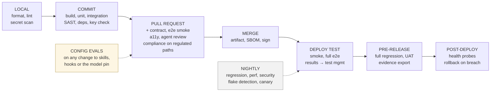

# Continuous integration and continuous testing

Continuous testing is not "run all the tests all the time." It is: **the cheapest check
that could catch this class of defect runs at the earliest stage where it could catch
it**, and each stage produces evidence.

Read `.evidence/context/deployment.md` for the actual CI system, environments and
regions before designing anything.

## Stage design

| Stage | Trigger | Runs | Blocks? | Evidence produced |
| --- | --- | --- | --- | --- |
| Pre-commit (local hook) | Commit | Format, lint on changed files, secret scan | Yes, locally | — |
| Commit | Push to branch | Build, unit, integration, SAST, dependency scan, licence check | Yes | Build log, test report, scan reports |
| Pull request | PR opened/updated | Everything above, plus contract tests, E2E smoke, agent review passes, compliance pass on regulated paths | Yes on tests; findings advisory to the reviewer | Reports attached to the PR |
| Merge to main | Merge | Full build, artifact, SBOM, publish to registry | Yes | Artifact + SBOM, signed |
| Deploy to test env | Merge | Deploy, smoke, full E2E, accessibility, API regression | Yes | Run posted to the test management system |
| Nightly | Schedule | Full regression, performance, extended security, flake detection | No — reports | Trend reports |
| Pre-release | Release candidate | Full regression, manual/UAT run, validation evidence assembly | Yes | Release test run, traceability export |
| Post-deploy | Deploy to any env | Smoke, health, key business-journey probes | Yes — triggers rollback | Deployment record |

Adjust to what the repository actually has. The shape matters more than the specifics.

## What blocks and what informs

Be precise about this or the pipeline becomes noise:

- **Blocks:** compilation, unit and integration failure, secret detection, critical or
  high security findings, contract-test failure, coverage of a regulated path dropping.
- **Informs:** style nits, agent review findings, non-critical scan findings, performance
  drift within band. These attach to the PR for the human reviewer; they do not gate.

A findings count that gates a merge automatically will be gamed within a month. Human
approval, informed by findings, is the control.

## Evidence, not just green

Every stage that produces evidence must post it somewhere durable and reachable from
the tracker key. A pipeline that goes green and leaves nothing behind gives you speed
and no auditability, which in a regulated context is half a solution.

## Agent steps in the pipeline

Where the CI system allows it, run the agent non-interactively for judgement steps:
triaging a failed build, classifying a flake as real or environmental, drafting the
changelog, summarising review findings. Start read-only. Anything the agent writes
arrives as a pull request through branch protection; it has no route to the protected
branch.

Note the platform reality: some managed review integrations are hosted-provider
specific. Where yours is not supported, run the agent headlessly in your own pipeline
instead — the controls are the same, the plumbing differs. Record which you use in the
toolchain profile.

## Speed

If the commit stage takes longer than ten minutes, people stop waiting for it and the
whole model degrades. Parallelise, shard, and push slow checks to nightly. Guard the
commit stage's duration as a metric.

**Scope the commit stage to what the change actually touches.** Running the full suite
on every commit is what makes the ten-minute guardrail hard to hold as a codebase
grows. Use whatever dependency-graph, coverage-mapping, or affected-target mechanism
the project's own test runner or CI system already provides to run only the tests an
impacted-analysis says the change could plausibly break at the commit stage, and
reserve a full, unscoped run for the heavier gates that already exist for this
(pull request, nightly, pre-release) — never for a Tier 3 change, and never as a
substitute for the full run those gates already require. Impact analysis is a speed
technique for the earliest, cheapest stage, not a narrower definition of what a
release needs proven. If the project has no such mechanism, say so and name the gap
rather than approximate one by hand.

## Rollback is a tested path

Post-deploy checks that can trigger rollback are worthless if rollback has never been
rehearsed. Exercise it in a lower environment on a schedule and record the date.
